# Užklausos

Viena dažniausiai naudojamų SQL užklausų:

```sql
SELECT * FROM person
```
žvaigždutė reiškia 'viską', person - lentelės pavadinimas. Su ja paimama absoliučiai viskas iš lentelės.

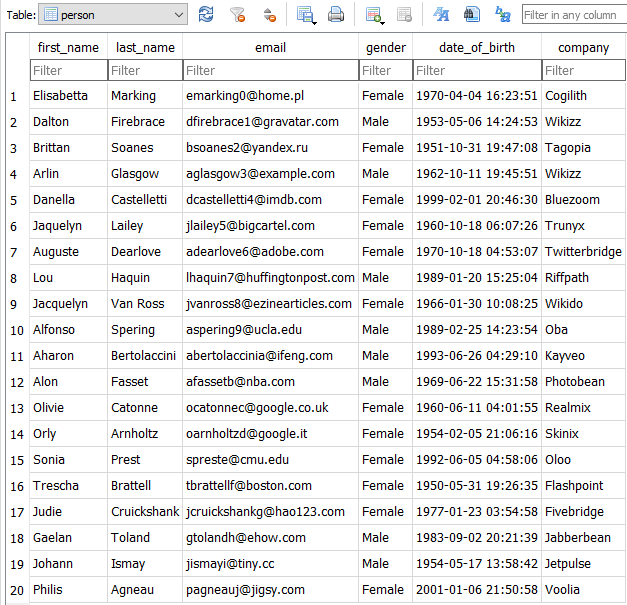

galima išrinkti tik stulpelius, kurie mus domina:
```sql
SELECT first_name, gender FROM person;
```


norėdami išrinkti unikalias (nepasikartojančias) reikšmes, po SELECT prirašome DISTINCT:

```sql
SELECT DISTINCT gender FROM person;
```
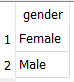

## WHERE

WHERE naudojame užklausos papildymui kokia nors sąlyga:
```sql
SELECT * FROM person WHERE gender="Female";
``` 
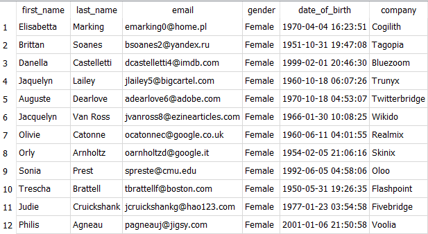

kitas pavyzdys:
```sql
SELECT * FROM person WHERE date_of_birth > date('1980-01-01');
```
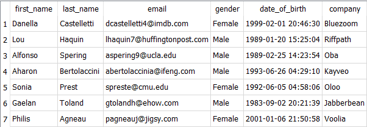

sąlygas galima kombinuoti su OR arba AND:
```sql
SELECT * FROM person WHERE date_of_birth > date('1990-01-01') AND gender="Female";
```
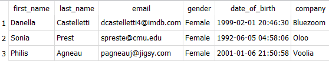

## ORDER BY

papildoma sąlyga rezultato išrūšiavimui pagal tam tikrą stulpelį:
```sql
SELECT * FROM person WHERE date_of_birth > date('1980-01-01') ORDER BY company;
```
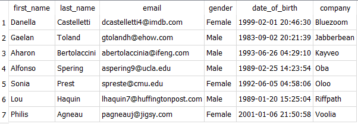

Gale prirašius DESC gausime atvikštinį rūšiavimą:
```sql
SELECT * FROM person WHERE date_of_birth > date('1980-01-01') ORDER BY company DESC;
```


## GROUP BY

Rezultatus galime grupuoti:

```sql
SELECT * FROM person GROUP BY gender, last_name;
```

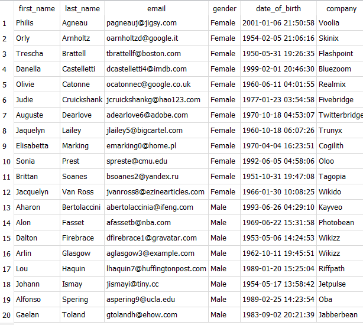

```sql
SELECT
	*
FROM
	person
GROUP BY
	last_name,
	first_name	
HAVING
	gender="Female";
```

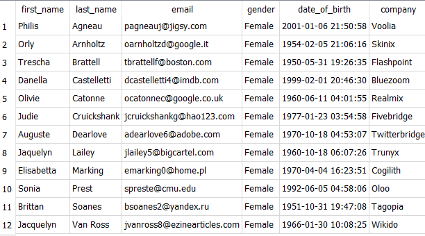

sudėtingesnis pavyzdys:

```sql
SELECT
	*
FROM
	person
GROUP BY
	last_name,
	first_name	
HAVING
	date_of_birth 
		BETWEEN 
			date('1980-01-01') 
		AND 
			date('1990-01-01');
```


# Duomenų įterpimas
## INSERT

duomenų įterpimui naudojame INSERT, pvz:
```sql
INSERT INTO person VALUES(
"Jotautas", "Treigys", "jtr@gmail.com", "Male", date('1981-04-25'), "FTMC"
);
```
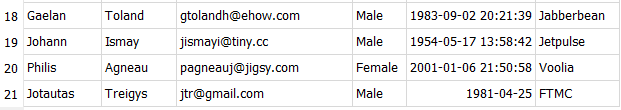

galime įterpinėti tik į konkrečius stulpelius:
```sql
INSERT INTO person 
	(first_name, last_name, gender, date_of_birth, company)
VALUES
	("Antanas", "Šampanas", "Male", date('1979-02-02'), "Microsoft");
```

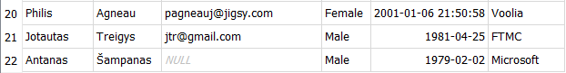

## UPDATE

Norėdami pakeisti įrašus, naudojame UPDATE:
```sql
UPDATE person SET email = "antanas@gmail.com" WHERE first_name = "Antanas";
```

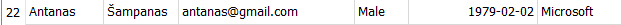

kitas pvz.:
```sql
UPDATE person SET company = "Microsoft" WHERE date_of_birth >= date('1990-01-01') AND gender = "Female";
```
(Nelabai korektiškas pvz...)

Galime pakeisti keleto stulpelių reikšmes:
```sql
UPDATE person SET first_name = "Mikrosoftas", last_name = "Mikrosoftauskas" WHERE company = "Microsoft";	
```

išrinkę viską pagal kompaniją 'Microsoft', gausime:
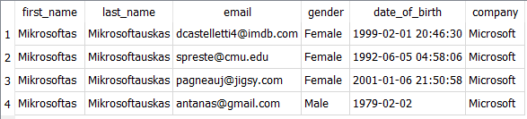

## DELETE

Triname su DELETE. Pvz.:
```sql
DELETE FROM person where company = "Microsoft";
```

jeigu nenurodome sąlygos, bus ištrintos visos eilutės:
```sql
DELETE FROM person;
```

tas pats įvyktų, jeigu naudotumėm 
```sql
TRUNCATE person;
```

jeigu norime ištrinti lentelę su visa struktūra:
```sql
DROP TABLE person;
```


