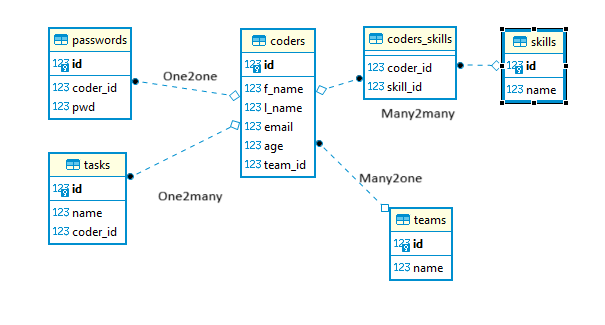

# CREATE TABLE

Sukurkime paprastą lentelę:

```sql
CREATE TABLE coder (
    f_name VARCHAR(50),
    l_name VARCHAR(50),
    email VARCHAR(100),
    age INT,
    xp_years INT
)
```

Sukūrėme lentelę coder, kurioje stulpeliai vardas, pavardė, amžius, patirtis(metais) turi nurodytus duomenų tipus. Populiarių DBVS duomenų tipus (ir ne tik) galite pasinagrinėti šioje [nuorodoje](https://www.digitalocean.com/community/tutorials/sqlite-vs-mysql-vs-postgresql-a-comparison-of-relational-database-management-systems).

## Constraints

Dabar sukurkime lentelę su apribojimais (constraints):

```sql
CREATE TABLE coder (
    id PRIMARY KEY NOT NULL,
	f_name VARCHAR(50) NOT NULL,
    l_name VARCHAR(50) NOT NULL,
    email VARCHAR(100) UNIQUE,
    age INT CHECK (age > 17 AND age < 75),
    xp_years INT CHECK (xp_years < 40)
)
```

po nurodyto stulpelio duomenų tipo galime (pagal poreikį) surašyti apribojimus:


* NOT NULL - nurodo, kad įrašas negali būti tuščias;
* PRIMARY KEY - stulpelį nustato kaip pirminį raktą;
* UNIQUE - nurodo, kad įrašai stulpelyje negali kartotis;
* CHECK (Sąlyga) - Tikrina, ar įrašomi duomenys atitinka sąlygą;
* DEFAULT - nurodo numatytąją reikšmę, jeigu duomenys nesuvedami;

## ALTER TABLE

pridėkime stulpelį:

```sql
ALTER TABLE coder ADD COLUMN project_id INTEGER;
```

pervadinkime jį į team_id:

```sql
ALTER TABLE coder RENAME COLUMN project_id TO team_id;
```

galima pervadinti ir lentelės pavadinimą:

```sql
ALTER TABLE coder RENAME TO coderiai 
```

SQLite nepalaiko daugiau ALTER TABLE komandos variacijų, pavyzdžiui ALTER TABLE lentele ADD CONSTRAINT ir kt. Todėl reikia skirti daugiau dėmesio planavimui. 

# Loginiai ryšiai
## One to many
sukurkime sistemą, kur vienoje lentelėje bus programuotojai, o kitoje komandos. Vienai komandai gali priklausyti keletas programuotojų (one-to-many):

```sql
CREATE TABLE teams (
  id integer PRIMARY KEY,
  name string
);
```
```sql
CREATE TABLE coders (
  id integer PRIMARY KEY,
  f_name string NOT NULL,
  l_name string NOT NULL,
  email string UNIQUE,
  age integer,
  team_id integer,
  FOREIGN KEY (team_id) REFERENCES teams (id)
);
```
Ryšys sukuriamas išorinio rakto - FOREIGN KEY pagalba. Paskutinėje eilutėje nurodoma, kad team_id stulpelis bus išorinis raktas ir referuos į person lentelės id, kuris turėtų būti pirminis raktas (unikalus indentifikatorius).

Pridėkime lentelę tasks, kurioje vienas programuotojas galės turėti daug užduočių:

```sql
CREATE TABLE tasks (
	id integer PRIMARY KEY,
	name string,
	coder_id integer,
	FOREIGN KEY (coder_id) REFERENCES coders (id)
);
```

užpildykime pseudo duomenimis:

```sql
INSERT INTO "teams" ("name") VALUES ('Back End');
INSERT INTO "teams" ("name") VALUES ('DevOps');
INSERT INTO "teams" ("name") VALUES ('Front End');

INSERT INTO "coders" ("f_name", "l_name", "email", "age", "team_id") VALUES ('Jonas', 'Jonaitis', 'jj@gmail.com', '20', '1');
INSERT INTO "coders" ("f_name", "l_name", "email", "age", "team_id") VALUES ('Antanas', 'Antanaitis', 'aa@gmail.com', '25', '1');
INSERT INTO "coders" ("f_name", "l_name", "email", "age", "team_id") VALUES ('Juozas', 'Juozaitis', 'jj@hotmail.com', '30', '2');
INSERT INTO "coders" ("f_name", "l_name", "email", "age", "team_id") VALUES ('Petras', 'Petraitis', 'pp@mail.lt', '29', '2');
INSERT INTO "coders" ("f_name", "l_name", "email", "age", "team_id") VALUES ('Virgis', 'Virgutis', 'vv@gmail.com', '21', '3');
INSERT INTO "coders" ("f_name", "l_name", "email", "age", "team_id") VALUES ('Tomas', 'Aidietis', 'ta@imone.lt', '35', '3');

INSERT INTO "tasks" ("name", "coder_id") VALUES ('Sutvarkyti DB', '5');
INSERT INTO "tasks" ("name", "coder_id") VALUES ('Perdaryti dizainą', '1');
INSERT INTO "tasks" ("name", "coder_id") VALUES ('Perdaryti formas', '2');
INSERT INTO "tasks" ("name", "coder_id") VALUES ('Atnaujinti tvarkykles', '6');
INSERT INTO "tasks" ("name", "coder_id") VALUES ('Perkrauti serverius', '5');
INSERT INTO "tasks" ("name", "coder_id") VALUES ('Atnaujinti bibliotekas', '6');
INSERT INTO "tasks" ("name", "coder_id") VALUES ('Pakeisti logotipus', '2');
INSERT INTO "tasks" ("name", "coder_id") VALUES ('Atnaujinti dokumentaciją', '3');
INSERT INTO "tasks" ("name", "coder_id") VALUES ('Ištestuoti programą', '4');
INSERT INTO "tasks" ("name", "coder_id") VALUES ('Perdaryti API', '4');
```

## Many to many

Sakykime, kad reikia darbuotojus kažkaip susieti su turimomis kompetencijomis. Pirmiausia sukurkime lentelę skills:

```sql
CREATE TABLE skills (
  id integer PRIMARY KEY,
  name integer
);
```

užpildykime duomenimis:

```sql
INSERT INTO "skills" ("name") VALUES ('Python');
INSERT INTO "skills" ("name") VALUES ('JS');
INSERT INTO "skills" ("name") VALUES ('CSS');
INSERT INTO "skills" ("name") VALUES ('Go');
INSERT INTO "skills" ("name") VALUES ('AWS');
INSERT INTO "skills" ("name") VALUES ('Linux');
```

Turime situaciją, kai daug žmonių gali turėti daug kompetencijų ir atvirkščiai (*pritempta*). Gaunasi many-to-many ryšys. Tam, kad susikurtų toks ryšys, turime turėti tarpinę lentelę:

```sql
CREATE TABLE coders_skills (
	coder_id integer,
	skill_id integer,
	FOREIGN KEY (coder_id) REFERENCES coders (id),
	FOREIGN KEY (skill_id) REFERENCES skills (id)
  );
```

Lentelėje yra tik du išoriniai raktai, ji yra techninė, saugo tik ryšius. Užpildykime:

```sql
INSERT INTO "coders_skills" ("coder_id", "skill_id") VALUES ('1', '2');
INSERT INTO "coders_skills" ("coder_id", "skill_id") VALUES ('1', '3');
INSERT INTO "coders_skills" ("coder_id", "skill_id") VALUES ('2', '2');
INSERT INTO "coders_skills" ("coder_id", "skill_id") VALUES ('2', '3');
INSERT INTO "coders_skills" ("coder_id", "skill_id") VALUES ('3', '1');
INSERT INTO "coders_skills" ("coder_id", "skill_id") VALUES ('3', '4');
INSERT INTO "coders_skills" ("coder_id", "skill_id") VALUES ('4', '1');
INSERT INTO "coders_skills" ("coder_id", "skill_id") VALUES ('4', '6');
INSERT INTO "coders_skills" ("coder_id", "skill_id") VALUES ('5', '4');
INSERT INTO "coders_skills" ("coder_id", "skill_id") VALUES ('5', '5');
INSERT INTO "coders_skills" ("coder_id", "skill_id") VALUES ('6', '5');
INSERT INTO "coders_skills" ("coder_id", "skill_id") VALUES ('6', '6');
```
## One to one

Retai naudojamas ryšys, nes galima paprasčiausiai sudėti duomenis į tą pačią lentelę. Tarkime, kad norime paslėpti dalį informacijos, kad nesimatytų pagrindinėje lentelėje:

```sql
CREATE TABLE passwords (
	id integer PRIMARY KEY,
	coder_id integer UNIQUE,
	pwd string,
	FOREIGN KEY (coder_id) REFERENCES coders (id)
);
```

Ryšys kuriamas taip pat, kaip ir one to many, tik išoriniam raktui pritaikomas UNIQUE apribojimas. Užpildykime:

```sql
INSERT INTO "passwords" ("coder_id", "pwd") VALUES ('1', '12345');
INSERT INTO "passwords" ("coder_id", "pwd") VALUES ('2', 'verisykret');
INSERT INTO "passwords" ("coder_id", "pwd") VALUES ('3', 'qwerty');
INSERT INTO "passwords" ("coder_id", "pwd") VALUES ('4', 'uauauai');
INSERT INTO "passwords" ("coder_id", "pwd") VALUES ('5', 'slaptazodis');
INSERT INTO "passwords" ("coder_id", "pwd") VALUES ('6', 'barzda');
```

Galutinis mūsų duomenų bazės variantas atrodo taip:




