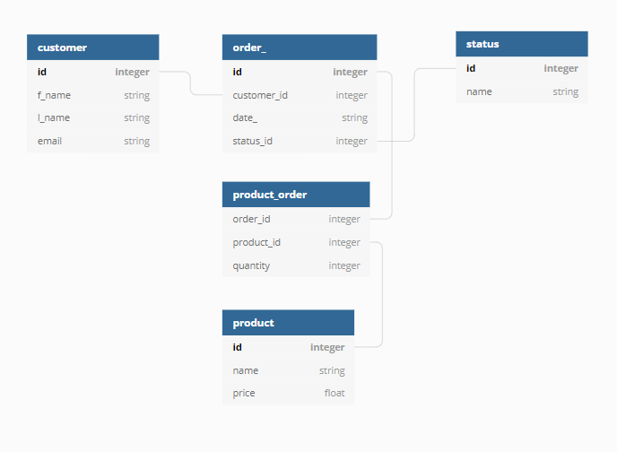
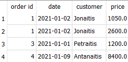
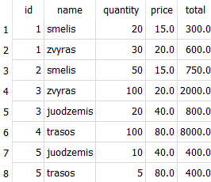
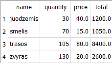

# Užduotis

1. Sukurkite duomenų bazę pagal tokią diagramą:

2. Užpildykite duomenimis - bent 3 klientai, bent 5 užsakymai, kiekviename jų po 1-3 pozicijas, keletas produktų, keletas užsakymo statusų (pvz, patvirtintas, vykdomas, įvykdytas, atmestas).

3. suformuokite porą užklausų:

* kad rezultate matytųsi užsakymo id, užsakovo pavardė, data, bendra užsakymo suma:

* kad rezultate matytųsi užsakymo id, pozicijos su kiekiais, kainomis ir bendra pozicijos suma:

* prieš tai buvusios užklausos pagrindu sukurkite užklausą, kurioje matytųsi, kiek ir kokio produkto buvo užsakyta:

