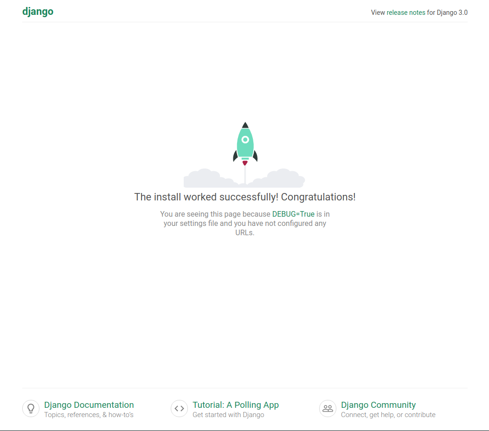
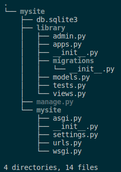
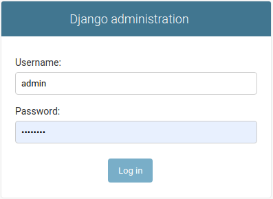

## Įžanga, failų sistema

Django yra internetinių puslapių ir programų framework'as. Pasižymi tokiomis savybėmis:

* Greitis - geba tvarkytis su labai daug užklausų per sekundę.
* Išplečiamumas (scalability) - ateityje savo programai galėsite nesunkiai pridėti papildomo funkcionalumo, kitaip tariant leidžia programai augti.
* Saugumas - orientuotas į saugumą. Jeigu Flask leidžia jums daryti, ką norite, django aplinkoje susidursite su apribojimais, jeigu jūsų sumanymas nesaugus.
* *Batteries included* - django turi praktiškai viską, ko gali prireikti standartinei web aplikacijai. Pvz. administratoriaus svetainę.
* Populiarumas - pats populiariausias Python web kūrimo įrankis. Užstrigus procese, labai tikėtina, kad rasite savo problemos sprendimą internete.
* Puikiai dokumentuotas - dokumentacijas anksčiau ar vėliau teks pradėti skaityti, django atveju tai bus žymiai maloniau, negu kad pvz Odoo :)
* Turbūt pagrindinis - greitas rezultatas (rapid development). Pramokus django, web projektus darysite greitai.

Instaliacija. Visų pirma terminale (PyCharm programoje Alt+F12) įdiegiame django:
```cmd
pip install django
```

pirmą kartą naudodami django turėsite pasirūpinti pradinio karkaso inicijavimu (initial setup): 

```cmd 
django-admin startproject mysite
```

konsolėje nieko neįvyko, tačiau atkreipkite dėmesį, kad ten, kur iniciavote komandą, atsirado katalogas mysite. Čia gulės mūsų projektas. Jis turi tokią struktūrą:


* manage.py - pagrindinis komandinės eilutės failas, per jį savo projektui siųsime įvairias komandas susijusias su serverio paleidimu, migracijomis ir t.t.

* asgi.py ir wsgi.py - šie failai bus naudingi talpinant gatavą projektą į linux serverį.

* __init__.py - tuščias failas, kuris nurodo python'ui, kad katalogas /mysite(vidinis) yra modulis, ir su juo reikia elgtis atitinkamai.

* settings.py - pagrindinis projekto nustatymų puslapis.
* urls.py - jame bus surašyti URL adresai (*endpoints*).


Mūsų projektas jau veikia lokaliame vystymo (*development*) serveryje:

```cmd
cd mysite
python manage.py runserver
```

Pirmą kartą panaudojome manage.py! 
Django startinis puslapis atrodo taip:



Vienas iš django trūkumų - palyginti didelė failų struktūra, kurią reikia suprasti ir tvarkingai dėliotis nuo pat projekto pradžios. Jeigu Flask'as leidžia turėti viską viename faile, su django tokie dalykai neišdegs. Šis kompromisas neišvengiamas, norint greitai daryti didelės apimties projektus.

Taigi, vietoje firminės užsklandos norime matyti kažką savo, gražesnio. Susikurkime app'są!

```cmd
python manage.py startapp library
```

Dabar turime projektą mysite, o jame app'są library. Vienas projektas gali turėti daug app'sų. Failų struktūra dabar atrodo taip:



Kiekvieno failo paskirtį išsiaiškinsime eigoje.

Faile views.py sukurkime tokį įrašą:

```python
from django.http import HttpResponse

def index(request):
    return HttpResponse("Labas, pasauli!")
```


Kataloge /library sukurkime urls.py:

```python
from django.urls import path

from . import views

urlpatterns = [
    path('', views.index, name='index'),
]
```

Taigi, prie standartinio *path* importuojame failą views.py, kurį rašėme prieš tai. Į sąrašą *urlpatterns* dedame iš django.urls importuotą funkciją *path*, kurios parametruose nurodome:

* tuščias kabutes - vadinasi response gausime mūsų app'so reliatyviame adrese (*endpoint'e*) '/'.
* *views.index* - nurodome, kad funkcija, kuri mums grąžins *HttpResponse("Labas, pasauli!")* yra faile *views* ir ji vadinasi *index*.
* *name='index'* - suteikiame pavdinimą šiam adresui. Ateityje tai bus naudinga referuojant į jį iš šablonų (templates).

Sekantis veiksmas yra sureguliuoti, kaip mūsų app'sas atrodys projekto kontekste. Faile urls.py, kuris yra mysite kataloge, įrašykime tai:

```python
from django.contrib import admin
from django.urls import include, path

urlpatterns = [
    path('admin/', admin.site.urls),
    path('', include('library.urls')),
]
```

Jei norime įdėti daugiau dizaino, galime sukurti atskirą html failą. Tam savo appso (library) kataloge sukurkime katalogą templates ir jame sukurkime failą index.html, pavyzdžiui:

```html
<!DOCTYPE html>
<html lang="en">
<head>
    <meta charset="UTF-8">
    <title>Mūsų biblioteka</title>
</head>
<body>
<h1>Mūsų biblioteka</h1>
<p>Sveiki atvykę į mūsų bibliotekos svetainę!</p>
</body>
</html>
```

Taip pat reikės paredaguoti rodinį, kad jis matytų mūsų naują šabloną views.py faile:

```python
from django.shortcuts import render

def index(request):
    return render(request, template_name="index.html")
```

Tam, kad visi ateityje naudojami įrankiai atpažintų mūsų aplikaciją, ją reikia užregistruoti settings.py:

```python
INSTALLED_APPS = [
    'library',
    'django.contrib.admin',
    'django.contrib.auth',
    'django.contrib.contenttypes',
    'django.contrib.sessions',
    'django.contrib.messages',
    'django.contrib.staticfiles',
]
```

Taip pririšame app'są prie projekto. Projektas mato mūsų aplikaciją *library*,kaip modulį, tą galime nuspėti iš sintaksės. Galime kurti daug aplikacijų, ir pats centrinis modelis, ir jos pačios viena kitą matys kaip modulius. Pamėginkime paleisti serverį dar kartą:

```cmd
python manage.py runserver
```

Užėję į 127.0.0.1:8000 matome, kad raketa dingo, vietoj jos turime klaidos pranešimą:


Django pranešimai, kuomet settings.py nustatytas *DEBUG = True* yra pakankamai informatyvūs: šią klaidą matome todėl, kad mysites urls.py yra nurodyti tik galiniai adresai *library/* ir *admin/*. Patikrinkim juos:


ir django pasididžiavimas, vienas iš batteries included komponentų, puikioji administratoriaus svetainė:



...apie kurią būtinai kalbėsime ateityje! 

## Užduotis
Pradėti kurti Django užduotį – [Autoservisas](https://github.com/robotautas/kursas/wiki/Django-u%C5%BEduotis:-Autoservisas):
* Sukurti naują Django projektą su appsu autoservice
* Jame sukurti statinį puslapį index su norimu tekstu ir dizainu ;)
