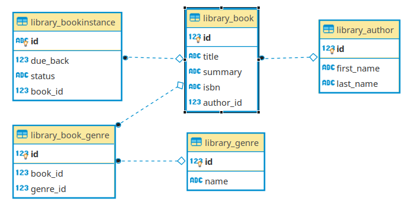

# Rajono biblioteka

Tai bus projektas, kuris bus jums kaip pavyzdys, kaip veikia django sistema. Jame nebūtinai bus viskas labai logiška. Pvz., jeigu tarkime, prireiks kažkokio komponento, kuris projektui nebūtinas, bet mokymosi procesui naudingas, mes jį įterpsime. 

Dizainas nėra šio Django kurso akcentas, todėl kai kurios projekto dalys gali atrodyti grubokai. Svarbu, kad programos valdymas būtų aiškus ir funkcionalus. Sekdami šį, ar darydami savo projektą, turėsite pasirūpinti frontendu pagal savo estetikos supratimą. Projekto eigoje bus panaudotas Bootstrap CSS karkasas.

Projektas bus apie vietinę biblioteką, kurioje bus modeliai knyga, autorius, apžvalga, komentaras, ir pan. Bus vartotojų registracija ir prisijungimai, formos ir kiti web backend'o karkasui būdingi atributai.

Django turi keletą būdų įgyvendinti kai kurias funkcijas, jas visas stengsimės pademonstruoti, tačiau realiam gyvenime turbūt darytumėt kuriuo nors vienu, nuosekliai. 

Taip pat reikėtų suprasti, kad Django yra labai plati tema (apimtis turbūt panaši kaip visos python kalbos), todėl nepamirškite draugų - stackoverflow, dokumentacijos, Copilot ir kitų:) Sėkmės!

Programos schema:



# Modeliai

Duomenų bazės modeliui imsime paprastą bibliotekos pavyzdį, kuris turi visus reliacinius ryšius:

KNYGA:

* Pavadinimas
* Autorius(One2many) ----> Vardas, knygos(ryšys)
* Aprašymas
* ISBN
* Žanras(Many2many) ---> Pavadinimas, knygos(ryšys)

Knyga turės ne tik aukščiau aprašytus teorinius duomenis, bet ir fizinių kopijų statusą atspindinčią lentelę:

* unikalus ID
* statusas (paskolinta, rezervuota, laisva)
* kada galima pasiskolinti (data)
* ryšys su aprašymu

Django turi nuosavą ORM sistemą, kuri skiriasi nuo SQLAlchemy. Savo aplikacijos modelius kursime models.py faile. Pradėkime nuo pačio paprasčiausio - Žanras:

```python
from django.db import models

class Genre(models.Model):
    name = models.CharField(verbose_name="Name", max_length=200)

    def __str__(self):
        return self.name
```
* Importavome modelių paketą
* Sukūrėme klasę *(models.Model)*
* Nurodėme, kad žanro pavadinimas bus iki 200 eilučių string'as, pagalbinį tekstą, kuris matysis administratoriaus svetainėje.
* def __str__ nurodėme, kaip reprezentuosis modelis. 

Pridėkime modelį Author: 
```python
class Author(models.Model):
    first_name = models.CharField(verbose_name="First Name", max_length=100)
    last_name = models.CharField(verbose_name="Last Name", max_length=100)

    def __str__(self):
        return f"{self.first_name} {self.last_name}"
```

Pridėkime knygos modelį:
```python
class Book(models.Model):
    title = models.CharField(verbose_name="Title", max_length=200)
    author = models.ForeignKey(to="Author", verbose_name="Author", on_delete=models.SET_NULL, null=True, blank=True)
    summary = models.TextField(verbose_name="Summary", max_length=1000, help_text='Short Book Description')
    isbn = models.CharField(verbose_name='ISBN', max_length=13)
    genre = models.ManyToManyField(to="Genre", verbose_name="Genres")

    def __str__(self):
        return self.title
```

Modelis iš esmės pats save aprašantis. Į ką reikėtų atkreipti dėmesį:

* author lauko parametruose *on_delete=models.SET_NULL* reiškia, kad ištrynus autorių, knygą neišsitrins, tiesiog vietoje autoriaus bus nustatytas NULL laukas.
* *null=True* - leidžia duomenų bazėje nurodyti *NULL* reikšmę. Plačiau apie parametro naudojimą [čia](https://i.stack.imgur.com/TMMej.png) ir [čia](https://i.stack.imgur.com/gUanA.png).

Sukurkime dar vieną, atskirų knygos kopijų (egzempliorių), modelį:

```python
import uuid

class BookInstance(models.Model):
    uuid = models.UUIDField(verbose_name="UUID", default=uuid.uuid4)
    book = models.ForeignKey(to="Book", verbose_name="Book", on_delete=models.SET_NULL, null=True, blank=True, related_name="instances")
    due_back = models.DateField(verbose_name="Available On", null=True, blank=True)

    LOAN_STATUS = (
        ('d', 'Administered'),
        ('t', 'Taken'),
        ('a', 'Available'),
        ('r', 'Reserved'),
    )

    status = models.CharField(verbose_name="Status", max_length=1, choices=LOAN_STATUS, blank=True, default="d")

    def __str__(self):
        return str(self.uuid)
```

UUIDField generuos unikalų identifikacinį numerį, pvz. 81afcd8c-7544-4c0e-b2df-838c0c8c3446. Meta klasėje nurodėme, kaip rūšiuosime atvejus.

Jau turime keletą duomenų bazės modelių, taip pat django jau susikūrė keletą lentelių vidiniam vartojimui, todėl reikia praleisti migracijas:

```cmd
python manage.py makemigrations
python manage.py migrate
```
Kad programa teisingai fiksuotų laiką, galime nustatyti laiko zoną faile settings.py:
```python
# TIME_ZONE = 'UTC'
TIME_ZONE = "Europe/Vilnius"

# USE_TZ = True
USE_TZ = False
```

# Administratoriaus svetainė

Dabar, kai jau numigravome mūsų ilgai ruoštus duomenų bazės modelius, užregistruokime juos administratoriaus svetainėje. Atsidarykime admin.py ir pridėkime:

```python
from .models import Author, Genre, Book, BookInstance

admin.site.register(Book)
admin.site.register(Author)
admin.site.register(Genre)
admin.site.register(BookInstance)
```

Susikurkime supervartotoją (prisijungimas administratoriui):

```bash
$ python manage.py createsuperuser
Username (leave blank to use 'your_current_linux_user'): admin
Email address: 
Password: 
Password (again): 
This password is too short. It must contain at least 8 characters.
Bypass password validation and create user anyway? [y/N]: y
Superuser created successfully.
```

Prisijunkime prie 127.0.0.1:8000/admin ir susiveskime po keletą objektų!

## Užduotis
Tęsti kurti Django užduotį – [Autoservisas](https://github.com/robotautas/kursas/wiki/Django-u%C5%BEduotis:-Autoservisas):
* Sukurti visus modelius pagal nurodytą programos DB struktūrą
* Admin puslapyje sukurti meniu punktus visiems sukurtiems modeliams
* Susikurti superuser vartotoją, prisijungti ir išbandyti įrašyti visų modelių įrašus
