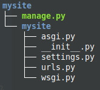
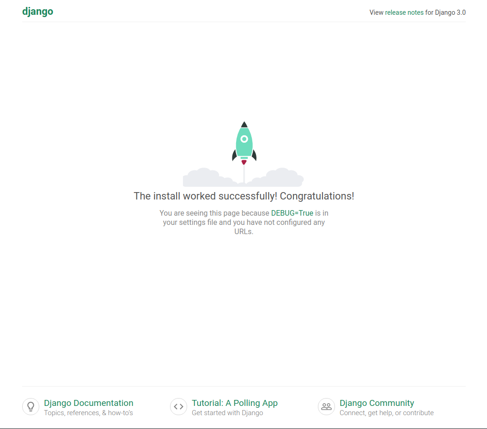
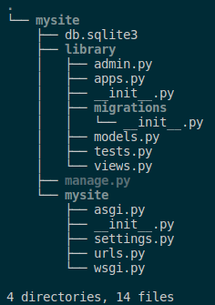
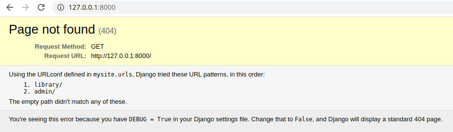
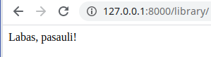
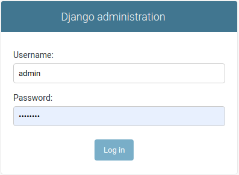

## Įžanga, failų sistema

Django yra internetinių puslapių ir programų framework'as. Pasižymi tokiomis savybėmis:

* Greitis - geba tvarkytis su labai daug užklausų per sekundę.
* Išplečiamumas (scalability) - ateityje savo programai galėsite nesunkiai pridėti papildomo funkcionalumo, kitaip tariant leidžia programai augti.
* Saugumas - orientuotas į saugumą. Jeigu Flask leidžia jums daryti, ką norite, django aplinkoje susidursite su apribojimais, jeigu jūsų sumanymas nesaugus.
* *Batteries included* - django turi praktiškai viską, ko gali prireikti standartinei web aplikacijai. Pvz. administratoriaus svetainę.
* Populiarumas - pats populiariausias Python web kūrimo įrankis. Užstrigus procese, labai tikėtina, kad rasite savo problemos sprendimą internete.
* Puikiai dokumentuotas - dokumentacijas anksčiau ar vėliau teks pradėti skaityti, django atveju tai bus žymiai maloniau, negu kad pvz Odoo :)
* Turbūt pagrindinis - greitas rezultatas (rapid development). Pramokus django, web projektus darysite greitai.

Atkreipkite dėmesį, Django 3.0 palaiko Python 3.6, 3.7, and 3.8 versijas. Django 3 neveiks, jeigu bandysite naudoti su ankstesne už 3.6 python versija. Instaliacija:

```bash
$ pip install django
Collecting django
  Downloading https://files.pythonhosted.org/packages/a9/4f/8a247eee2958529a6a805d38fbacd9764fd566462fa0016aa2a2947ab2a6/Django-3.0.5-py3-none-any.whl (7.5MB)
    100% |████████████████████████████████| 7.5MB 246kB/s 
Collecting asgiref~=3.2 (from django)
  Downloading https://files.pythonhosted.org/packages/68/00/25013f7310a56d17e1ab6fd885d5c1f216b7123b550d295c93f8e29d372a/asgiref-3.2.7-py2.py3-none-any.whl
Collecting pytz (from django)
  Downloading https://files.pythonhosted.org/packages/e7/f9/f0b53f88060247251bf481fa6ea62cd0d25bf1b11a87888e53ce5b7c8ad2/pytz-2019.3-py2.py3-none-any.whl (509kB)
    100% |████████████████████████████████| 512kB 2.5MB/s 
Collecting sqlparse>=0.2.2 (from django)
  Downloading https://files.pythonhosted.org/packages/85/ee/6e821932f413a5c4b76be9c5936e313e4fc626b33f16e027866e1d60f588/sqlparse-0.3.1-py2.py3-none-any.whl (40kB)
    100% |████████████████████████████████| 40kB 6.8MB/s 
Installing collected packages: asgiref, pytz, sqlparse, django
Successfully installed asgiref-3.2.7 django-3.0.5 pytz-2019.3 sqlparse-0.3.1
```

pirmą kartą naudodami django turėsite pasirūpinti pradinio karkaso inicijavimu (initial setup): 

```bash 
$ django-admin startproject mysite
```

konsolėje nieko neįvyko, tačiau atkreipkite dėmesį, kad ten, kur iniciavote komandą, atsirado katalogas mysite. Čia gulės mūsų projektas. Jis turi tokią struktūrą:



* manage.py - pagrindinis komandinės eilutės failas, per jį savo projektui siųsime įvairias komandas susijusias su serverio paleidimu, migracijomis ir t.t.

* asgi.py ir wsgi.py - šie failai bus naudingi talpinant gatavą projektą į linux serverį.

* __init__.py - tuščias failas, kuris nurodo python'ui, kad katalogas /mysite(vidinis) yra modulis, ir su juo reikia elgtis atitinkamai.

* settings.py - pagrindinis projekto nustatymų puslapis.
* urls.py - jame bus surašyti URL adresai (*endpoints*).


Mūsų projektas jau veikia lokaliame vystymo (*development*) serveryje:

```bash
$ python manage.py runserver
Watching for file changes with StatReloader
Performing system checks...

System check identified no issues (0 silenced).

You have 17 unapplied migration(s). Your project may not work properly until you apply the migrations for app(s): admin, auth, contenttypes, sessions.
Run 'python manage.py migrate' to apply them.

April 06, 2020 - 17:50:02
Django version 3.0.5, using settings 'mysite.settings'
Starting development server at http://127.0.0.1:8000/
Quit the server with CONTROL-C.
```

Pirmą kartą panaudojome manage.py! 
Django startinis puslapis atrodo taip:



Vienas iš django trūkumų - palyginti didelė failų struktūra, kurią reikia suprasti ir tvarkingai dėliotis nuo pat projekto pradžios. Jeigu Flask'as leidžia turėti viską viename faile, su django tokie dalykai neišdegs. Šis kompromisas neišvengiamas, norint greitai daryti didelės apimties projektus.

Taigi, vietoje firminės užsklandos norime matyti kažką savo, gražesnio. Susikurkime app'są!

```bash
$ python manage.py startapp library
```

Dabar turime projektą mysite, o jame app'są library. Vienas projektas gali turėti daug app'sų. Failų struktūra dabar atrodo taip:



Kiekvieno failo paskirtį išsiaiškinsime eigoje.

Faile views.py sukurkime tokį įrašą:

```python
from django.http import HttpResponse

def index(request):
    return HttpResponse("Labas, pasauli!")
```


Kataloge /library sukurkime urls.py:

```python
from django.urls import path

from . import views

urlpatterns = [
    path('', views.index, name='index'),
]
```

Taigi, prie standartinio *path* importuojame failą views.py, kurį rašėme prieš tai. Į sąrašą *urlpatterns* dedame iš django.urls importuotą funkciją *path*, kurios parametruose nurodome:

* tuščias kabutes - vadinasi response gausime mūsų app'so reliatyviame adrese (*endpoint'e*) '/'.
* *views.index* - nurodome, kad funkcija, kuri mums grąžins *HttpResponse("Labas, pasauli!")* yra faile *views* ir ji vadinasi *index*.
* *name='index'* - suteikiame pavdinimą šiam adresui. Ateityje tai bus naudinga referuojant į jį iš šablonų (templates).

Sekantis veiksmas yra sureguliuoti, kaip mūsų app'sas atrodys projekto kontekste. Faile urls.py, kuris yra mysite kataloge, įrašykime tai:

```python
from django.contrib import admin
from django.urls import include, path

urlpatterns = [
    path('library/', include('library.urls')),
    path('admin/', admin.site.urls),
]
```

Taip pririšame app'są prie projekto. Projektas mato mūsų aplikaciją *library*,kaip modulį, tą galime nuspėti iš sintaksės. Galime kurti daug aplikacijų, ir pats centrinis modelis, ir jos pačios viena kitą matys kaip modulius. Pamėginkime paleisti serverį dar kartą:

```bash
$ python manage.py runserver
```

Užėję į 127.0.0.1:8000 matome, kad raketa dingo, vietoj jos turime klaidos pranešimą:



Django pranešimai, kuomet settings.py nustatytas *DEBUG = True* yra pakankamai informatyvūs: šią klaidą matome todėl, kad mysites urls.py yra nurodyti tik galiniai adresai *library/* ir *admin/*. Patikrinkim juos:



ir django pasididžiavimas, vienas iš batteries included komponentų, puikioji administratoriaus svetainė:



...apie kurią būtinai kalbėsime ateityje! 

Tam, kad visi ateityje naudojami įrankiai atpažintų mūsų aplikaciją, ją reikia užregistruoti settings.py:

```python
INSTALLED_APPS = [
    'library',
    'django.contrib.admin',
    'django.contrib.auth',
    'django.contrib.contenttypes',
    'django.contrib.sessions',
    'django.contrib.messages',
    'django.contrib.staticfiles',
]
```

Kol kas neturime jokių duomenų bazės modelių, tačiau django jau susikūrė keletą lentelių vidiniam vartojimui, todėl reikia praleisti migracijas:

```bash
$ python manage.py makemigrations
$ python manage.py migrate
```

# Rajono biblioteka

Tai bus projektas, kuris bus jums kaip pavyzdys, kaip veikia django sistema. Jame nebūtinai bus viskas labai logiška. Pvz., jeigu tarkime, prireiks kažkokio komponento, kuris projektui nebūtinas, bet mokymosi procesui naudingas, mes jį įterpsime. 

Dizainas - su django visiškai nesusijusi tema, todėl bus vietų, atrodančių kiek grubokai. Sekdami šį, ar darydami savo projektą, turėsite pasirūpinti frontendu pagal savo estetikos supratimą. Projekto eigoje bus įjungtas paprasčiausias Bootstrap CSS karkasas.

Projektas bus apie vietinę biblioteką, kurioje bus modeliai knyga, autorius, apžvalga, komentaras, ir pan. Bus vartotojų registracija ir prisijungimai, formos ir kiti web backend'o karkasui būdingi atributai.

Django turi keletą būdų įgyvendinti kai kurias funkcijas, jas visas stengsimės pademonstruoti, tačiau realiam gyvenime turbūt darytumėt kuriuo nors vienu, nuosekliai. 

Siekiant išvengti painumo, gatavas kodas Github repozitorijoje perskeltas pusiau - iki 6 paskaitos ir nuo jos, kadangi eigoje stipriai keisis modeliai ir kiti komponentai iš visiškai paprastų į kiek sudėtingesnius.

Taip pat reikėtų suprasti, kad Django yra labai plati tema (apimtis turbūt panaši kaip visos python kalbos), todėl nepamirškite draugų - stackoverflow, dokumentacijos ir kitų:) Sėkmės!

# Modeliai

Duomenų bazės modeliui imsime paprastą bibliotekos pavyzdį, kuris turi visus reliacinius ryšius:

KNYGA:

* Pavadinimas
* Autorius(One2many) ----> Vardas, knygos(ryšys)
* Aprašymas
* ISBN
* Žanras(Many2many) ---> Pavadinimas, knygos(ryšys)

Knyga turės ne tik aukščiau aprašytus teorinius duomenis, bet ir fizinių kopijų statusą atspindinčią lentelę:

* unikalus ID
* statusas (paskolinta, rezervuota, laisva)
* kada galima pasiskolinti (data)
* ryšys su aprašymu

Django turi nuosavą ORM sistemą, kuri skiriasi nuo SQLAlchemy. Savo aplikacijos modelius kursime models.py faile. Pradėkime nuo pačio paprasčiausio - Žanras:

```python
from django.db import models

class Genre(models.Model):
    name = models.CharField(verbose_name="Pavadinimas", max_length=200, help_text='Įveskite knygos žanrą (pvz. detektyvas)')
    
    def __str__(self):
        return self.name
```
* Importavome modelių paketą
* Sukūrėme klasę *(models.Model)*
* Nurodėme, kad žanro pavadinimas bus iki 200 eilučių string'as, pagalbinį tekstą, kuris matysis administratoriaus svetainėje.
* def __str__ nurodėme, kaip reprezentuosis modelis. 

pridėkime knygos modelį:
```python
from django.urls import reverse #Papildome imports

class Book(models.Model):
    """Modelis reprezentuoja knygą (bet ne specifinę knygos kopiją)"""
    title = models.CharField(verbose_name="Pavadinimas", max_length=200)
    author = models.ForeignKey(to="Author", verbose_name="Autorius", on_delete=models.SET_NULL, null=True, blank=True, related_name='books')
    summary = models.TextField(verbose_name="Aprašymas", max_length=1000, help_text='Trumpas knygos aprašymas')
    isbn = models.CharField(verbose_name="ISBN", max_length=13, help_text='13 Simbolių <a href="https://www.isbn-international.org/content/what-isbn">ISBN kodas</a>')
    genre = models.ManyToManyField(to="Genre", verbose_name="Žanrai", help_text='Išrinkite žanrą(us) šiai knygai')

    def __str__(self):
        return self.title
```

Modelis iš esmės pats save aprašantis. Į ką reikėtų atkreipti dėmesį:

* author lauko parametruose *on_delete=models.SET_NULL* reiškia, kad ištrynus autorių, knygą neišsitrins, tiesiog vietoje autoriaus bus nustatytas NULL laukas.
* *null=True* - leidžia duomenų bazėje nurodyti *NULL* reikšmę. Plačiau apie parametro naudojimą [čia](https://i.stack.imgur.com/TMMej.png) ir [čia](https://i.stack.imgur.com/gUanA.png).

Sukurkime dar vieną modelį:

```python
import uuid

class BookInstance(models.Model):
    """Modelis, aprašantis konkrečios knygos kopijos būseną"""
    uuid = models.UUIDField(default=uuid.uuid4, help_text='Unikalus ID knygos kopijai')
    book = models.ForeignKey('Book', on_delete=models.SET_NULL, null=True, related_name="instances") 
    due_back = models.DateField('Bus prieinama', null=True, blank=True)

    LOAN_STATUS = (
        ('a', 'Administruojama'),
        ('p', 'Paimta'),
        ('g', 'Galima paimti'),
        ('r', 'Rezervuota'),
    )

    status = models.CharField(max_length=1, choices=LOAN_STATUS, blank=True, default="a", help_text='Statusas')

    class Meta:
        ordering = ['due_back']

    def __str__(self):
        return f'{self.id} ({self.book.title})'
```

UUIDField generuos unikalų identifikacinį numerį, pvz. 81afcd8c-7544-4c0e-b2df-838c0c8c3446. Meta klasėje nurodėme, kaip rūšiuosime atvejus.

Pridėkime modelį Author: 

```python
class Author(models.Model):
    """Model representing an author."""
    first_name = models.CharField(verbose_name='Vardas', max_length=100)
    last_name = models.CharField(verbose_name='Pavardė', max_length=100)

    class Meta:
        ordering = ['last_name', 'first_name']

    def __str__(self):
        """String for representing the Model object."""
        return f'{self.last_name} {self.first_name}'
```

Modeliai paruošti, dabar paleisime migracijas.

```bash
$ python manage.py makemigrations
Migrations for 'library':
  library/migrations/0001_initial.py
    - Create model Author
    - Create model Book
    - Create model Genre
    - Create model BookInstance
    - Add field genre to book
```

```bash
$ python manage.py migrate
Operations to perform:
  Apply all migrations: admin, auth, contenttypes, library, sessions
Running migrations:
  Applying library.0001_initial... OK
```

gavome štai tokią schemą:


# Administratoriaus svetainė

Dabar, kai jau numigravome mūsų ilgai ruoštus duomenų bazės modelius, užregistruokime juos administratoriaus svetainėje. Atsidarykime admin.py ir pridėkime:

```python
from .models import Author, Genre, Book, BookInstance

admin.site.register(Book)
admin.site.register(Author)
admin.site.register(Genre)
admin.site.register(BookInstance)
```

Susikurkime supervartotoją (prisijungimas administratoriui):

```bash
$ python manage.py createsuperuser
Username (leave blank to use 'your_current_linux_user'): admin
Email address: 
Password: 
Password (again): 
This password is too short. It must contain at least 8 characters.
Bypass password validation and create user anyway? [y/N]: y
Superuser created successfully.
```

Prisijunkime prie 127.0.0.1:8000/admin ir susiveskime po keletą objektų!

## Užduotis
Pradėti kurti Django užduotį – [Autoservisas](https://github.com/robotautas/kursas/wiki/Django-u%C5%BEduotis:-Autoservisas):
* Sukurti naują Django projektą su appsu autoservice
* Sukurti visus modelius pagal nurodytą programos DB struktūrą
* Admin puslapyje sukurti meniu punktus visiems sukurtiems modeliams
* Susikurti superuser vartotoją, prisijungti ir išbandyti įrašyti visų modelių įrašus
