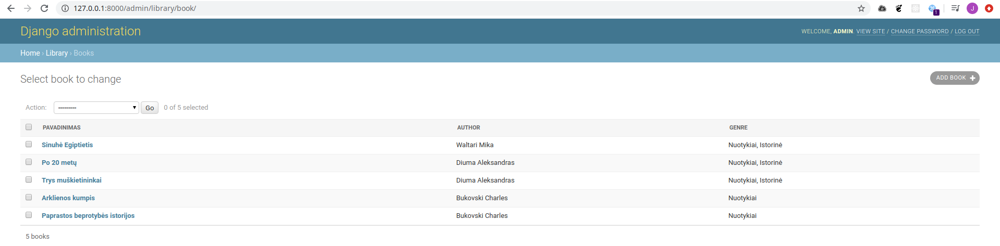
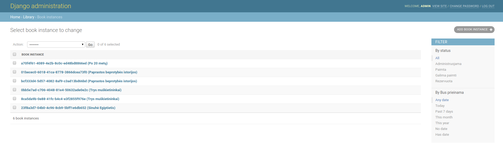
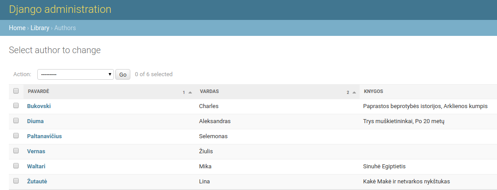

# Administratoriaus svetainė

Praeitoje paskaitoje tik susipažinome su administratoriaus svetaine, su standartiniais nustatymais. Dabar susipažinsime su galimybėmis labiau pritaikyti ją saviems poreikiams. 

Pakeiskime modelių pavadinimus administratoriaus svetainėje
Faile *models.py*, modelio klasės apačioje, sukurkime Meta klasę ir įrašykite, kaip norime norimus pavadinimas vienaskaitoje ir daugiskaitoje, pvz.:

```python
class Genre(models.Model):
    name = models.CharField('Pavadinimas', max_length=200, help_text='Įveskite knygos žanrą (pvz. detektyvas)')

    def __str__(self):
        return self.name

    class Meta:
        verbose_name = 'Žanras'
        verbose_name_plural = 'Žanrai'
```

Pakeiskime modelio Book vaizdavimą administratoriaus svetainėje, kad būtų informatyvesnis:
*admin.py:*

```python
from django.contrib import admin
from .models import Author, Genre, Book, BookInstance

class BookAdmin(admin.ModelAdmin):
    list_display = ('title', 'author', 'display_genre')

admin.site.register(Book, BookAdmin) 
admin.site.register(Author)
admin.site.register(Genre)
admin.site.register(BookInstance)
```

mėginame perdaryti, kad matytumėm daugiau informacijos knygų aprašymo lentelėje. *title, author* laukai yra aiškūs. Taip pat norėtumėm matyti ir žanrą, tačiau django neleis taip pat paprastai jo įtraukti, nes gausis "database heavy" operacija. Taip yra su many2many laukais. Apribojimą galime apeiti šiek tiek pakoreguojant patį modelį Book - jame pridėkime šias eilutes:

```python
        def display_genre(self):
            return ', '.join(genre.name for genre in self.genre.all()[:3])

        display_genre.short_description = 'Žanras'
```

makemigrations, migrate. Dabar turėtume matyti panašų vaizdą:


Sukurkime klasę ir BookInstance modeliui:

```python
class BookAdmin(admin.ModelAdmin):
    list_display = ('title', 'author', 'display_genre')


class BookInstanceAdmin(admin.ModelAdmin):
    list_display = ('book', 'status', 'due_back')
    list_filter = ('status', 'due_back')

    fieldsets = (
        ('General', {'fields': ('id', 'book')}),
        ('Availability', {'fields': ('status', 'due_back')}),
    )
```

Šį kartą sukūrėme filtrus:



Taip pat pakoregavome vaizdavimą atskiruose atvejuose:


dabar knygų modelį papildykime taip, kad atsidarę knygos aprašymus matytumėm visus egzempliorius su jų statusu. Reikalingos tokios korekcijos:

```python
class BooksInstanceInline(admin.TabularInline):
    model = BookInstance
    extra = 0 # išjungia papildomas tuščias eilutes įvedimui

class BookAdmin(admin.ModelAdmin):
    list_display = ('title', 'author', 'display_genre')
    inlines = [BooksInstanceInline]
```

Rezultatas:


Jei nenorite, kad knygų modelyje leistų ištrinti ar redaguoti egzempliorius, galime papildyti BooksInstanceInline klasę:

```python
class BooksInstanceInline(admin.TabularInline):
    model = BookInstance
    readonly_fields = ('id',)
    can_delete = False
    extra = 0
```

Taip pat norėtųsi, kad autorių sąraše matytųsi, kokias kokias jo knygas biblioteka turi. Panašiai darėme su žanrais, tačiau one2many atveju operacija šiek tiek skirsis. Tam pirmiausia pakoreguosime patį Author modelį:

```python
    def display_books(self):
        return ', '.join(book.title for book in self.books.all()[:3])

    display_books.short_description = 'Knygos'
```

Modelyje *Books* prie lauko *author*, parametruose reikia įrašyti:

```python
author = models.ForeignKey('Author', on_delete=models.SET_NULL, null=True, related_name='books')
```

tokiu būdu sukūrėme ryšį, leidžiantį iš objekto author gauti knygų sąrašą. *related_name='books'* leido mums prašyti autoriaus knygų per *self.**books**.all()[:3]*.

admin.py reikia sukurti naują klasę:

```python
class AuthorAdmin(admin.ModelAdmin):
    list_display = ('last_name', 'first_name', 'display_books')
```

ir nepamiršti ją užregistruoti:

```python
admin.site.register(Author, AuthorAdmin)
```

Mūsų autorių sąrašas dabar atrodo taip:



kai bibliotekoje prisikaups daugybė knygų, administratoriui bus pravartu turėti paiešką. Tai nesudėtingai įgyvendinama pridedant tokią eilutę (prie modelio BookInstanceAdmin):

```python
search_fields = ('id', 'book__title')
```

atkreipkite dėmesį, kaip reikia nurodyti paieškomą lauką, kai tas laukas yra reliacinis. Dabar turime veikiančią paiešką:


Reliacinio paieškos lauko pavyzdys:

```python
search_fields = ['foreign_key__related_fieldname']
```

Jei norime, kad pačiame knygų egzempliorių sąraše galima būtų redaguoti stulpelius (kaip iliustracijoje aukščiau), prirašykite papildomą parametrą list_editable (ir nurodykite redaguotinus laukus) į klasę BookAdmin faile *admin.py:* 

```python
class BookInstanceAdmin(admin.ModelAdmin):
    list_display = ('book', 'due_back', 'id', 'status')
    list_editable = ('due_back', 'status')
    list_filter = ('status', 'due_back')
    search_fields = ('id', 'book__title')
```

 ## Užduotis
Tęsti kurti Django užduotį – [Autoservisas](https://github.com/robotautas/kursas/wiki/Django-u%C5%BEduotis:-Autoservisas):
* Padaryti, kad modelių pavadinimai būtų atvaizduojami teisingai (vienaskaita ir daugiskaita)
* Padaryti, kad užsakymo sąraše būtų matomi automobilio ir datos stulpeliai
* Padaryti, kad užsakymo formoje būtų matomos ir užsakymo eilutės (į jas galima būtų įrašyti informaciją)
* Padaryti, kad automobilių sąraše būtų matomi kliento, automobilio, valstybinio numerio ir VIN numerio stulpeliai
* Padaryti, kad Paslaugų sąraše būtų matomi paslaugos pavadinimų ir kainų stulpeliai
* Į Automobilių sąrašą įdėti filtrą pagal klientą ir automobilio modelį*
* Į Automobilių sąrašą įdėti paiešką pagal valstybinį numerį ir VIN kodą


[Atsakymas](https://github.com/DonatasNoreika/autoservisas)

