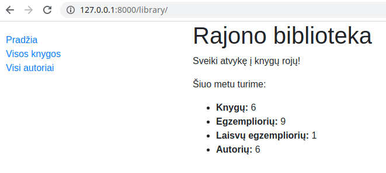

# Šablonai

Django (kaip ir Flask) naudoja Jinja 2 šablonų kūrimo kalbą. Visas django puslapių veikimo mechanizmas atsispindi šiame paveikslėlyje:


Šioje paskaitoje susidėliosime savo modelį į svetainę. Pradėkime nuo index funkcijos perdarymo views.py:

```python
from django.shortcuts import render
from django.http import HttpResponse
from library.models import Book, Author, BookInstance, Genre

def index(request):
    
    # Suskaičiuokime keletą pagrindinių objektų
    num_books = Book.objects.all().count()
    num_instances = BookInstance.objects.all().count()
    
    # Laisvos knygos (tos, kurios turi statusą 'g')
    num_instances_available = BookInstance.objects.filter(status__exact='g').count()
    
    # Kiek yra autorių    
    num_authors = Author.objects.count()
    
    # perduodame informaciją į šabloną žodyno pavidale:
    context = {
        'num_books': num_books,
        'num_instances': num_instances,
        'num_instances_available': num_instances_available,
        'num_authors': num_authors,
    }

    # renderiname index.html, su duomenimis kintamąjame context
    return render(request, 'index.html', context=context)
```

Trumpus paaiškinimus rasite komentaruose. 

Dabar reikia pasirašyti šabloną *base.html*, kurį naudosime dar daug kartų, jis saugos kiekviename šablone atsikartojančius komponentus, tokius kaip navigacijos skydelis, footer'is ir pan.:

```html
<!DOCTYPE html>
<html lang="en">
<head>
  <title>Local Library</title>
  <meta charset="utf-8">
  <meta name="viewport" content="width=device-width, initial-scale=1">
  <link rel="stylesheet" href="https://stackpath.bootstrapcdn.com/bootstrap/4.1.3/css/bootstrap.min.css" integrity="sha384-MCw98/SFnGE8fJT3GXwEOngsV7Zt27NXFoaoApmYm81iuXoPkFOJwJ8ERdknLPMO" crossorigin="anonymous">
  <!-- Add additional CSS in static file -->
  
  <link rel="stylesheet" href="">
</head>
<body>
  <div class="container-fluid">
    <div class="row">
      <div class="col-sm-2">
      
        <ul class="sidebar-nav">
          <li><a href="">Pradžia</a></li>
          <li><a href="">Visos knygos</a></li>
          <li><a href="">Visi autoriai</a></li>
        </ul>
     
      </div>
      <div class="col-sm-10 "></div>
    </div>
  </div>
</body>
</html>
```

Kol kas palikime taip, eigoje kažkiek keisime. Atkreipkite dėmesį į 5 eilutę nuo apačios. Joje yra *div* blokas, kuriame talpinsis visa likusi mūsų aplikacijos logika. Pradėkime nuo index.html:

```html



  <h1>Rajono biblioteka</h1>
  <p>Sveiki atvykę į knygų rojų!</p>
  <p>Šiuo metu turime:</p>
  <ul>
    <li><strong>Knygų:</strong> {{ num_books }}</li>
    <li><strong>Egzempliorių:</strong> {{ num_instances }}</li>
    <li><strong>Laisvų egzempliorių:</strong> {{ num_instances_available }}</li>
    <li><strong>Autorių:</strong> {{ num_authors }}</li>
  </ul>

```

Taip veikia Jinja2 šablonų paveldėjimo mechanizmas. 

* ** - nurodome, kad šį turinį talpinsime į base.html 'apvalkalą'.
* * ir * - rodo, kur bus mūsų 'įterpinio' pradžia ir pabaiga.

Taip pat settings.py reikia nurodyti, kur bus mūsų templates katalogas:

```python
TEMPLATES = [
    {
        'BACKEND': 'django.template.backends.django.DjangoTemplates',
        'DIRS': [os.path.join(BASE_DIR, 'templates'),],
        'APP_DIRS': True,
        'OPTIONS': {
            'context_processors': [
                'django.template.context_processors.debug',
                'django.template.context_processors.request',
                'django.contrib.auth.context_processors.auth',
                'django.contrib.messages.context_processors.messages',
            ],
        },
    },
]
```

Dar vienas dalykas, kurio reikia nepamiršti - statinių failų susiejimas su programa. Sukurkime */library/static/css/styles.css*:

```css
.sidebar-nav {
    margin-top: 20px;
    padding: 0;
    list-style: none;
}
```

*/mysite/urls.py* perrašykime sekančiai:

```python
from django.contrib import admin
from django.urls import include, path
from django.conf import settings
from django.conf.urls.static import static

urlpatterns = [
    path('library/', include('library.urls')),
    path('admin/', admin.site.urls),
] + static(settings.STATIC_URL, document_root=settings.STATIC_ROOT)
```

Galbūt atkreipėte dėmesį, *base.html* buvo tokios eilutės:

```html

  <link rel="stylesheet" href="">
```

ir dar, settings.py, pati paskutinė eilutė yra *STATIC_URL = '/static/'*. Pabandykite logiškai susieti šiuos 4 epizodus :) 

Taip Django nurodoma, kur ieškoti statinių failų. Galėsite ant Bootstrap ar kito CSS karkaso viršaus darašinėti savo stiliaus korekcijas. Static, apima ne tik CSS, tačiau ir JS skriptus, paveikslėlius. Pastaruosius aptarsime vėlesnėje eigoje. 

Štai taip dabar atrodo mūsų aplikacija:



Šiuo metu mūsų veikiančio puslapio URL adresas yra *127.0.0.1:8000/library*. Jeigu neketiname prie to paties projekto rišti daugiau aplikacijų, galime padaryti nukreipimą iš */library* į /. Tam dar kartą atsidarysime /mysite/urls.py ir perrašysime taip:

```python
from django.contrib import admin
from django.# Užduotis

views.generic import RedirectView


urlpatterns = [
    path('library/', include('library.urls')),
    path('admin/', admin.site.urls),
    path('', RedirectView.as_view(url='library/', permanent=True)),
] + static(settings.STATIC_URL, document_root=settings.STATIC_ROOT)
```

