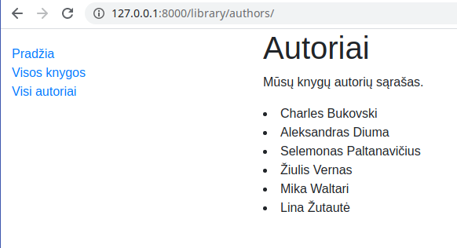
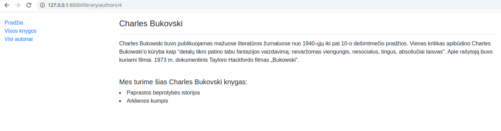
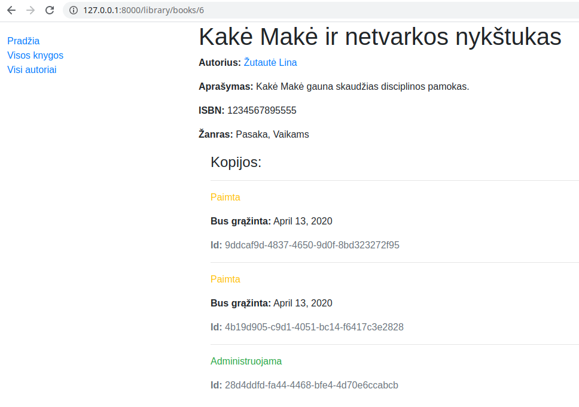

# Views

Toliau dirbsime su views. Django turi du views įgyvendinimo mechanizmus, vienas iš jų yra *function based*, kitas - *class based views*. Plačiau apie privalumus ir trūkumus ir kodėl apskritai taip yra, jeigu įdomu, pasiskaitykite [čia](https://simpleisbetterthancomplex.com/article/2017/03/21/class-based-views-vs-function-based-views.html), arba django dokumentacijoje. Mūsų pavyzdys leidžia pademonstruoti abu būdus, tad tą ir padarysime. Pradėsime nuo intuityvesnio, function based.

Atsidarykime *views.py* ir sukurkime funkciją autorių sąrašui:

```python
from .models import Author

def authors(request):
    
    authors = Author.objects.all()
    context = {
        'authors': authors
    }
    print(authors)
    return render(request, template_name='authors.html', context=context)
```

papildykime */library/urls.py*:

```python
urlpatterns = [
    path('', views.index, name='index'),
    path('authors/', views.authors, name='authors'),
]
```

Sukurkime šabloną authors.html:

```html


Autoriai


<h1>Autoriai</h1>
<p>Mūsų knygų autorių sąrašas.</p>

<p>{{author.first_name}} {{author.last_name}}</p>


```

Tiesiog banaliai išvardinome autorius, rezultatas atrodo štai taip:



Sekantis logiškas žingsnis būtų, kad paspaudus ant autoriaus vardo-pavardės mus nuvestų į jo aprašymą. Kadangi mūsų autoriai turi labai mažai laukų, kad jų anketos nebūtų labai nykios, sukurkime jiems tekstinį lauką 'description', ir praleiskime migracijas. 

```python
    description = models.TextField(verbose_name="Description", max_length=3000, default="")
```

Sukuriame funkciją *author* faile *views.py*:

```python
from django.shortcuts import render
from .models import Author

def author(request, author_id):
    author = Author.objects.get(pk=author_id)
    return render(request, template_name='author.html', context={'author': author})
```
* importuojame funkciją, kuri pagal nurodytą *primary key* traukia konkretų objektą iš modelio *Author*.
* funkcijos parametruose įrašome *author_id*. Jį funkcija pasigaus iš naršyklės, priklausomai, ant kurio autoriaus paspausite.

Po to reikia sukurti dinaminį URL maršrutą pavieniams autoriams. Įterpkime eilutę į urlpatterns sąrašą faile /library/urls.py:
```python
    path('authors/<int:author_id>', views.author, name='author'),
```

Pakoreguokime *authors.html* taip, kad kiekvienas autorius būtų nuoroda į savo paties aprašymą:
```html

<p><a href="">{{author.first_name}} {{author.last_name}}</a></p>

```

* ** - suformuoja galinį adresą nuorodai į autoriaus aprašymą, pvz /author/3

belieka sukurti *author.html*:

```html


Autorius


<p><strong>Vardas: </strong>{{ author.first_name }}</p>
<p><strong>Pavardė: </strong>{{ author.last_name }}</p>
<hr>
<p><strong>Jo knygos:</strong></p>

<p>{{ book.title }}</p>


```

Turime tokį rezultatą:



# Class Based Views

Dabar išdėliokite knygas views'uose per klases. 
Pirmiausiai papildykime urlpatterns sąrašą:

```python
  path('books/', views.BookListView.as_view(), name='books'),
```

Sukurkime klasę views.py:

```python
from django.views import generic

class BookListView(generic.ListView):
    model = Book
    template_name = "books.html"
    context_object_name = "books"
```

...ir books.html:

```html


Knygos


  <h1>Mūsų knygos:</h1>
  
  <ul>
    
      <li>
        <a href="{{ book.id }}">{{ book.title }}</a> ({{ book.author }})
      </li>
    
  </ul>
  
    <p>Bibliotekoje knygų nėra.</p>
  

```

Atrodo ganėtinai paprasta ir mažiau kodo. Viską sugeneruoja automatiškai, pagal tam tikras taisykles. Tačiau, jei prireiktų nestandartinių dalykų, tektų pakeitimus nurodyti klasės atributuose.

Jei, tarkime, į kontekstą prireiktų pridėti kintamąjį, nesusijusį su pačiu modeliu, galėtume daryti taip:

```python
class BookListView(generic.ListView):
    model = Book

    def get_context_data(self, **kwargs):
        context = super(BookListView, self).get_context_data(**kwargs)
        context['duomenys'] = 'eilutė iš lempos'
        return context
```

Taigi, views'ai per klases yra šiek tiek greičiau rašomi (kai gerai žinote, ką rašyti), tačiau mažiau intuityvūs, nepanašūs į kitų web karkasų metodus. Jeigu modelis turi potencialą darytis sudėtingas, ateityje gali kilti sunkumų, todėl mėgstantiems tiesiog rezultatą, būtų pasiūlymas - iš pradžių CVB view'sų privengti.  

Dabar sukursime klasę pavienių knygų aprašymams:

```python
class BookDetailView(generic.DetailView):
    model = Book
    template_name = "book.html"
    context_object_name = "book"
```

Papildykime urlpatterns sąrašą (urls.py):
```python
path('books/<int:pk>', views.BookDetailView.as_view(), name='book'),
```

...ir book.html:

```html


Knyga


<p><strong>Pavadinimas: </strong>{{ book.title }}</p>
<p><strong>Autorius: </strong>{{ book.author }}</p>
<p><strong>ISBN: </strong>{{ book.isbn }}</p>
<p><strong>Žanras (-ai): </strong>{{ book.display_genre }}</p>
<p>{{ book.summary }}</p>
  <h2>Kopijos:</h2>
    
    
    <hr>
<p class="text-successtext-dangertext-warning"><strong>{{ copy.get_status_display }}</strong></p>
    
    <p><strong>Bus gražinta: </strong>{{ copy.due_back }}</p>
    
    <small class="text-muted"><strong>ID: </strong>{{ copy.uuid }}</small>
    
    
    <p>Šios knygos kopijų neturime</p>
    

```
Rezultatas:



Paskutinis dalykas - tai nesujinginėta navigacija. Sutvarkykime base.html:

```html
<nav class="navbar navbar-expand-sm bg-dark navbar-dark">
    <div class="container-fluid">
        <ul class="navbar-nav">
            <li class="nav-item">
                <a class="nav-link active" href="">HOME</a>
            </li>
            <li class="nav-item">
                <a class="nav-link active" href="">Autoriai</a>
            </li>
            <li class="nav-item">
                <a class="nav-link active" href="">Knygos</a>
            </li>
        </ul>
    </div>
</nav>
```

 ## Užduotis
Tęsti kurti Django užduotį – [Autoservisas](https://github.com/robotautas/kursas/wiki/Django-u%C5%BEduotis:-Autoservisas):
* Sukurti puslapį (per funkciją views faile), pvz. autoservice/automobiliai, kuriame būtų atvaizduoti visi servise užregistruoti automobiliai. 
* Paspaudus ant automobilio nuorodos, būtų rodoma detali informacija apie automobilį (savininkas, automobilio modelis, valstybinis numeris, VIN kodas)
* Sukurti puslapį (per klasę views faile), pvz. autoservice/uzsakymai, kuriame būtų atvaizduoti visi serviso užsakymai.
* Paspaudus ant užsakymo nuorodos, būtų rodoma detali informacija apie užsakymą. Čia pat būtų matoma ir užsakymo eilučių informacija.
* Sutvarkyti meniu (sudėti aktyvias nuorodas į sukurtus view'sus)
* PAPILDOMAI: padaryti, kad prie užsakymo eilutės būtų rodoma jos suma. O prie užsakymo - bendra užsakymo suma.

[Atsakymas](https://github.com/DonatasNoreika/autoservisas)
