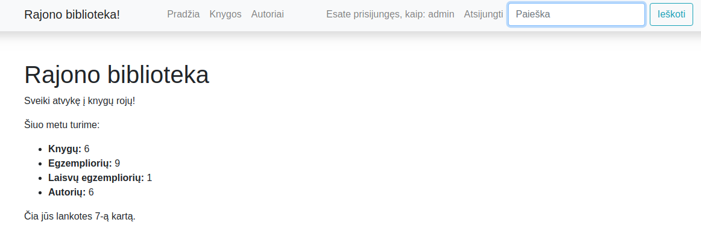
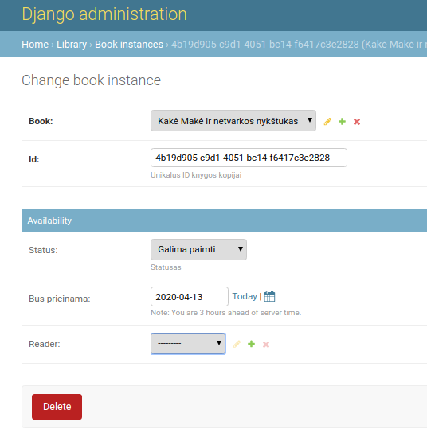
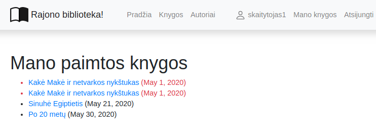
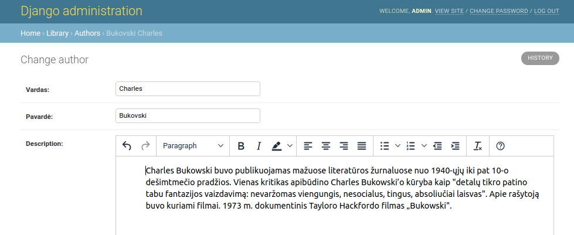
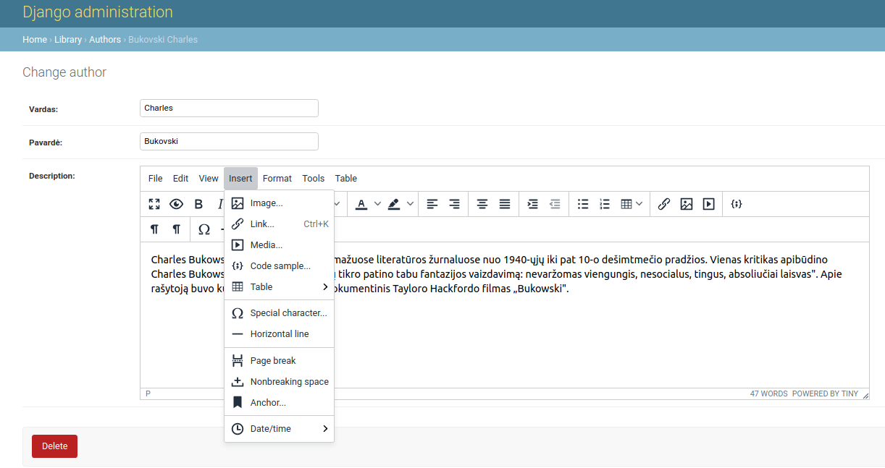
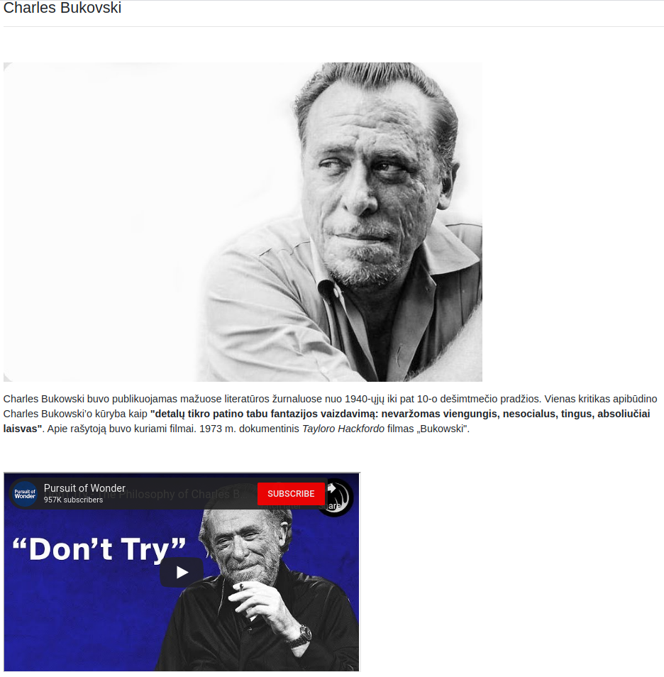

# Vartotojai - autorizuotas turinys

Pagrindinis dinaminių tinklalapių požymis - jų gebėjimas bendrauti su kiekvienu vartotoju atskirai, pateikiant jam aktualų turinį. Mūsų atveju, tinklalapio vartotojai bus bibliotekos skaitytojai. Iš pradžių pertvarkykime *base.html* taip, kad vartotojas matytų, ar jis yra prisijungęs:

```html
        <ul class="navbar-nav ml-auto">
          
            <li class="nav-item"><a class="nav-link" href="#">Esate prisijungęs, kaip: {{ user.get_username }}</a></li>
            <li class="nav-item"><a class="nav-link" href="?next={{request.path}}">Atsijungti</a></li>   
          
            <li class="nav-item"><a class="nav-link" href="?next={{request.path}}">Prisijungti</a></li>   
          
        </ul>
```



jeigu paeksperimentuotumėte su atskirų vartotojų prisijungimais, atsijungimais, pastebėtumėte, kad apsilankymų skaitliukas kinta, priklausomai nuo to, koks vartotojas prisijungęs. 

pamėginkime pertvarkyti *BookInstance* modelį taip, kad kiekviena paimta kopija būtų priskirta tam tikram vartotojui. Pirmiausiai, į *models.py** importuokime *User* klasę, bei *datetime* biblioteką.

```python
from django.contrib.auth.models import User
from datetime import date
```

tuomet papildykime klasę *BookInstance* skaitytoju:

```python
reader = models.ForeignKey(User, on_delete=models.SET_NULL, null=True, blank=True)
```

toje pačioje klasėje pridėkime *@property* dekoratorių. Jo paskirtį išsiaiškinsime kiek vėliau:

```python
def is_overdue(self):
    if self.due_back and date.today() > self.due_back:
        return True
    return False
```

...ir viską numigruokime.

Skaitytojo laukelį integruokime ir į administratoriaus svetainę:

```python
class BookInstanceAdmin(admin.ModelAdmin):
    
    list_display = ('book', 'status', 'reader', 'due_back', 'id')
    list_editable = ('status', 'due_back')
    list_filter = ('status', 'due_back')
    search_fields = ('id', 'book__title')

    
    fieldsets = (
        (None, {
            'fields': ('book', 'id')
        }),
        ('Availability', {
            'fields': ('status', 'due_back', 'reader')
        }),
    )
```

Rezultatas atrodys taip:



Dabar administratorius gali 'išrašinėti' skaitytojams knygas, ta proga paskolinkime skaitytojams keletą egzempliorių.


Dabar pats metas sukurti *view*'są, kuriame prisijungęs vartotojas matys savo paimtas knygas.

views.py:
```python
from django.contrib.auth.mixins import LoginRequiredMixin

class LoanedBooksByUserListView(LoginRequiredMixin,generic.ListView):
    model = BookInstance
    template_name ='user_books.html'
    paginate_by = 10
    
    def get_queryset(self):
        return BookInstance.objects.filter(reader=self.request.user).filter(status__exact='p').order_by('due_back')
```

šiek tiek paaiškinimų:

* importuojame *LoginRequiredMixin*, ir keliame jį į klasės parametrus. Jis django nurodo, kad *view'*sas bus prieinamas tik prisiregistravusiam vartotojui. Jei naudotumėm funkcinį *view*'są, prieš jį dėtumėm dekoratorių *@login_required*.

* *override*'inam *get_queryset* funkciją ir nurodome, kad *Bookinstance* modelį filtruosime pagal prisiregistravusį skaitytoją, pagal statusą 'p'(paimta), ir išrūšiuosime pagal *due_back* lauką.

užregistruokime *view*'są *urls.py*:

```python
path('mybooks/', views.LoanedBooksByUserListView.as_view(), name='my-borrowed')
```

Reikės šablono:

```html



    <h1>Mano paimtos knygos</h1>

    
    <ul>

       
      <li class="text-danger">
        <a href="">{{bookinst.book.title}}</a> ({{ bookinst.due_back }})        
      </li>
      
    </ul>

    
      <p>Šiuo metu iš mūsų nesate paėmę knygų.</p>
           

```

Čia matome, kaip praktikoje veikia mūsų anksčiau sukurtas metodas *is_overdue*. Jis leidžia tikrinti, ar vėluojame grąžinti knygą. Jeigu vėluojame - knyga tekste bus žymima raudonu tekstu. 

Belieka tik įdėti nuorodą į aukščiau sukurtą šabloną faile *base.html* (taip pat prie prisijungusio skaitytojo pridėjome ikonėlę, kad navigacijos meniu viskas tilptų):

```html
          
            <li class="nav-item"><a class="nav-link" href="#">
              <svg class="bi bi-person" width="1.5em" height="1.5em" viewBox="0 0 16 16" fill="currentColor" xmlns="http://www.w3.org/2000/svg">
                <path fill-rule="evenodd" d="M13 14s1 0 1-1-1-4-6-4-6 3-6 4 1 1 1 1h10zm-9.995-.944v-.002.002zM3.022 13h9.956a.274.274 0 00.014-.002l.008-.002c-.001-.246-.154-.986-.832-1.664C11.516 10.68 10.289 10 8 10c-2.29 0-3.516.68-4.168 1.332-.678.678-.83 1.418-.832 1.664a1.05 1.05 0 00.022.004zm9.974.056v-.002.002zM8 7a2 2 0 100-4 2 2 0 000 4zm3-2a3 3 0 11-6 0 3 3 0 016 0z" clip-rule="evenodd"/>
              </svg>
            {{ user.get_username }}</a></li>
            <li class="nav-item"><a class="nav-link" href="">Mano knygos</a></li>
            <li class="nav-item"><a class="nav-link" href="?next=/library">Atsijungti</a></li>   
          
            <li class="nav-item"><a class="nav-link" href="?next={{request.path}}">Prisijungti</a></li>   
          
```

rezultatas:



## Kaip išvengti klaidos "Can't compare naive and aware"?

Kai @property metode lyginame datas su laiku (ne tik datas), galime gauti šią ar panašią klaidą "Can't compare naive and aware datetime.now() <= challenge.datetime_end". Ją galima išspręsti taip:

```python
import pytz
utc=pytz.UTC

    @property
    def praejes_terminas(self):
        if self.grazinimo_laikas and datetime.today().replace(tzinfo=utc) > self.grazinimo_laikas.replace(tzinfo=utc):
            return True
        return False
```

Daugiau sprendimo variantų rasite čia:

https://stackoverflow.com/questions/15307623/cant-compare-naive-and-aware-datetime-now-challenge-datetime-end

# HTML laukai modeliuose

Tokios platformos, kaip django, atrodytų turi viską, ko gali panorėti programuotojas, bet pralaimi elementariam wordpress'ui, kai reikia pasigaminti paprasčiausią blogą, nes negalime prigaminti straipsnių, taip, kad viename paveikslėliai būtų trys ir būtent tose vietose, kur norime, o kitame galbūt nebūtų nei vieno. O kitame galbūt video kaip nors įterptas. Kaip turėtų atrodyti mūsų straipsnio modelis? 

Čia į pagalbą mums ateina trečių šalių paketai. Vienas iš tokių yra TinyMCE. Išbandykime:

```bash
pip install django-tinymce
```

settings.py faile, prie instaliuotų programų sąrašo pridėkime:

```python
INSTALLED_APPS = (
    ...
    'tinymce',
)
```

 mysite\/urls.py papildykime:

 ```python
 urlpatterns = [
    path('library/', include('library.urls')),
    path('admin/', admin.site.urls),
    path('', RedirectView.as_view(url='library/', permanent=True)),
    path('accounts/', include('django.contrib.auth.urls')),
    path('tinymce/', include('tinymce.urls')),
] + (static(settings.STATIC_URL, document_root=settings.STATIC_ROOT) +  
    static(settings.MEDIA_URL, document_root=settings.MEDIA_ROOT))
 ```

sakykime, kad norime autorių aprašymus daryti pilno straipsnio pobūdžio. Mums reikės pakoreguoti modelį *Author*:

```python
from tinymce.models import HTMLField

description = HTMLField()
```

Administratoriaus svetainėjė turime tokį rezultatą:



Pats paprasčiausias TinyMCE variantas, be papildomų konfigūracijų duoda mums teksto formatavimo galimybę. Bet mes norime daugiau :)

settings.py papildykime TinyMCE nustatymais:

```python
TINYMCE_DEFAULT_CONFIG = {
    'height': 360,
    'width': 1120,
    'cleanup_on_startup': True,
    'custom_undo_redo_levels': 20,
    'selector': 'textarea',
    'plugins': '''
            textcolor save link image media preview codesample contextmenu
            table code lists fullscreen  insertdatetime  nonbreaking
            contextmenu directionality searchreplace wordcount visualblocks
            visualchars code fullscreen autolink lists  charmap print  hr
            anchor pagebreak
            ''',
    'toolbar1': '''
            fullscreen preview bold italic underline | fontselect,
            fontsizeselect  | forecolor backcolor | alignleft alignright |
            aligncenter alignjustify | indent outdent | bullist numlist table |
            | link image media | codesample |
            ''',
    'toolbar2': '''
            visualblocks visualchars |
            charmap hr pagebreak nonbreaking anchor |  code |
            ''',
    'contextmenu': 'formats | link image',
    'menubar': True,
    'statusbar': True,
    }
```
Ką reiškia kiekvienas nustatymas, galite pasiskaityti [dokumentacijoje](https://django-tinymce.readthedocs.io/en/latest/installation.html#configuration)

bet iš esmės - *plugins* yra tas skyrelis, kuris aktyvuoja viduje surašytus TinyMCE įskiepius.



Dabar jau turime pilną redaktorių su meniu, kurį galime išsididinti fullscreen ir dirbti tarsi su Word programa. Pamėginkime :) Bet prieš tai django nurodykime, kad šie pakeitimai yra saugūs. Django nelabai nori leisti programoms iš išorės daryti html įterpimus. Pakoreguokime *author.html*:

```html
<p>{{ author.description | safe }}</p>
```



 ## Užduotis
Tęsti kurti Django užduotį – [Autoservisas](https://github.com/robotautas/kursas/wiki/Django-u%C5%BEduotis:-Autoservisas):
* Į užsakymo modelį įdėti vartotojo lauką (ForeignKey su User, kaip paskaitoje).
* Į užsakymo modelį įdėti automobilio gražinimo termimo lauką.
* Į administratoriaus puslapį pridėti šiuos du laukus.
* Į užsakymo modelį įdėti @property metodą, kuris pasibaigus automobilio gražinimo terminui, gražintų True.
* Padaryti meniu punktą "Mano Užsakymai", kuris vestų į puslapį, kuriame prisijungęs vartotojas galėtų matyti tik savo užsakymus.
* Paspaudus ant užsakymo, vartotojas patektų į išsamų jo aprašymą (galima - į anksčiau sukurtą).
* Padaryti, kad jei automobilio gražinimo laikas praėjo, užsakymas būtų pažymimas raudona spalva.
* Į automobilio (konkretaus, su savininku, valstybiniu numeriu, VIN kodu) modelį įdėti aprašymo lauką. Jame būtų leidžiama įvesti html kodą (padaryti teksto redagavimą su tinyMCE).
* Padaryti, kad HTML aprašymas būtų teisingai atvaizduojamas automobilio formoje (puslapyje, ne admin).


[Atsakymas](https://github.com/DonatasNoreika/autoservisas)
