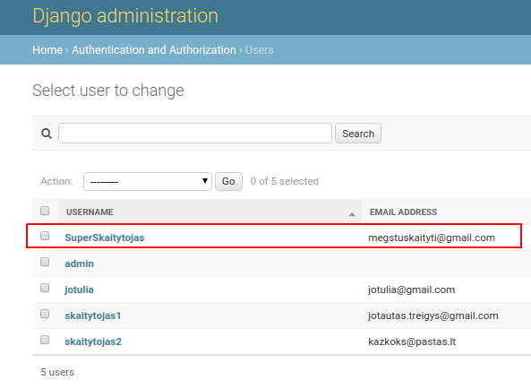
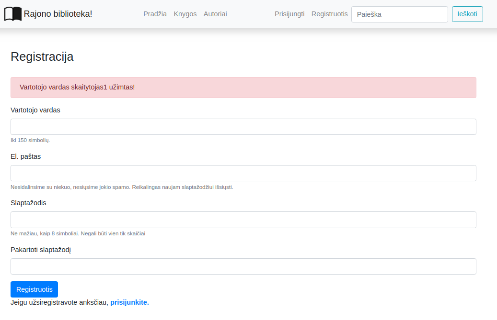
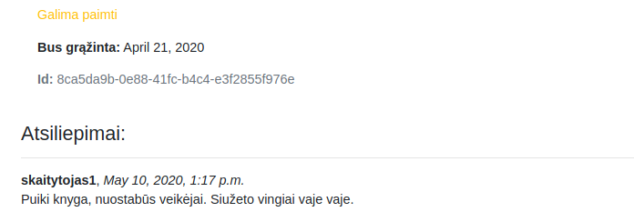
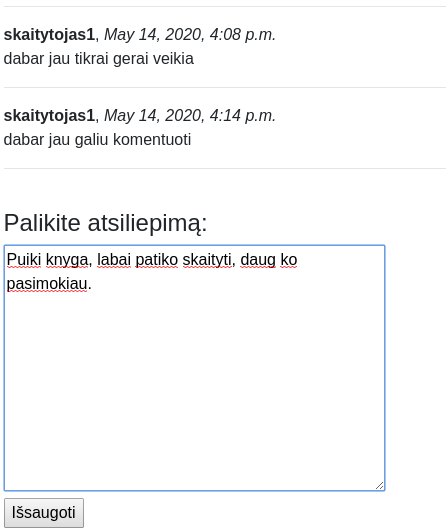

# Formos

## Crispy Formos

Vartotojo registracijai ir vėliau naudosime Crispy formas. Crispy leidžia pritaikyti Bootstrap dizainą automatinėms Django formoms.

Jei dirbame su **Bootstrap5** (tai galima pasižiūrėti base.html failo viršuje):

Reikės įsidiegti tai:
```console
pip install django-crispy-forms crispy-bootstrap5
```

```python
INSTALLED_APPS = [
    'tinymce',
    'library',
    'crispy_forms',
    'crispy_bootstrap5',
    'django.contrib.admin',
    'django.contrib.auth',
    'django.contrib.contenttypes',
    'django.contrib.sessions',
    'django.contrib.messages',
    'django.contrib.staticfiles',
]
```

settings.py gale:
```python

CRISPY_ALLOWED_TEMPLATE_PACKS = "bootstrap5"
CRISPY_TEMPLATE_PACK = 'bootstrap5'
```

Jei dirbame su **Bootstrap4**:

Reikės įsidiegti tai:
```console
pip install django-crispy-forms crispy-bootstrap4
```

Į settings.py įdėti:
```python
INSTALLED_APPS = [
    'tinymce',
    'library',
    'crispy_forms',
    'crispy_bootstrap4',
    'django.contrib.admin',
    'django.contrib.auth',
    'django.contrib.contenttypes',
    'django.contrib.sessions',
    'django.contrib.messages',
    'django.contrib.staticfiles',
]
```

settings.py gale:
```python
CRISPY_TEMPLATE_PACK = 'bootstrap4'
```

## Vartotojo registracija

Pradėkime nuo vartotojo registracijos view'so sukūrimo views.py faile:
```python
from django.contrib.auth.forms import UserCreationForm
from django.urls import reverse_lazy

class SignUpView(generic.CreateView):
    form_class = UserCreationForm
    template_name = "signup.html"
    success_url = reverse_lazy("login")
```

Į library/urls.py pridedame naują kelią:

```python
    path('signup/', views.SignUpView.as_view(), name='signup'),
```

Taip pat sukūriame naują šabloną templates/signup.html:

```html


Sign Up


<div class="container mt-5">
    <div class="row justify-content-center">
        <div class="col-md-4">
            <h2 class="mb-4 text-center">Sign Up</h2>
            <form method="post">
                
                
                {{ form | crispy }}
                <button type="submit" class="btn btn-primary w-100">Sign Up</button>
            </form>
            <p><a href="" class="btn btn-link w-100">Already Registered? Login</a></p>
        </div>
    </div>
</div>

```

Galiausiai pridedame registracijos mygtuką į meniu:

```html
                
                    <li class="nav-item"><a class="nav-link" href="">Prisijungti</a></li>
                    <li class="nav-item"><a class="nav-link" href="">Registracija</a></li>
                
            </ul>
````

## ALTERNATYVA: Vartotojo registracija per function-based view'ą
Pradėkime nuo šablono *register.html* sukūrimo:

```html


Registracija



    <div class="container register">
        <h3>Registracija</h3><br/>
        <form method="post">
            
            <div class="form-group">
                <label for="username">Vartotojo vardas</label>
                <input name="username" type="text" class="form-control" id="username" aria-describedby="usernameHelp">
                <small id="usernameHelp" class="form-text text-muted">Iki 150 simbolių.</small>
            </div>
            <div class="form-group">
                <label for="exampleInputEmail1">El. paštas</label>
                <input name="email" type="email" class="form-control" id="exampleInputEmail1" aria-describedby="emailHelp">
                <small id="emailHelp" class="form-text text-muted">Nesidalinsime su niekuo, nesiųsime jokio spamo.
                    Reikalingas naujam slaptažodžiui išsiųsti. </small>
            </div>
            <div class="form-group">
                <label for="password">Slaptažodis</label>
                <input name="password" type="password" class="form-control" id="password" aria-describedby="pwdHelp">
                <small id="pwdHelp" class="form-text text-muted">Ne mažiau, kaip 8 simboliai. Negali būti vien tik
                    skaičiai</small>
            </div>
            <div class="form-group">
                <label for="password2">Pakartoti slaptažodį</label>
                <input name="password2" type="password" class="form-control" id="password2" aria-describedby="pwd2Help">
            </div>
            <button type="submit" class="btn btn-primary register-button mt-2">Registruotis</button>
        </form>
        <p>Jeigu užsiregistravote anksčiau, <a href=""><strong>prisijunkite.</strong></a></p>
    </div>


```

tai tiesiog iš *bootstrap* nukopijuota ir situacijai pritaikyta forma, su vartotojo vardu, el. paštu ir dviem slaptažodžio laukais. Dar reikės sukurti *view*są. Pradžioje *views.py* pasidarykime keletą *import*ų:

```python
from django.shortcuts import redirect
from django.contrib.auth.forms import User
from django.views.decorators.csrf import csrf_protect
from django.contrib import messages
from django.contrib.auth import password_validation
```

Ir dabar pačią registracijos funkciją:

```python
@csrf_protect
def register(request):
    if request.method == "POST":
        # pasiimame reikšmes iš registracijos formos
        username = request.POST['username']
        email = request.POST['email']
        password = request.POST['password']
        password2 = request.POST['password2']
        # tikriname, ar sutampa slaptažodžiai
        if password == password2:
            # tikriname, ar neužimtas username
            if User.objects.filter(username=username).exists():
                messages.error(request, f'Vartotojo vardas {username} užimtas!')
                return redirect('register')
            else:
                # tikriname, ar nėra tokio pat email
                if User.objects.filter(email=email).exists():
                    messages.error(request, f'Vartotojas su el. paštu {email} jau užregistruotas!')
                    return redirect('register')
                else:
                    try:
                        password_validation.validate_password(password)
                    except password_validation.ValidationError as e:
                        for error in e:
                            messages.error(request, error)
                        return redirect('register')

                    # jeigu viskas tvarkoje, sukuriame naują vartotoją
                    User.objects.create_user(username=username, email=email, password=password)
                    messages.info(request, f'Vartotojas {username} užregistruotas!')
                    return redirect('login')
        else:
            messages.error(request, 'Slaptažodžiai nesutampa!')
            return redirect('register')
    return render(request, 'register.html')
```

Šiek tiek paaiškinimų rasite kodo komentaruose.

Užregistruokime *endpoint'ą urls.py*:

```python
path('register/', views.register, name='register')
```

Taip pat, *base.html*, reikės nuorodos į registracijos formą. Iš karto po navigacijos meniu punkto "prisijungti" įterpkime:

```html
            <li class="nav-item">
                <a class="nav-link active" href="">Prisijungti</a>
            </li>
            <li class="nav-item">
                <a class="nav-link active" href="">Registruotis</a>
            </li>
```

Jeigu viskas pasisekė, turėsime štai tokią formą:


Pagrindinės (ne visos!) registracijos funkcijos veikia:



Nors su formomis dar nebaigėme, dabar geras metas panagrinėti django pranešimų sistemą. Jeigu pamenate, *views.py* jau importavome *messages* ir į registracijos *view*'są įterpėme šiek tiek logikos su pranešimais. Bet jie neveikia - todėl, kad jų nenurodėme šablone. Sutvarkykime *base.html*:

```html
<div class="container mt-4">
    <div class="row">
        <div class="col-sm">
            
            
            <div class="alert alert-dangersuccess"
                 role="alert">
                {{ message }}
            </div>
            
            
            
        </div>
    </div>
</div>
```

Turėsime tokį rezultatą:



## Dedame atsiliepimus prie knygos

Pabandykime padaryti taip, kad užsiregistravęs skaitytojas galėtų palikti atiliepimą apie knygą. Pirmiausiai sukurkime atsiliepimų modelį:

```python
class BookReview(models.Model):
    book = models.ForeignKey(to="Book", verbose_name="Book", on_delete=models.SET_NULL, null=True, blank=True, related_name="reviews")
    reviewer = models.ForeignKey(to=User, verbose_name="Reviewer", on_delete=models.SET_NULL, null=True, blank=True)
    date_created = models.DateTimeField(verbose_name="Date Created", auto_now_add=True)
    content = models.TextField(verbose_name="Content", max_length=2000)

    class Meta:
        verbose_name = "Book Review"
        verbose_name_plural = 'Book Reviews'
        ordering = ['-date_created']
```
Nepamirštame migracijų!

*Dėmesio!* Užtikrinkite, kad prie ryšinių laukų (book ir reviewer) būtų parametrai null=True ir blank=True. Kitaip formos negalės validuoti prieš priskiriant book ir reviewer.

pridėkime į administratoriaus svetainę:

```python
from .models import Genre, Author, Book, BookInstance, BookReview

class BookReviewAdmin(admin.ModelAdmin):
    list_display = ['book', 'date_created', 'reviewer', 'content']

admin.site.register(BookReview, BookReviewAdmin)
```

padarykime atsiliepimus matomus šablone *book.html* po knygos aprašymu:

```html
<h2>Komentarai:</h2>


<p><strong>{{ review.reviewer }}</strong>, <em>{{ review.date_created }}</em></p>
<p>{{ review.content }}</p>
<hr>


<p>Komentarų nėra</p>

```

susimuliuokime atsiliepimą per administratoriaus svetainę:



dabar sukursime paprastą formą atsiliepimui. Naudosimės django integruotu būdu formoms kurti. Pirmiausia susikurkime naują failą *forms.py*:

```python
from .models import BookReview
from django import forms

class BookReviewForm(forms.ModelForm):
    class Meta:
        model = BookReview
        fields = ['content']
```

Kadangi komentuoti galės tik prisijungęs vartotojas, o knyga visuomet bus ta, po kuria komentuojamama, *book* ir *reviewer* laukų nenurodėme.

Dabar perrašykime *BookDetailView*  *view*'są taip:

```python
from django.shortcuts import render, reverse, get_object_or_404, reverse
from .forms import BookReviewForm
from django.views.generic.edit import FormMixin

class BookDetailView(FormMixin, generic.DetailView):
    model = Book
    template_name = "book.html"
    context_object_name = "book"
    form_class = BookReviewForm

    # nurodome, kur atsidursime komentaro sėkmės atveju.
    def get_success_url(self):
        return reverse("book", kwargs={"pk": self.object.id})

    # standartinis post metodo perrašymas, naudojant FormMixin, galite kopijuoti tiesiai į savo projektą.
    def post(self, request, *args, **kwargs):
        self.object = self.get_object()
        form = self.get_form()
        if form.is_valid():
            return self.form_valid(form)
        else:
            return self.form_invalid(form)

    # štai čia nurodome, kad knyga bus būtent ta, po kuria komentuojame, o vartotojas bus tas, kuris yra prisijungęs.
    def form_valid(self, form):
        form.instance.book = self.get_object()
        form.instance.reviewer = self.request.user
        form.save()
        return super().form_valid(form)
```

čia iš karto susiduriame su situacija, kai *CBV (class based views*) parodo mažiau gražią savo pusę - *view*'sas tapo griozdiškas ir sunkiai suprantamas. Mes *override*'iname keletą funkcijų, ir turime žinoti, kaip ir kokias iš jų perrašyti. Na ir paskutiniai pakeitimai bus *book_detail.html* šablone:

```html

<div class="fieldWrapper">
    <hr><br/>
    <h1>Palikite atsiliepimą</h1>
    <form action="" method="post">
        
        {{ form.content }}<br/>
        <input type="submit" value="Paskelbti">
    </form>
</div>

```

rezultatas:



 ## Užduotis
Tęsti kurti Django užduotį – [Autoservisas](https://github.com/robotautas/kursas/wiki/Django-u%C5%BEduotis:-Autoservisas):
* Padaryti vartotojo registracijos formą pagal šioje pamokoje išmoktus žingsnius.
* Padaryti, kad prisijungusiam vartotojui leistų palikti komentarus prie bet kurio užsakymo.

[Atsakymas](https://github.com/DonatasNoreika/autoservisas)
