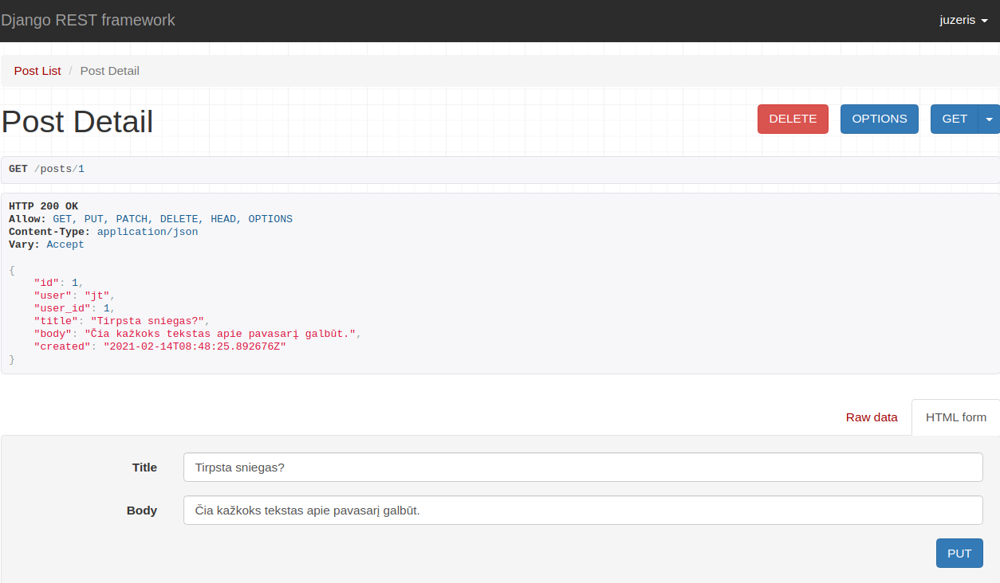
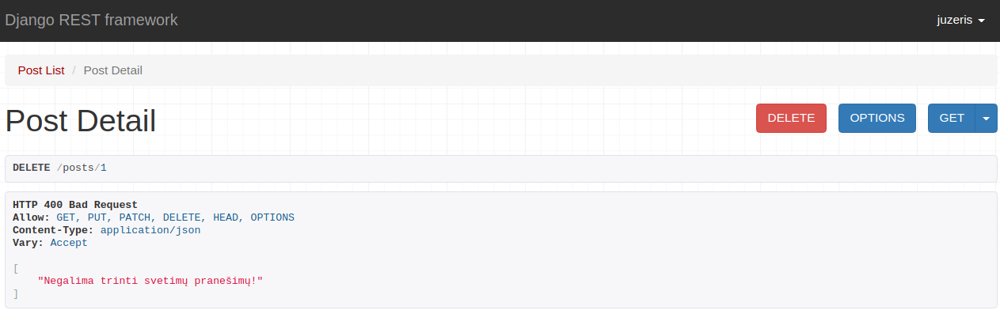
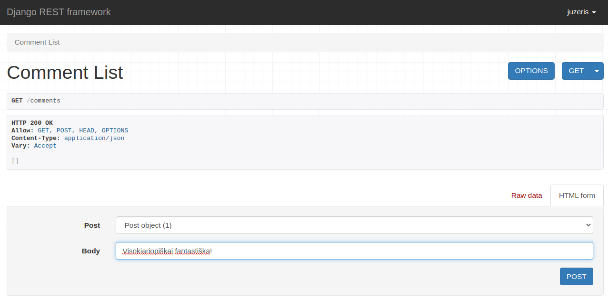
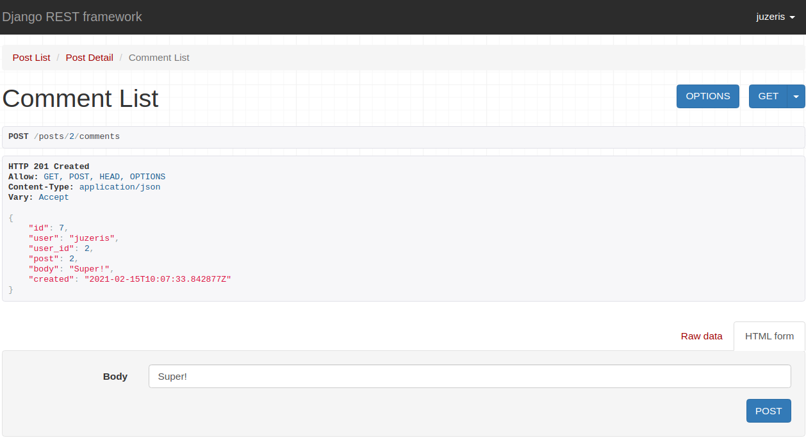
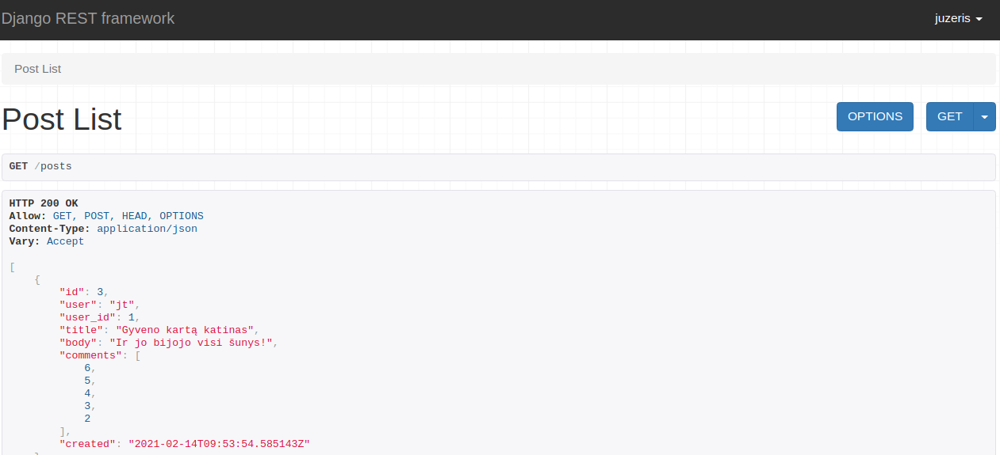
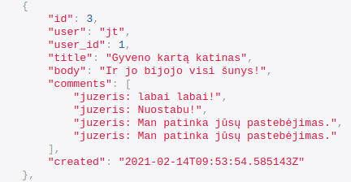

## Update, Delete

Jeigu norime pakoreguoti ar ištrinti pranešimą, pirmiausia susikurkime naują *views* klasę, kuri rodytų atskirus pranešimus pagal numerį, nurodytą URL:

```python
class PostDetail(generics.RetrieveUpdateDestroyAPIView):
    queryset = Post.objects.all()
    serializer_class = PostSerializer
    permission_classes = [permissions.IsAuthenticatedOrReadOnly]
```

Atkreipkime dėmesį, kad klasė paveldi *RetrieveUpdateDestroyAPIView*. Užregistruokime rodinį *urls.py*:

```python
urlpatterns = [
    path('posts', PostList.as_view()),
    path('posts/<int:pk>', PostDetail.as_view()),
]
```


Problema - bet koks prisiregistravęs vartotojas gali trinti tiek savo, tiek svetimus pranešimus. Paveikslėlyje matome vartotoją 'juzeris', kuris ką tik sėkmingai pakoregavo vartotojo 'jt' pranešimą. 

*Norėdami turėti galimybę paprastai prisijungti per DRF vartotojo sąsają, į api_example/urls.py sąrašą įrašykime:*

```python
path('api-auth/', include('rest_framework.urls', namespace='rest_framework'))
```

Tam kad galėtumėm trinti ir koreguoti tik savo pranešimus, *PostDetail* klasę turime papildyti metodais:

```python
from rest_framework.exceptions import ValidationError

    def delete(self, request, *args, **kwargs):
        post = Post.objects.filter(pk=kwargs['pk'], user=self.request.user)
        if post.exists():
            return self.destroy(request, *args, **kwargs)
        else:
            raise ValidationError('Negalima trinti svetimų pranešimų!')
```

pranešimą išfiltravome pagal sąlygą, kad pranešėjas būtų prisiregistravęs asmuo, o pranešimas būtų tas, kurį bandome trinti. Jeigu šios aplinkybės sutampa, pranešimas trinamas. Kitu atveju iškeliame klaidą, kad negalima vykdyti tokios užklausos. 



Analogiškai ir su PUT metodu:

```python
    def put(self, request, *args, **kwargs):
        post = Post.objects.filter(pk=kwargs['pk'], user=self.request.user)
        if post.exists():
            return self.update(request, *args, **kwargs)
        else:
            raise ValidationError('Negalima koreguoti svetimų pranešimų!')
```

## Ryšiai

Pridėkime prie API mūsų komentarų skiltį. Pradėkime nuo *serializers.py*:

```python
class CommentSerializer(serializers.ModelSerializer):
    user = serializers.ReadOnlyField(source='user.username')
    user_id = serializers.ReadOnlyField(source='user.id')

    class Meta:
        model = Comment
        fields = ['id', 'user', 'user_id', 'post', 'body', 'created']
```

sukurkime *view*:

```python
class CommentList(generics.ListCreateAPIView):
    queryset = Comment.objects.all()
    serializer_class = CommentSerializer
    permission_classes = [permissions.IsAuthenticatedOrReadOnly]
    
    def perform_create(self, serializer):
        serializer.save(user=self.request.user)
```

įdėkime *endpoint'ą* į *urls*:

```python
path('comments', CommentList.as_view()),
```



Turime galimybę komentuoti :)
Dabar matome, kad visi komentarai guli vienoje krūvoje. Galima pasidaryti taip, kad matytumėm komentarus pagal straipsnį. Klasę *CommentList* papildykime metodu:

```python
    def get_queryset(self):
        post = Post.objects.get(pk=self.kwargs['pk'])
        return Comment.objects.filter(post=post)
```
Kadangi *queryset* šiek tiek sudėtingesnis, apsibrėžėme jį per metodą. Logika - grąžiname tik tuos komentarus, kurių straipsnio id yra nurodyta URL.

pakoreguokime *urls.py*:

```python
path('posts/<int:pk>/comments', CommentList.as_view()),
```

Išlieka dar viena problema - iš konkretaus straipsnio komentarų puslapio galima komentuoti visus straipsnius. Pakoreguokime *perform_create* metodą:

```python
    def perform_create(self, serializer):
        post = Post.objects.get(pk=self.kwargs['pk'])
        serializer.save(user=self.request.user, post=post)
```

*Serializeryje* nurodykime, kad post laukas yra *read-only*:

```python
class CommentSerializer(serializers.ModelSerializer):
    user = serializers.ReadOnlyField(source='user.username')
    user_id = serializers.ReadOnlyField(source='user.id')
    post = serializers.ReadOnlyField(source='post.id')

    class Meta:
        model = Comment
        fields = ['id', 'user', 'user_id', 'post', 'body', 'created']
```



Padarykime PUT ir DELETE galimybę komentarams:

*views.py*:

```python
class CommentDetail(generics.RetrieveUpdateDestroyAPIView):
    queryset = Comment.objects.all()
    serializer_class = CommentSerializer
    permission_classes = [permissions.IsAuthenticatedOrReadOnly]

    def delete(self, request, *args, **kwargs):
        comment = Comment.objects.filter(pk=kwargs['pk'], user=self.request.user)
        if comment.exists():
            return self.destroy(request, *args, **kwargs)
        else:
            raise ValidationError('Negalima trinti svetimų komentarų!')

    def put(self, request, *args, **kwargs):
        comment = Comment.objects.filter(pk=kwargs['pk'], user=self.request.user)
        if comment.exists():
            return self.update(request, *args, **kwargs)
        else:
            raise ValidationError('Negalima koreguoti svetimų komentarų!')
```

Visiškai analogiškai, kaip ir su *PostDetail* klase. Belieka papildyti urls.py:

```python
path('comments/<int:pk>', CommentDetail.as_view()),
```

Komentarus trinsime/taisysime tiesiog pagal komentaro id.

Jeigu norime, kad pranešimuose matytųsi komentarai, modelyje *Comment* į post lauko parametrus pridėkime *related_name='comments'*, numigruokime.



Matome, kad mums duoda sąrašą komentarų id. Būdas netobulas, kadangi kurdami pranešimą turime galimybę tuo pačiu kurti ir komentarus :) reikėtų automatizuoti, kad 'comments' laukas būtų kuriamas tuščias. 

Jeigu norime matyti viską vienoje krūvoje, galime papildyti *PostSerializer* tokiu būdu:

```python
class PostSerializer(serializers.ModelSerializer):
    user = serializers.ReadOnlyField(source='user.username')
    user_id = serializers.ReadOnlyField(source='user.id')
    comments = CommentSerializer(many=True)

    class Meta:
        model = Post
        fields = ['id', 'user', 'user_id', 'title', 'body', 'comments', 'created']
```


Taip pat galime rodyti tai, ką grąžina *Comments* klasės __str__ metodas.
Tam mums reikės sukurti __str__ metodą, bei pakeisti kintamojo reikšmę Serializatoriuje taip:

```python
comments = serializers.StringRelatedField(many=True)
```



Tai ne visi būdai, jų yra daugiau, tačiau visų neaprėpsime:)

Pabaigai - kaip padaryti, kad rodytų komentarų skaičių? Vėl reikės koreguoti serializatorių:

```python
class PostSerializer(serializers.ModelSerializer):
    user = serializers.ReadOnlyField(source='user.username')
    user_id = serializers.ReadOnlyField(source='user.id')
    comment_count = serializers.SerializerMethodField()
    comments = serializers.StringRelatedField(many=True)

    class Meta:
        model = Post
        fields = ['id', 'user', 'user_id', 'title', 'body', 'comment_count', 'comments', 'created']

    def get_comment_count(self, post):
        return Comment.objects.filter(post=post).count()
```
kai norime turėti lauką, kurio rezultatą grąžina funkcija, reikia naudoti *SerializerMethodField()*. Iš jo susikuriame objektą, o žemiau metodą, kuris vadinasi atititinkamai (comment_count --> get_comment_count()). Šiuo atveju nurodėme, kad grąžintų sumą *Comment* klasėje esančių objektų, kuriuose post sutampa su iteruojamu Post objektu.


