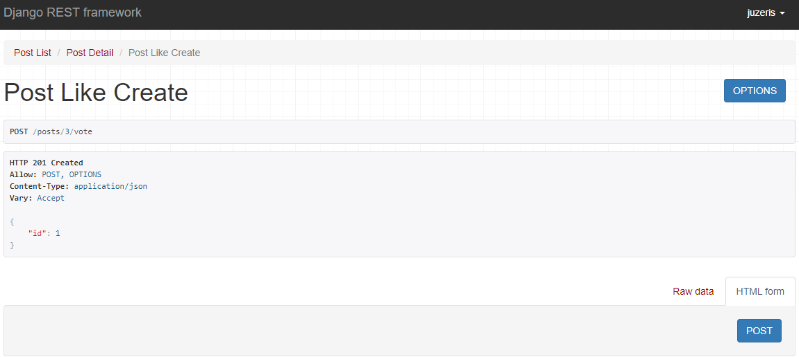
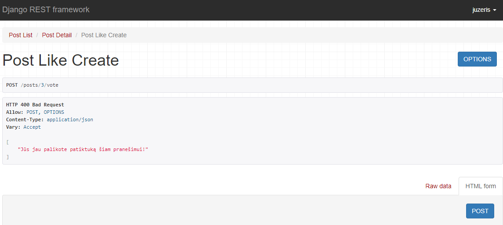
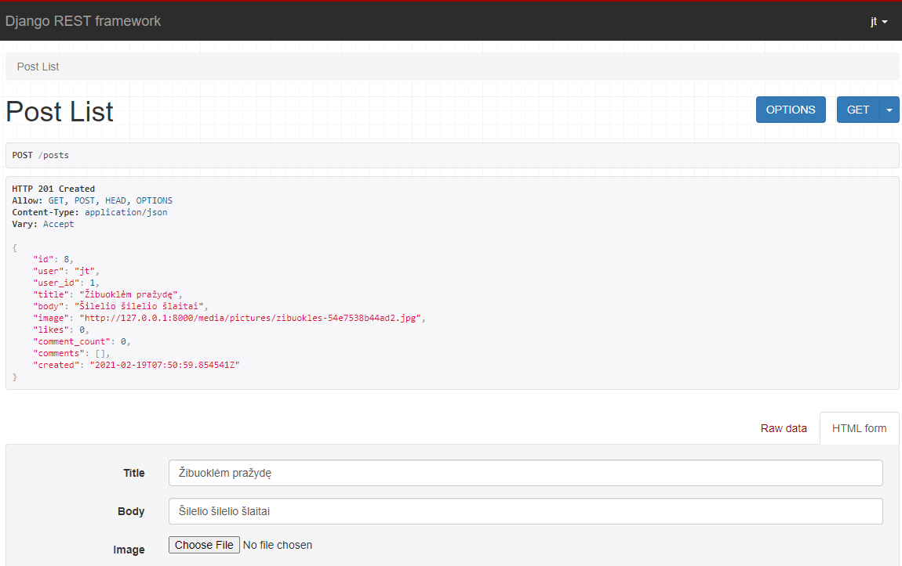
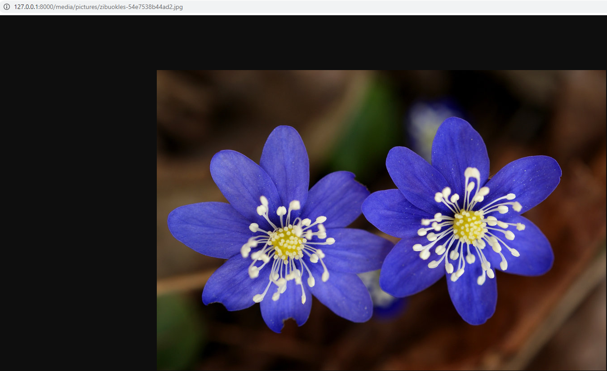

## Votes, Likes, ir kitokie jungikliai :)

Patiktukai turi šiek tiek kitokią specifiką, negu, tarkime, pranešimai. Mums reikės tik sukurti objektą, kuris nerodo jokios informacijos, išskyrus patį faktą, kad jis yra. Panašiai reikėtų programuoti, jeigu, tarkime norime paleisti kažkokius procesus serveryje, kažkokias atskiras funkcijas programoje, t.y. mūsų užklausa suveiktų kaip jungiklis. Taigi, susikursime *PostLikeSerializer*, kuris turės tik id lauką, visą kitą turėsime automatizuoti.

```python
class PostLikeSerializer(serializers.ModelSerializer):
    class Meta:
        model = PostLike
        fields = ['id']
```

dabar reikia sugalvoti, per kokį URL galėtumėm tą patiktuką nusiųsti:

```python
path('posts/<int:pk>/like', PostLikeCreate.as_view()),
```

taip pat reikia sukurti patį *view*:

```python
class PostLikeCreate(generics.CreateAPIView):
    serializer_class = PostLikeSerializer
    permission_classes = [permissions.IsAuthenticated]

    def get_queryset(self):
        user = self.request.user
        post = Post.objects.get(pk=self.kwargs['pk'])
        return PostLike.objects.filter(post=post, user=user)
    
    def perform_create(self, serializer):
        post = Post.objects.get(pk=self.kwargs['pk'])
        serializer.save(user=self.request.user, post=post)
```

*get_queryset* metodo pagalba pasidarome *queryset*, *perform_create* nurodo serializatoriui, kaip automatizuoti post ir user laukus, išsaugant juos į duomenų bazę.



Turime netobulą patiktukų sistemą - vienas vartotojas gali balsuoti už tą patį objektą kiek tik nori kartų. Teks *perform_create* metodą papildyti sąlyga:

```python
    def perform_create(self, serializer):
        if self.get_queryset().exists():
            raise ValidationError('Jūs jau palikote patiktuką šiam pranešimui!')
        post = Post.objects.get(pk=self.kwargs['pk'])
        serializer.save(user=self.request.user, post=post)
```

Šiuo atveju metodas *perform_create* patikrina, ar jau yra sukurtas objektas, kokį bandome sukurti (get_queryset() metodas kaip tik tokį objektą grąžina). Jeigu *True*, metame *ValidationError* klaidą.



persijungę kito vartotojo vardu, galime sėkmingai palikti dar vieną patiktuką.

Padarykime galimybę trinti patiktukus. Tam, kad nereikėtų kurti atskiro *views'o* (kaip darėme su komentarais), galime naudoti *mixins*. Pirmiausia juos importuokime:

```python
from rest_framework import generics, permissions, mixins, status
from rest_framework.response import Response
```

tuo pačiu importavome status ir Response klasę, kurie bus atsakingi už pranešimą, kad patiktukas sėkmingai pašalintas. Papildykime *PostLikeCreate* klasės paveldėjimus:

```python
class PostLikeCreate(generics.CreateAPIView, mixins.DestroyModelMixin):
```

papildykime metodu *delete*:

```python
    def delete(self, request, *args, **kwargs):
        if self.get_queryset().exists():
            self.get_queryset().delete()
            return Response(status=status.HTTP_204_NO_CONTENT)
        else:
            raise ValidationError('Jūs nepalikote patiktuko po šiuo pranešimu!')
```

Iš pradžių patikriname, ar yra patiktukas yra sukurtas to vartotojo, kuris bando jį trinti. Jeigu taip, triname ir grąžiname atsaką su http statusu 204. Kitu atveju išmetame klaidą, kad negalime ištrinti šio patiktuko, nes mes jo nesukūrėme.

Galiausiai, sutvarkykime *PostSerializer* taip, kad rodytų, kiek kartų pranešimas 'palaikintas':

```python
class PostSerializer(serializers.ModelSerializer):
    user = serializers.ReadOnlyField(source='user.username')
    user_id = serializers.ReadOnlyField(source='user.id')
    comment_count = serializers.SerializerMethodField()
    comments = serializers.StringRelatedField(many=True)
    likes = serializers.SerializerMethodField()

    class Meta:
        model = Post
        fields = ['id', 'user', 'user_id', 'title', 'body', 'likes', 'comment_count', 'comments', 'created']

    def get_comment_count(self, post):
        return Comment.objects.filter(post=post).count()

    def get_likes(self, post):
        return PostLike.objects.filter(post=post).count()
```

Kadangi komentarų 'patiktukinimas' yra beveik identiškas procesas, šios dalies nenagrinėsime.

## Nuotraukos

Mūsų pranešimas gali turėti vieną arba kelias nuotraukas. Keleto nuotraukų atveju turėtumėm sukurti papildomą modelį, jame sukurti kintamąjį post, kaip foreign key, tuomet kurti atskirą serializerį, rodinį, ir t.t. Visą tai mes jau darėme, todėl įsivaizduosime, kad mūsų atvejui užteks vienos nuotraukos :) Settings.py pabaigoje susikurkime media kintamuosius:

```python
MEDIA_ROOT = os.path.join(BASE_DIR, 'media')
MEDIA_URL = '/media/'
```

*Post* modelį papildykime kintamuoju *image*:

```python
image = models.ImageField(upload_to='pictures', null=True)
```
Nepamirškime numigruoti.

Projekto *urls.py*:

```python
...
from django.conf.urls.static import static
from django.conf import settings

urlpatterns = [
    path('admin/', admin.site.urls),
    path('', include('postit_api.urls')),
    path('api-auth/', include('rest_framework.urls', namespace='rest_framework'))
] + (static(settings.STATIC_URL, document_root=settings.STATIC_ROOT) +  
    static(settings.MEDIA_URL, document_root=settings.MEDIA_ROOT))
```

*PostSerializer* laukų sąrašą papildykime 'image'.


```python
...
        fields = ['id', 'user_id', 'user', 'title', 'body', 'created', 'comments', 'comment_count', 'likes', 'image']
...


```



Gauname nuorodą į paveikslėlį:




