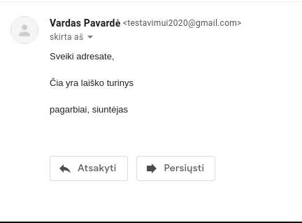
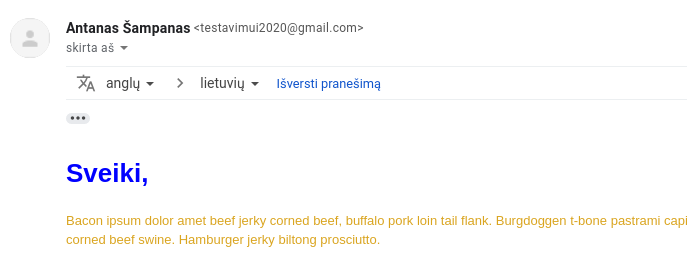
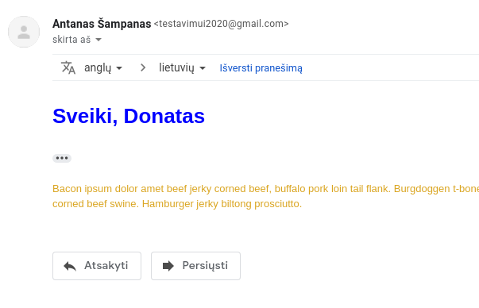
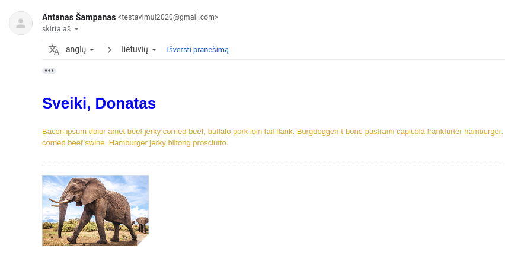
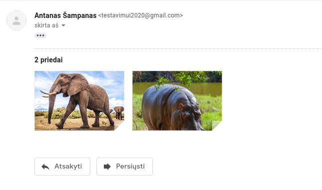

### Email

Prieš atliekant įvairius bandymus su laiškų siuntimu python'e, rekomenduotina susikurti tam skirtą pašto dėžutę (gmail veikia visai neblogai). Susikūrus dėžutę, leisti prie jos jungtis 'nelabai saugioms programoms'. https://myaccount.google.com/lesssecureapps čia įjunkite ON. 

```python
import smtplib # biblioteka susikalbėjimui su pašto serveriu
from email.message import EmailMessage
from slaptazodis import password # importuoju slaptažodį, 
                                 # (galima nurodyti ir tiesiai į parametrus)

# elementarios email žinutės sukūrimas:
email = EmailMessage()
email['from'] = 'Vardas Pavardė'
email['to'] = 'adresatas@gmail.com'
email['subject'] = 'email from python'

email.set_content('Sveiki adresate,\n\nČia yra laiško turinys\n\npagarbiai, siuntėjas')

with smtplib.SMTP(host='smtp.gmail.com', port=587) as smtp:
    smtp.ehlo() # žiūrėkite, kaip į pasisveikinimą su serveriu
    smtp.starttls() # inicijuojame šifruotą kanalą
    smtp.login('testavimui2020@gmail.com', password) # nurodome prisijungimo duomenis
    smtp.send_message(email) # išsiunčiame žinutę
```

Čia yra paprasta programėlė, kurioje matosi visas laiškų siuntimo mechanizmas. Komentaruose matome šiek tiek detalių.



## HTML laiškų siuntimas

Susikurkime HTML laišką:

```html
<!DOCTYPE html>
<html lang="en">
<head>
    <meta charset="UTF-8">
    <meta name="viewport" content="width=device-width, initial-scale=1.0">
    <meta http-equiv="X-UA-Compatible" content="ie=edge">
    <style>
        body {background-color: black;}
        h1   {color: blue;}
        p    {color: goldenrod;}
        </style>
    <title>Laiškas</title>
</head>
<body>
    <h1>Sveiki,</h1>
    <p>Bacon ipsum dolor amet beef jerky corned beef, 
        buffalo pork loin tail flank. Burgdoggen t-bone 
        pastrami capicola frankfurter hamburger. Buffalo leberkas 
        jowl ground round, hamburger meatball porchetta short loin 
        bresaola drumstick t-bone chislic boudin corned beef swine. 
        Hamburger jerky biltong prosciutto.</p>
</body>
</html>
```

Dabar python'o dalis:

```python
import smtplib
from email.message import EmailMessage
from slaptazodis import password

with open('index.html', 'r') as f:
    html = f.read()

email = EmailMessage()
email['from'] = 'Antanas Šampanas'
email['to'] = 'adresatas@gmail.com'
email['subject'] = 'email from python'

email.set_content(html, 'html')

with smtplib.SMTP(host='smtp.gmail.com', port=587) as smtp:
    smtp.ehlo()
    smtp.starttls()
    smtp.login('testavimui2020@gmail.com', password)
    smtp.send_message(email)
```

 Sukurdami žinutės objektą, *.set_content* parametruose nurodome, kintamąjį su turiniu, ir kad norėsime 'html' formato. Visa kita vyksta analogiškai, kaip ir siunčiant paprastą žinutę.



Deja, CSS palaikymas yra sunkiai prognozuojamas, todėl fono spalva nepasikeitė. Taip yra todėl, kad bandome sumaišyti savo CSS su gmail'o CSS.

## Laiškų personalizavimas

Sakykime, mums prireikė išsiųsti daug laiškų, kurių kiekviename kažkiek skiriasi turinys pagal situaciją. Reikės naudoti *Template* klasę iš *string* paketo.

Pataisykime savo .html faile \<h1> bloką:

```html
<h1>Sveiki, $vardas</h1>
```

Python failą perdarykime taip:

```python
import smtplib
from email.message import EmailMessage
from slaptazodis import password
from string import Template

with open('index.html', 'r') as f:
    html = f.read()

sablonas = Template(html)

email = EmailMessage()
email['from'] = 'Antanas Šampanas'
email['to'] = 'adresatas@gmail.com'
email['subject'] = 'email from python'

email.set_content(sablonas.substitute({'vardas': 'Donatas'}), 'html')

with smtplib.SMTP(host='smtp.gmail.com', port=587) as smtp:
    smtp.ehlo()
    smtp.starttls()
    smtp.login('testavimui2020@gmail.com', password)
    smtp.send_message(email)
```

Template modulis leidžia mums pakeisti žodžius su '$' ženklu priekyje kintamųjų reikšmėmis. 
Tokiu būdu, iteruodami kokį nors žodyną, kiekvienam adresatui galime parinkti kreipnį. Panaudojimo galimybės, žinoma, tuo neapsiriboja :)

Template galima naudoti ne tik su html, bet ir su bet kokiais tekstais, pvz kad ir su paprasta *str* eilute. Ir ne tik su email operacijomis.



## Prisegtukų prisegimas

pakoreguokime kodą:

```python
import smtplib
from email.message import EmailMessage
from slaptazodis import password
from string import Template

with open('index.html', 'r') as f:
    html = f.read()

sablonas = Template(html)

email = EmailMessage()
email['from'] = 'Antanas Šampanas'
email['to'] = 'adresatas@gmail.com'
email['subject'] = 'email from python'

email.set_content(sablonas.substitute({'vardas': 'Donatas'}), 'html')

with open('elephant.png', 'rb') as file:
    content = file.read()
    email.add_attachment(
        content, 
        maintype='image/png', 
        subtype='png', 
        filename='elephant.png')

with smtplib.SMTP(host='smtp.gmail.com', port=587) as smtp:
    smtp.ehlo()
    smtp.starttls()
    smtp.login('testavimui2020@gmail.com', password)
    smtp.send_message(email)
```

1. Atidarėme *elephant.png*, nuskaitėme 'rb' būdu į kintamąjį content 
2. nurodėme *content* turinį, maintype, subtype ir failo pavadinimą į *add_attachment* metodo parametrus. 

Kad būtų lengviau susiorientuoti, ką nurodyti parametruose - [nuoroda](https://developer.mozilla.org/en-US/docs/Web/HTTP/Basics_of_HTTP/MIME_types/Complete_list_of_MIME_types). Kas yra MIMEType, labai gražiai išverčia google translate:

Laikmenos tipas (dar žinomas kaip daugiafunkcinis interneto pašto plėtinys arba MIME tipas) yra standartas, nurodantis dokumento, failo ar *baitų išrūšiavimo* pobūdį ir formatą.



jeigu norime prisegti keletą prisegtukų, **importuojame mimetypes** ir dalį,atsakingą už prisegtukus pertvarkome taip:

```python
files = ['elephant.png', 'hippo.jpg']

for file in files:
    mimetype = mimetypes.guess_type(file)[0]
    subtype = mimetype.split('/')[1]
    with open(file, 'rb') as img:
        content = img.read()
        email.add_attachment(
            content, 
            maintype=mimetype,
            subtype=subtype, 
            filename=file)
```

kadangi add_attachment reikalauja maintype ir subtype, o failų tipai skirtingi, pasitelkėme biblioteką, atsakingą už failo *mimetype* atspėjimą. Veikia  maždaug tokiu principu:

```python
mimetype = mimetypes.guess_type('elephant.png')[0]
print(mimetype)
subtype = mimetype.split('/')[1]
print(subtype)

# image/png
# png
```

rezultatas:


