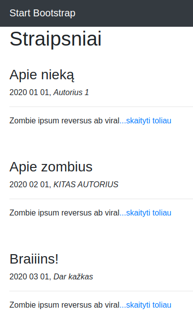
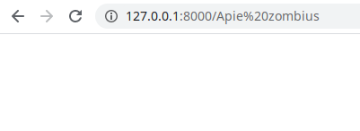
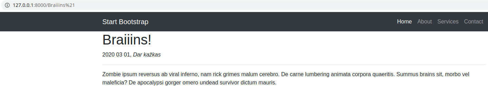
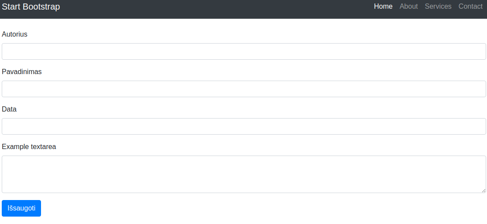
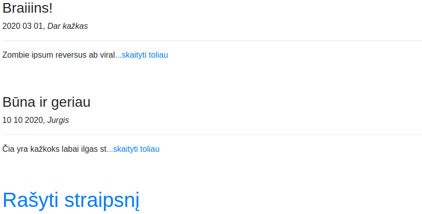
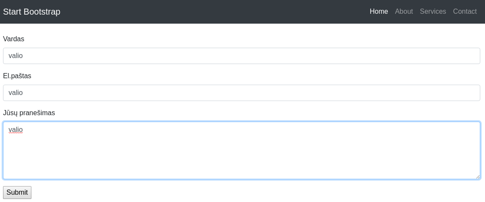
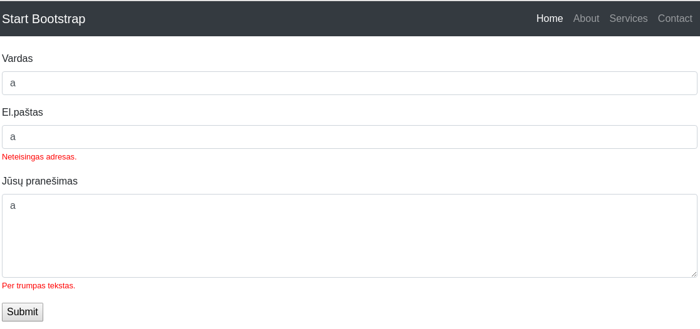
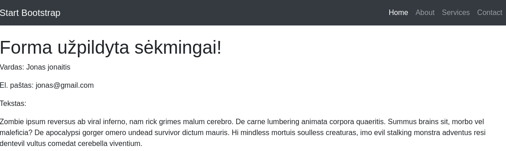

# Flask 2 dalis

### Dinaminiai maršrutai

Tęskime su praeitos paskaitos medžiaga. Įsivaizduokime, kad mums reikės straipsnių sąrašo, su dalimi teksto, ir po kiekvienu sąrašo elementu nuorodos 'skaityti toliau...'. Tokiose situacijose labai praverčia dinaminiai maršrutai. Susikurkime naują maršrutą app.py:

```python
@app.route('/<string:title>') # parametruose nurodomas kintamasis (title) ir jo tipas (string)
def article(title): # kintam1jį būtinai nurodykite ir funkcijos parametruose
    return render_template('article.html', title=title, data=data) # taip pat ir čia reikia jį perduoti
```

dabar pakoreguokime mūsų index.html:

```html




<h1>Straipsniai</h1>
<br>

<h3>{{ straipsnis['pavadinimas'] }}</h3>
<p>{{ straipsnis['data'] }}, <i>{{ straipsnis['autorius'] }}</i></p>
<hr>
<p>{{ straipsnis['tekstas'][:30] }}<a href="{{ url_for('article', title=straipsnis['pavadinimas']) }}">...skaityti toliau</a></p>
<br><br>



```

panagrinėkime \<p> bloką. 
* {{ straipsnis['tekstas'][:30] }} - vietoje pilno teksto pasiliekame ištrauką pirmų 30ties simbolių
* nuorodoje naudojama url_for() yra pagalbinė Jinja funkcija. Į parametrus priima maršruto funkcijos pavadinimą. Paprastesniu atveju, url_for('about') nukreiptų į mūsų 'Apie' puslapį.
* {{ url_for('article', title=straipsnis['pavadinimas']) }} - šiuo atveju mes nurodėme, kad norime į 'article' ir kad jo parametruose esantis *title* būtų prilygintas straipsnio pavadinimui.

Mūsų straipsnių puslapis dabar atrodo taip:


Susikurkime tuščią article.html ir pažiūrėkime, kas vyksta:



article.html tuščias, todėl nėra jokio turinio. Tačiau URL eilutėje matome, kad puslaio *endpoint'as* yra straipsnio pavadinimas. Padarykime taip, kad matytumėm straipsnio turinį

article.html:
```html







<h1>{{ straipsnis['pavadinimas'] }}</h1>
<p>{{ straipsnis['data'] }}, <i>{{ straipsnis['autorius'] }}</i></p>
<hr>
<p>{{ straipsnis['tekstas'] }}</p>
<br><br>





```
išbandykime:


# Formos

Formas flaske galima kurti dviem būdais. Aptarsime abu. Pirmas iš jų būtų paprastos formos iš HTML duomenų surinkimas. Tinka įvairiems testavimams, ne kritiniams duomenims apdoroti. Veikimo principas buvo glaustai pademonstruotas įžangos skyriuje. Žinoma, tas formas galima privesti iki profesionalaus lygmens, tačiau reikės nemažai papildomo darbo. 

sukurkime naują maršrutą:
```python
@app.route('/add_article')
def add_article():
    return render_template('add_article.html')
```

papildykime index.html nuoroda po straipsniais "Rašyti straipsnį"

```html




<h1>Straipsniai</h1>
<br>

<h3>{{ straipsnis['pavadinimas'] }}</h3>
<p>{{ straipsnis['data'] }}, <i>{{ straipsnis['autorius'] }}</i></p>
<hr>
<p>{{ straipsnis['tekstas'][:30] }}<a href="{{ url_for('article', title=straipsnis['pavadinimas']) }}">...skaityti toliau</a></p>
<br><br>

<h1><a href="{{ url_for('add_article') }}"> Rašyti straipsnį</a></h1>

```

sukurkime naują šabloną add_article.html:

```html




<form action="/", method="post">
  <div class="form-group">
    <label for="autorius">Autorius</label>
    <input type="text" class="form-control" id="autorius" name="autorius">
  </div>
  <div class="form-group">
    <label for="pavadinimas">Pavadinimas</label>
    <input type="text" class="form-control" id="pavadinimas" name="pavadinimas">
  </div>
  <div class="form-group">
    <label for="date">Data</label>
    <input type="text" class="form-control" id="date" name="date">
  </div>
  <div class="form-group">
    <label for="tekstas">Example textarea</label>
    <textarea class="form-control" id="tekstas" name="tekstas" rows="3"></textarea>
  </div>
  <button type="submit" class="btn btn-primary">Išsaugoti</button>
</form>


```

užeikime į "Rašyti straipsnį" nuorodą:



Turime neveikiančią formą.

Prie importų iš *flask* pridėkime *request*. Pakoreguokime index() funkciją:

```python
@app.route('/', methods=['GET', 'POST'])
def index():
    if request.method == 'POST':
        date = request.form['date']
        autorius = request.form['autorius']
        tekstas = request.form['tekstas']
        pavadinimas = request.form['pavadinimas']
        data.append({
            'data': date,
            'autorius': autorius,
            'pavadinimas': pavadinimas,
            'tekstas': tekstas,
            'status': 'published'
        })
    return render_template('index.html', data=data)
```

funkcijoje pasitikriname, ar yra 'post' užklausa, jeigu yra, tai papildome mūsų "duomenų bazę" naujais duomenimis:



### flask-wtf

Antras būdas tvarkytis su formomis yra trečios šalies bibliotekos flask_wtf naudojimas. Ji pasirūpina saugumo klausimais "out of the box" ir yra industrijos standartas dirbant su flask. Pamėginsime kontaktuose sukurti paprastą formą. Reikia šiek tiek pasiruošti:

* sukurkime naują tuščią maršrutą contact_us
* sukurkime naują tuščią šabloną tam maršrutui
* navigacijoje aktyvuokime nuorodą į contact_us
* sukurkime naują failą forms.py
* įsidiekime flask-wtf biblioteką (pip arba conda install flask-wtf)

forms.py:

```python
from flask_wtf import FlaskForm
from wtforms import StringField, TextAreaField, SubmitField
from wtforms.validators import DataRequired, Length, Email


class ContactForm(FlaskForm):
    name = StringField('Vardas', [DataRequired()])
    email = StringField('El.paštas', [Email(message=('Neteisingas adresas.')), DataRequired()])
    body = TextAreaField('Jūsų pranešimas', [DataRequired(), 
                                        Length(min=10, 
                                        message=('Per trumpas tekstas.'))])
    submit = SubmitField('Submit')
```

Šį kartą mūsų forma aprašoma, kaip klasė. Visus laukų tipus ir validatorius (patvirtintojus?..) reikia importuotis atskirai. Pvz.: eilutę priskirtą kintamąjam *body* galima dekonstruoti taip:

* TextAreaField - nurodome, kokio tipo formos lauką generuoti.
* 'Jūsų pranešimas' - formos lauko pavadinimas (label).
* [DataRequired(), Length(min=10, message=('Per trumpas tekstas.'))]) - sąraše yra *validators* - Nurodome kad laukas būtinas užpildyti, kad minimum 10 simbolių, ir kokia klaidos žinutė.

Kokie yra galimi laukai, galima pažiūrėti [čia](https://wtforms.readthedocs.io/en/stable/fields.html). Kokie yra galimi *validators*, galima pažiūrėti [čia](https://wtforms.readthedocs.io/en/stable/validators.html).

pakoreguokime maršrutą:

```python
@app.route('/contact_us', methods=['GET', 'POST'])
def contact_us():
    form = ContactForm()
    if form.validate_on_submit():
        return render_template('contact_success.html', form=form)
    return render_template('contact_us.html', form=form)
```

pakoregavome *contact_us* maršrutą taip, kad jeigu forma sėkmingai praėjo validaciją, nukreiptų mus į sėkmės puslapį.

pasidarykime šablonus - contact_us.html:
```html




  <form method="post" action="{{ url_for('contact_success') }}">
      {{ form.hidden_tag() }}
      <div class="form-group">
      {{ form.name.label(class="form-control-label") }}
      {{ form.name(class="form-control") }}
      </div>
      <div class="form-group">
      {{ form.email.label(class="form-control-label") }}
      {{ form.email(class="form-control") }}
      </div>
      <div class="form-group">
      {{ form.body.label(class="form-control-label") }}
      {{ form.body(class="form-control", rows="5") }}
      </div>
      {{ form.submit }}
  </form>


```

*reikėtų atkreipti dėmesį, kad Bootstrap klasės rašomos į kintamųjų parametrus*

ir sėkmės puslapiui - contact_success.html

```html




<h1>Forma užpildyta sėkmingai!</h1>
<p>Vardas: {{form.name.data}}</p>
<p>El. paštas: {{form.email.data}}</p>
<p>Tekstas:</p>
<p>{{form.body.data}}</p>


```
kadangi apie duomenų bazes kalbėsime sekančioje paskaitoje, su šiuo labai nesistengėme, išgaudysime formos reikšmes į pliką html'ą.



paspaudus 'Submit' mygtuką, mes niekur nenukreipiami, nes forma nepraėjo validacijos filtrų. Būtų gerai, jeigu mus informuotų, kas atsitiko. Reikia koreguoti formos šabloną:

```html




  <form method="post" action="#">
      {{ form.csrf_token }}
      <div class="form-group">
      {{ form.name.label(class="form-control-label") }}
      {{ form.name(class="form-control") }}
      
        
          <small><font color="red">{{ error }}</font></small>
        
      
      </div>
      <div class="form-group">
      {{ form.email.label(class="form-control-label") }}
      {{ form.email(class="form-control") }}
      
        
          <small><font color="red">{{ error }}</font></small>
        
      
      </div>
      <div class="form-group">
      {{ form.body.label(class="form-control-label") }}
      {{ form.body(class="form-control", rows="5") }}
      
        
          <small><font color="red">{{ error }}</font></small>
        
      
      </div>
      {{ form.submit }}
  </form>


```

Atrodo painiai :) Tai tik po kiekvienu lauku nurodyta sąlyga, kad jeigu tam laukui yra kažkokios klaidos, praiteruojame jas, ir parašome, kas tai per klaida:



Na ir pagaliau pabandykime teisingai suvesti:




