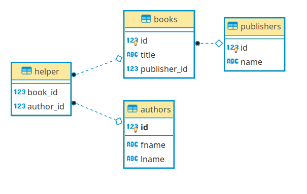
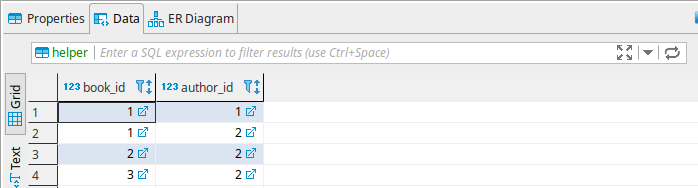

# Duomenų bazių ryšiai

## One2Many

Dauguma programų turi po daugiau negu vieną duomenų bazės modelį. 
Įsivaizduokime, kad turime du modelius - knyga ir leidykla:

* Knyga
  * Autorius
  * Pavadinimas
  * ISBN (primary key)

* Leidykla
  * Pavadinimas
  * Adresas
  * Knyga ID (Foreign Key)
  
Viena leidykla gali turėti daug knygų, pabandykime sumodeliuoti duomenų bazę šiam atvejui.

Susikurkime app.py:
```python
import os
from flask import Flask
from flask_sqlalchemy import SQLAlchemy
from flask_migrate import Migrate

basedir = os.path.abspath(os.path.dirname(__file__))

app = Flask(__name__)

app.config['SQLALCHEMY_DATABASE_URI'] = 'sqlite:///' + os.path.join(basedir, 'data.sqlite')
app.config['SQLALCHEMY_TRACK_MODIFICATIONS'] = False

db = SQLAlchemy(app)
Migrate(app, db)

'''
Klasėje Book mus domina publisher_id kintamasis. Jis susieja klasę Book su klase Publisher per ForeignKey, 
kuriame parametruose nurodytas kitos lentelės pavadinimas ir prie kurio lauko rišame, t.y. prie id, 
kuris publishers lentelėje yra primary_key. 
'''
class Book(db.Model):

    __tablename__ = 'books'
    id = db.Column(db.Integer, primary_key=True)
    author = db.Column(db.String(150))
    title = db.Column(db.String(300))
    publisher_id = db.Column(db.Integer, db.ForeignKey('publishers.id'))

    def __init__(self, author, title, publisher_id):
        self.author = author
        self.title = title
        self.publisher_id = publisher_id

    def __repr__(self):
        return self.title

'''
Klasėje Publisher, atgalinį ryšį su Books klase sukuria books kintamąjam priskirta eilutė. 
Parametruose nurodyta klasė, su kuria siejame ir backref - kol kas žiūrėkite, kaip į papildomą 
saitą tarp python klasių. 
'''
class Publisher(db.Model):

    __tablename__ = 'publishers'
    id = db.Column(db.Integer, primary_key=True)
    name = db.Column(db.String(100), unique=True)
    books = db.relationship('Book', backref='publisher')

    def __init__(self, name):
        self.name = name

    def __repr__(self):
        return self.name
```

Sukūrėme du modelius, šiek tiek detalių rasite komentaruose. Išbandykime, ar veikia:

* terminale - *set FLASK_APP=app.py*, *flask db init*, *flask db migrate -m "pirma migracija"*, *flask db upgrade*.
* šį kartą dirbsime iš python konsolės:
```bash
Python 3.7.3 (default, Mar 27 2019, 22:11:17) 
[GCC 7.3.0] :: Anaconda, Inc. on linux
Type "help", "copyright", "credits" or "license" for more information.
>>> from app import db, Book, Publisher
>>> pub1 = Publisher('Baltos Lankos')
>>> pub2 = Publisher('Alma Littera')
>>> db.session.add_all([pub1, pub2])
>>> db.session.commit()
>>> book1 = Book('Biliūnas', 'Kliudžiau', 1)
>>> book2 = Book('Žemaitė', 'Marti', 1)
>>> book3 = Book('Mažvydas', 'Katekizmas', 2)
>>> db.session.add_all([book1, book2, book3])
>>> db.session.commit()
```

Susikūrėme bandomuosius duomenis. Patikrinkime, ar pavyko:

```bash
>>> books = Book.query.all()
>>> books
[Kliudžiau, Marti, Katekizmas]
>>> pubs = Publisher.query.all()
>>> pubs
[Baltos Lankos, Alma Littera]
>>> for i in books:
...     print(i, i.publisher)
... 
Kliudžiau Baltos Lankos
Marti Baltos Lankos
Katekizmas Alma Littera
>>> for i in pubs:
...     print(i, i.books)
... 
Baltos Lankos [Kliudžiau, Marti]
Alma Littera [Katekizmas]
>>> 
```

Matome, kad įrašai kuriasi, ryšiai veikia. Atkreipkite dėmesį, kai iteravome knygas, nurodėme spausdinti *i.publisher*, 
nors tokio stulpelio ir nėra. Tai reikšmė iš back reference parametro, galima ją taip naudoti.

## Many2Many

Pasitaiko, kad knygos turi ne po vieną autorių. Gaunasi situacija, daug knygų - daug autorių. 
Pabandykime sumodeliuoti:

```python
helper_table = db.Table('helper',
                        db.Column('book_id', db.Integer, db.ForeignKey('books.id')),
                        db.Column('author_id', db.Integer, db.ForeignKey('authors.id')))


class Book(db.Model):

    __tablename__ = 'books'
    id = db.Column(db.Integer, primary_key=True)
    title = db.Column(db.String(300))
    publisher_id = db.Column(db.Integer, db.ForeignKey('publishers.id'))
    authors = db.relationship('Author', secondary=helper_table, backref='books')

    def __init__(self, title, publisher_id):
        self.title = title
        self.publisher_id = publisher_id

    def __repr__(self):
        return self.title


class Publisher(db.Model):

    __tablename__ = 'publishers'
    id = db.Column(db.Integer, primary_key=True)
    name = db.Column(db.String(100), unique=True)
    books = db.relationship('Book', backref='publisher')

    def __init__(self, name):
        self.name = name

    def __repr__(self):
        return self.name


class Author(db.Model):

    __tablename__ = 'authors'
    id = db.Column(db.Integer, primary_key=True)
    fname = db.Column(db.String(150))
    lname = db.Column(db.String(300))

    def __init__(self, fname, lname):
        self.fname = fname
        self.lname = lname

    def __repr__(self):
        return f'{self.fname} {self.lname}'
```

* Pirmiausiai sukūrėme *helper_table*. Tai ne modelis, o tiesiog 
pagalbinė lentelė duomenų bazėje, apjungianti modelius *Book* ir *Author*.
* Modelyje *Books* vietoje seno *author*, sukūrėme naują *authors* stulpelį. Nurodėme, kad kreipsimės į *Author* modelį, 
per pagalbinę lentelę. Nurodėme backref='books'. Per šio parametro reikšmę vėliau galėsime kreiptis iš autoriaus į knygos modelį.
* Sukūrėme modelį *Author*. Jame jokiais ryšiais rūpintis nereikia, tai padaryta ankstesniuose punktuose.

Viską inicijavus, ir DB atidarius per duombazių administravimo programą (dbeaver), matome tokią schemą:



Patikrinimui suvedėme šiek tiek duomenų bandymams:
```bash
>>> books
[Mūsų bendra knyga, Knyga apie gyvenimą, Kaip mes kartu tarnavome]
>>> pubs
[Baltos Lankos, Alma Littera]
>>> authors
[Valdas Adamkus, Algimantas Čekuolis, Andrius Mamontovas, Antanas Baranauskas]
``` 

Pažiūrėkime, kaip veikia many2many mechanizmas flask aplinkoje:

```bash
>>> bendra_knyga = Book.query.filter_by(title='Mūsų bendra knyga').first()
>>> bendra_knyga
Mūsų bendra knyga
>>> v_adamkus = Author.query.filter_by(fname='Valdas').first()
>>> v_adamkus
Valdas Adamkus
>>> a_chuck = Author.query.filter_by(fname = 'Algimantas').first()
>>> a_chuck
Algimantas Čekuolis
>>> bendra_knyga.authors.append(v_adamkus)
>>> bendra_knyga.authors.append(a_chuck)
>>> bendra_knyga.authors
[Valdas Adamkus, Algimantas Čekuolis]
```
Vienai knygai priskyrėme porą autorių.
Pabandykime atvirkštinį veiksmą:

```bash
>>> knyga_ag = Book.query.filter_by(title='Knyga apie gyvenimą').first()
>>> knyga_ag
Knyga apie gyvenimą
>>> knyga_tarnavome = Book.query.filter_by(title='Kaip mes kartu tarnavome').first()
>>> knyga_tarnavome
Kaip mes kartu tarnavome
>>> a_chuck.books.append(knyga_tarnavome)
>>> a_chuck.books.append(knyga_ag)
>>> a_chuck.books
[Mūsų bendra knyga, Knyga apie gyvenimą, Kaip mes kartu tarnavome]
```

Pavyko. Čekuolis parašė tris knygas, vieną iš kurių su bendraautoriumi :) 
Dar kartą akcentuosiu, kad iš *Author* į *Book* modelį kreipiamasi per *backref*, 
šiuo atveju 'books'.



Taip atrodo *helper* lentelė - tiesiog knygų ID sąsajos su autorių ID.

