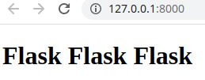
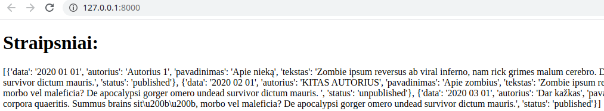
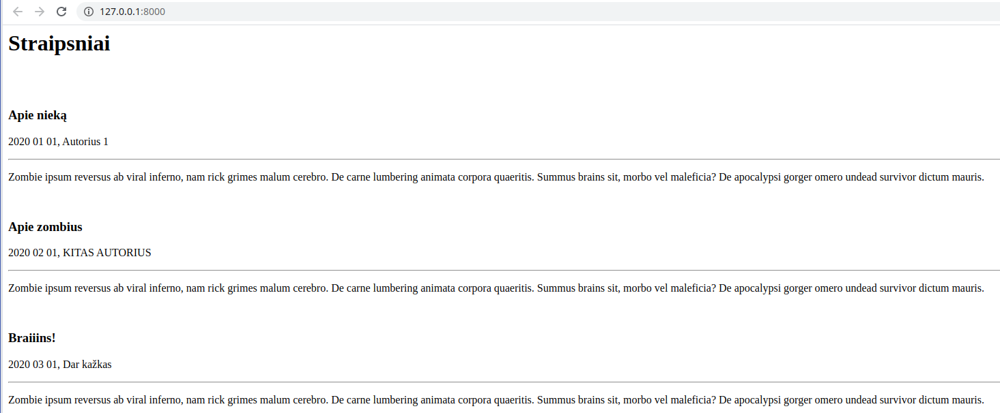
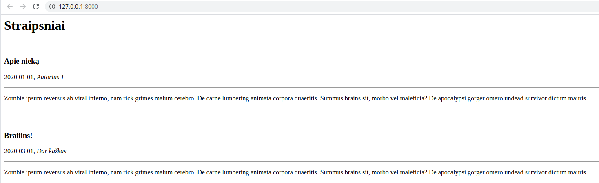
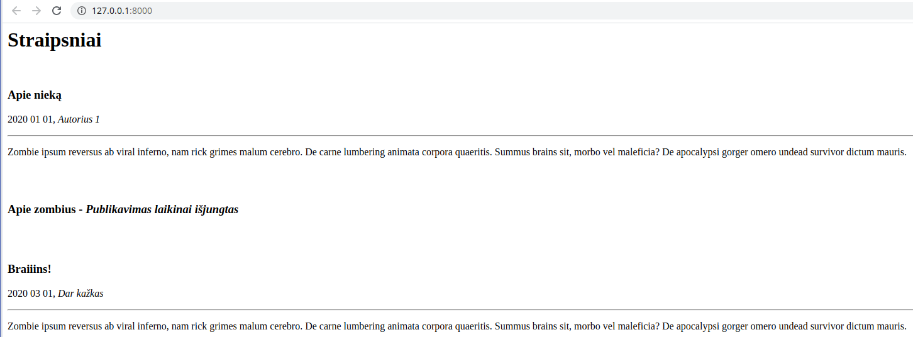
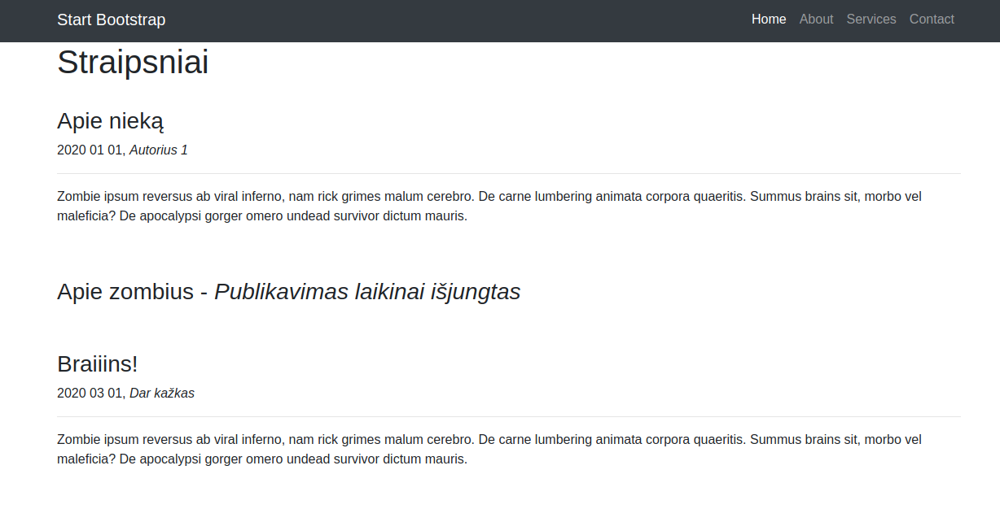
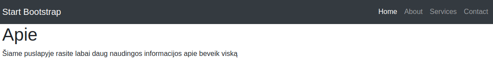

# Flask 1 dalis

Susikurkime paprastą flask aplikaciją:

app.py:
```python
from flask import Flask, render_template
# iš flask bibliotekos importuojame klasę Flask ir f-ją render_template.
app = Flask(__name__)
# inicijuojame klasės Flask objektą, priskiriame kintamąjam app.

@app.route('/')
# įvelkame f-ją į flask dekoratorių. Be jo  funkcija būtų bereikšmė. Dekorato riaus parametruose nurodome, kad norėsime rezultato 127.0.0.1:8000/ url adrese."""

def index():
    return render_template('index.html')
# funkcijoje index nurodome, kad norėsime sugeneruoti index.html

if __name__ == '__main__':
  app.run(host='127.0.0.1', port=8000, debug=True)

# patikrinę, ar programa leidžiama ne iš kito failo, leidžiame mūsų app, su parametrais. debug = True klaidos atveju mums rodys informatyvias žinutes naršyklėje. 
```

Komentaruose šiek tiek informacijos, kas vyksta. Dabar mums reikės susikurti html šabloną. Flask šablonų ieško templates kataloge. :

```html
<!DOCTYPE html>
<html lang="en">
<head>
    <meta charset="UTF-8">
    <meta name="viewport" content="width=device-width, initial-scale=1.0">
    <meta http-equiv="X-UA-Compatible" content="ie=edge">
    <title>Demo</title>
</head>
<body>
    <h1>Flask Flask Flask</h1>
</body>
</html>
```

Patikrinkime, ar veikia:



### Logikos naudojimas šablonuose:

Už logiką šablonuose atsako Jinja2 šablonų generatorius (templating engine), jis per savo sintaksę leidžia mums įterpti kintamuosius ir logiką į html failus. 

paruoškime paprastą žodynų sąrašą, kuris galės būti mūsų duomenų bazės imitacija:

dictionary.py:

```python
data =[{
    'data':'2020 01 01',
    'autorius': 'Autorius 1',
    'pavadinimas': 'Apie nieką',
    'tekstas': 'Zombie ipsum reversus ab viral inferno, nam rick grimes malum cerebro. De carne lumbering animata corpora quaeritis. Summus brains sit​​, morbo vel maleficia? De apocalypsi gorger omero undead survivor dictum mauris.'
},
{
    'data':'2020 02 01',
    'autorius': 'KITAS AUTORIUS',
    'pavadinimas': 'Apie zombius',
    'tekstas': 'Zombie ipsum reversus ab viral inferno, nam rick grimes malum cerebro. De carne lumbering animata corpora quaeritis. Summus brains sit​​, morbo vel maleficia? De apocalypsi gorger omero undead survivor dictum mauris. '
},
{
    'data':'2020 03 01',
    'autorius': 'Dar kažkas',
    'pavadinimas': 'Braiiins!',
    'tekstas': 'Zombie ipsum reversus ab viral inferno, nam rick grimes malum cerebro. De carne lumbering animata corpora quaeritis. Summus brains sit​​, morbo vel maleficia? De apocalypsi gorger omero undead survivor dictum mauris.' 
}]
```

Pagrindiniame faile importuokime šį kintamąjį ir perduokime į šabloną:

app.py:

```python
from flask import Flask, render_template
from dictionary import data # IMPORTUOJAME
app = Flask(__name__)


@app.route('/')

def index():
    return render_template('index.html', data=data) # PERDUODAME Į ŠABLONĄ

if __name__ == '__main__':
  app.run(host='127.0.0.1', port=8000, debug=True)
```

Dabar dirbsime su šablonu. Pradžiai tiesiog perduokime kintamąjį į *body*:

```html
<body>
    <h1>Straipsniai:</h1>
    {{ data }}  
</body>
```



Čia yra grubus žodynų sąrašo perdavimas, jį ir matome. Pabandykime tai paversti straipsnių puslapiu:

```html
<body>
    <h1>Straipsniai</h1>
    <br><br>
    
    <h3>{{ straipsnis['pavadinimas'] }}</h3>
    <p>{{ straipsnis['data'] }}, {{ straipsnis['autorius'] }}</p>
    <hr>
    <p>{{ straipsnis['tekstas'] }}</p>
    <hr>    
    
</body>
```



Matome, kaip galime iteruoti per duomenis html'e. Pamėginkime įtraukti if logiką. Pradžiai papildykime 'duomenų bazę'. Kiekviename žodyne įtraukime 'status'. Dalies statusas bus 'published', dalies 'unpublished':

```python
{
    'data':'2020 01 01',
    'autorius': 'Autorius 1',
    'pavadinimas': 'Apie nieką',
    'tekstas': 'Zombie ipsum reversus ab viral inferno, nam rick grimes malum cerebro. De carne lumbering animata corpora quaeritis. Summus brains sit​​, morbo vel maleficia? De apocalypsi gorger omero undead survivor dictum mauris.',
    'status': 'published'
}, # ir t.t.
```

įtraukime if logiką į šabloną:

```html
<body>
    <h1>Straipsniai</h1>
    <br>
    
    
    <h3>{{ straipsnis['pavadinimas'] }}</h3>
    <p>{{ straipsnis['data'] }}, <i>{{ straipsnis['autorius'] }}</i></p>
    <hr>
    <p>{{ straipsnis['tekstas'] }}</p>
    <br><br> 
    
    
</body>
```



Matome, kad straipsnis su statusu != 'published' nebuvo publikuotas.
Kaip ir python'e, galima naudoti ** ir **. Pvz.:

```html
<body>
    <h1>Straipsniai</h1>
    <br>
    
    
    <h3>{{ straipsnis['pavadinimas'] }}</h3>
    <p>{{ straipsnis['data'] }}, <i>{{ straipsnis['autorius'] }}</i></p>
    <hr>
    <p>{{ straipsnis['tekstas'] }}</p>
    <br><br>
    
    <h3>{{ straipsnis['pavadinimas'] }} - <i>Publikavimas laikinai išjungtas</i></h3>
    <br><br>
    
    
</body>
```



# Paveldėjimas šablonuose

Dažniausiai interneto svetainės turi struktūrą, kai kiekviename puslapyje atsikartoja tam tikri komponentai. Tai gali būti titulinė puslapio dalis, *\<head>* komponentai, navigacijos panelė, *footer'is*, nuorodos į CSS, JavaScript ir pan. Jinja2 turi mechanizmą, leidžiantį mums kiekvieną kartą nerašyti į šabloną šių komponentų, t.y. išsaugoti juos atskirai ir naudoti tik nuorodas į juos. Pabandykime pritaikyti praktikoje.

* Pasiskolinkime standartinį išdėstymą iš [čia](view-source:https://blackrockdigital.github.io/startbootstrap-bare/). 
* Išsaugokime į kokį nors html failą. 
* Pakeiskime lokalias css ir JavaScript nuorodas į [Bootstrap CDN](https://getbootstrap.com/docs/4.3/getting-started/introduction/)
* Perkelkime savo \<body> dalį vietoje tos dalies, kuri yra po komentaru \<!-- Page Content -->
* senąjį failą pervadinkime backup.html, naująjį - index html.

Rezultatas atrodys maždaug taip:




Įsivaizduokime, kad mums reikės dar puslapio 'apie', galbūt dar keleto puslapių ateityje. Visi jie turės tą patį bootstrap'ą, ir tą pačią navigacijos panelę. 

* templates kataloge susikurkime failą base.html
* visą turinį iš index.html nukopijuokime į naują base.html.
* tuomet viską kas yra  \<div class="container"> viduje, triname ir pakeičiame į :

```html
                </ul>
            </div>
        </div>
    </nav>

    <!-- Page Content -->

    <body>
        <div class="container">
            
            
        </div>
    </body>


    <!-- Bootstrap core JavaScript -->
    <script src="https://code.jquery.com/jquery-3.3.1.slim.min.js"
        integrity="sha384-q8i/X+965DzO0rT7abK41JStQIAqVgRVzpbzo5smXKp4YfRvH+8abtTE1Pi6jizo"
        crossorigin="anonymous"></script>
```

* Išsaugokime base.html.
* index.html pertvarkykime taip:

```html




<h1>Straipsniai</h1>
<br>


<h3>{{ straipsnis['pavadinimas'] }}</h3>
<p>{{ straipsnis['data'] }}, <i>{{ straipsnis['autorius'] }}</i></p>
<hr>
<p>{{ straipsnis['tekstas'] }}</p>
<br><br>

<h3>{{ straipsnis['pavadinimas'] }} - <i>Publikavimas laikinai išjungtas</i></h3>
<br><br>




```

papildykime savo app.py nauju maršrutu:

```python
@app.route('/about')
def about():
    return render_template('about.html')
```

base.html susiraskime navigacijoje nuorodą 'About', ir nukreipkime į savo naująjį maršrutą:

```html
<li class="nav-item">
    <a class="nav-link" href="/about">About</a>
</li>
```

susikurkime dar vieną šabloną, about.html:

```html




<h1>Apie</h1>
<p>Šiame puslapyje rasite labai daug naudingos informacijos apie beveik viską</p>


```

Svetainėje, paspaudę nuorodą atsidursime puslapyje "Apie":



Naudodami šablonų paveldėjimą, išvengiame daugybės pasikartojančio kodo. Jeigu, pvz reikėtų padaryti pakeitimus navigacijoje, juos darytumėm tik viename faile. O turinio failai gaunasi labai sutrumpinti. 

