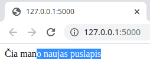
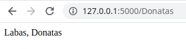
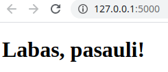
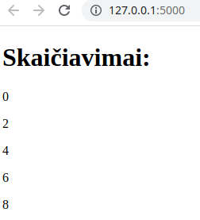
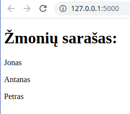
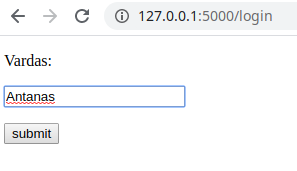
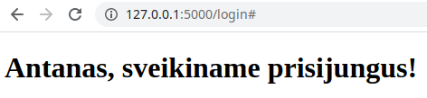

# Įžanga į flask

Flask yra populiariausias python'o microframework'as. Jeigu projektas nėra labai didelis, 
arba tiesiog norime pasidaryti kažkokį GUI per naršyklę, 
kažką greitai prototipuoti, Flask yra labai geras pasirinkimas. 
Su flask yra pakankamai paprasta gaminti API's. Diegiasi *pip install flask*. Ši paskaita bus greita įžanga, kitose 
nagrinėsime išsamiau. \

### Kaip sukurti minimalią svetainę:

```python
from flask import Flask
app = Flask(__name__)
@app.route("/")
def home():
 return "Čia mano naujas puslapis <h1></h1>"
if __name__ == "__main__":
 app.run(debug=True)
```
Gauname rezultatą:\


### Kaip puslapyje atvaizduoti įvestą kintamąjį:

```python
from flask import Flask
app = Flask(__name__)
@app.route("/<name>")
def user(name):
 return f"Labas, {name}"
if __name__ == "__main__":
 app.run()
```


### Kaip sukurti ir panaudoti HTML šabloną:
Main faile:
```python
from flask import Flask
app = Flask(__name__)
@app.route("/<name>")
def user(name):
 return f"Labas, {name}"
if __name__ == "__main__":
 app.run()
```
templates/index.html:
```html
<!DOCTYPE html>
<html lang="en">
<head>
    <meta charset="UTF-8">
    <title>Mano Puslapis</title>
</head>
<body>
<h1>Labas, pasauli!</h1>
</body>
</html>
```



### Įdėkime į šabloną šiek tiek logikos:

```html
<!DOCTYPE html>
<html lang="en">
<head>
 <meta charset="UTF-8">
 <title>Skaičiavimai</title>
</head>
<body>
<h1>Skaičiavimai: </h1>

 {%if x % 2 == 0 %}
 <p>{{x}}</p>
 

</body>
</html>
```



### Kaip kintamuosius perkelti į šabloną:

.py:
```python
from flask import Flask, render_template
app = Flask(__name__)
@app.route("/")
def home():
    vardai = ['Jonas', 'Antanas', 'Petras']
    return render_template("index.html", sarasas=vardai)
if __name__ == "__main__":
    app.run(debug=True)
```
.html
```html
<!DOCTYPE html>
<html lang="en">
<head>
 <meta charset="UTF-8">
 <title>Sarašas</title>
</head>
<body>
<h1>Žmonių sarašas: </h1>

 <p>{{vardas}}</p>

</body>
</html>
```



### Kaip perduoti duomenis iš svetainės į programą:

app.py:
```python
from flask import Flask, request, render_template
app = Flask(__name__)


@app.route("/login", methods=['GET', 'POST'])
def login():
    if request.method == "POST":
        vardas = request.form['vardas']
        return render_template("greetings.html", vardas=vardas)
    else:
        return render_template("login.html")
    
    
if __name__ == "__main__":
    app.run()
```

login.html:

```html
<!DOCTYPE html>
<html lang="en">
<head>
 <meta charset="UTF-8">
 <title>Prisijungimas</title>
</head>
<body>
 <form action="#" method="post">
 <p>Vardas:</p>
 <p><input type="text" name="vardas"/></p>
 <p><input type="submit" value="submit"/></p>
 </form>
</body>
</html>
```



greetings.html:

```html
<!DOCTYPE html>
<html lang="en">
<head>
 <meta charset="UTF-8">
 <title>Sveikiname</title>
</head>
<body>
 <h1>{{vardas}}, sveikiname prisijungus!</h1>
</body>
</html>
```

