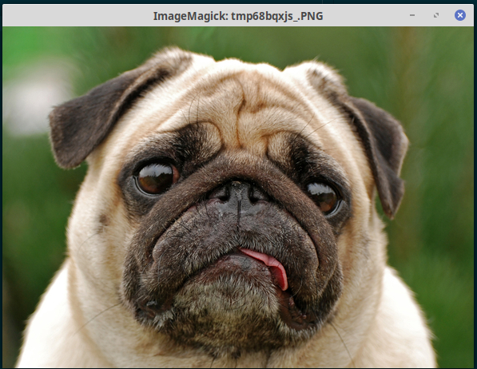
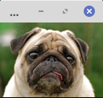
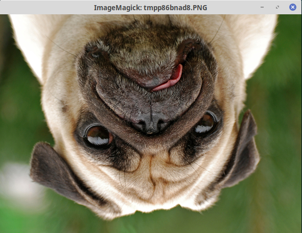
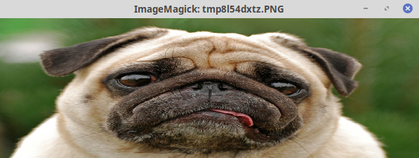
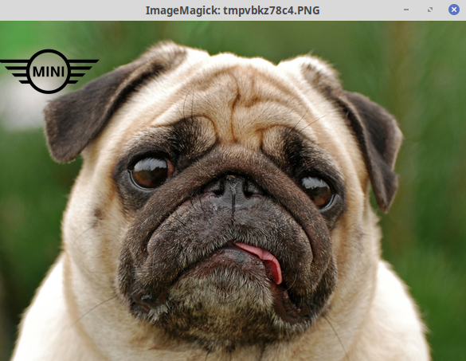
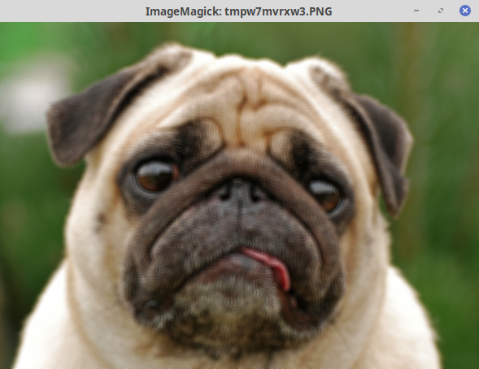
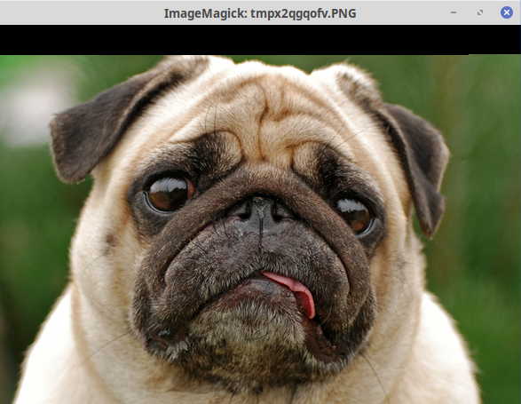
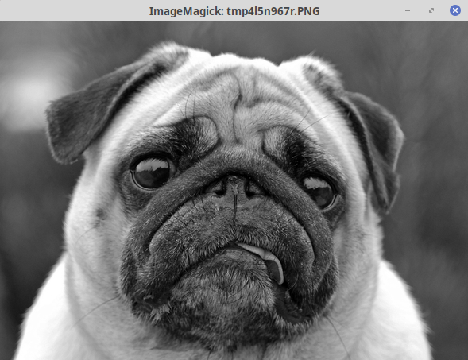
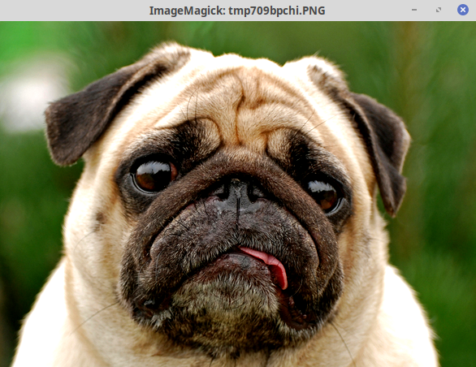

### Darbas su nuotraukomis

Dirbsime su python PIL biblioteka. Diegiasi *pip install Pillow*. Pradėkime nuo paprasto nuotraukos nuskaitymo ir atvaizdavimo ekrane:

```python
from PIL import Image

im = Image.open("dog.jpg")
im.show()
```

susikūrėme objektą im, kuris turi daugybę įvairių metodų, jų tarpe ir show(), kuris tiesiog atspausdina nuotrauką ekrane. 



## Nuotraukos išsaugojimas

Išsaugokime nuotrauką kitu pavadinimu:

```python
from PIL import Image

im = Image.open("dog.jpg")
im.save('large_dog.jpg')
```
šalia *dog.jpg* atsirado failas *large_dog.jpg*. Tai tik paprastas pavyzdys, prieš tai galime atlikti įvairiausias modifikacijas, ir išsaugoti kitame formate, pvz .png

## .format, .size, .mode

```python
from PIL import Image

im = Image.open("dog.jpg")
print(im.format, im.size, im.mode)

# JPEG (590, 428) RGB
```

## .thumbnail

```python
from PIL import Image

size = 128, 128
im = Image.open("dog.jpg")
im.thumbnail(size)
im.show()
```

sukuria miniatiūrą (*thumbnail*). Metodas išlaiko paveikslėlio proporcijas.



## .crop

```python
from PIL import Image

im = Image.open("dog.jpg")
box = (100, 100, 300, 300)
region = im.crop(box)
region.show()
```
Padaro iškarpą pagal nurodytas koordinates. Koordinačių sistemos pradžia (0,0) yra paveikslėlio viršutiniame-kairiame kampe. Šiuo atveju buvo nurodyti 2 taškai 100,100 ir 300,300. 


## .transpose

```python
from PIL import Image

im = Image.open("dog.jpg")
im.transpose(Image.FLIP_TOP_BOTTOM).show()
```

Transformuoja paveikslėlį pagal nurodytą parametrą. Galimi parametrai - Image.FLIP_LEFT_RIGHT, Image.FLIP_TOP_BOTTOM, Image.ROTATE_90, Image.ROTATE_180,Image.ROTATE_270, Image.TRANSPOSE



## .resize()

```python
from PIL import Image

im = Image.open("dog.jpg")
im.resize((500,200)).show()
```

pakeičia nuotraukos dydį pagal nurodytas reikšmes.



## .paste()

ant nuotraukos uždeda kitą nuotrauką. Tarkime turime logotipą su permatomu fonu:


Logotipo .mode turi rodyti reikšmę RGBA, kur A yra *alpha channel*, kuris nurodo, koks yra pikselio permatomumas. Sakykime, kad mums reikia tos nuotraukos su logo:

```python
from PIL import Image

dog = Image.open('dog.jpg')
logo = Image.open('logo.png')
logo_location = (0, 0, logo.size[0], logo.size[1])
dog.paste(logo, logo_location, logo)
dog.show()
```

.paste parametrai:
* *logo* - mūsų logo
* *logo_location* - vieta, kur turės būti įklijuotas logo. Svarbu atsiminti, kad vieta turi būti tokio pat dydžio, kaip ir pats logo, todėl sukurtame *tuple logo_location* naudojame kintamuosius.
* trečias parametras yra Image objektas, kurio *alpha channel* bus naudojamas kaip kaukė (mask). Šiuo atveju tai yra tas pats logo. Jeigu norėtumėm užklijuoti paprastą nuotrauką ant kitos nuotraukos viršaus, paskutinio parametro naudoti nereikia. 



## Filtrai

```python
from PIL import Image, ImageFilter

dog = Image.open('dog.jpg')
im1 = dog.filter(ImageFilter.BLUR)
im1.show()
```
Reikės papildomai importuoti *ImageFilter* modulį. Galimi filtrų variantai:
BLUR,
CONTOUR,
DETAIL,
EDGE_ENHANCE,
EDGE_ENHANCE_MORE,
EMBOSS,
FIND_EDGES,
SMOOTH,
SMOOTH_MORE,
SHARPEN. Apie filtrus daugiau informacijos rasite [čia](https://pillow.readthedocs.io/en/3.1.x/reference/ImageFilter.html#module-PIL.ImageFilter)



## .getdata()

sukuria objektą, kuriame saugomos visos pikselių reikšmės:

```python
from PIL import Image, ImageFilter

dog = Image.open('dog.jpg')
data = dog.getdata()

for i in range(5):
    print(data[i])

# (89, 142, 72)
# (89, 142, 70)
# (90, 143, 71)
# (90, 148, 74)
# (88, 144, 69)
```

## .putdata()

leidžia pakeisti paveikslėlio pikselius kitomis reikšmėmis:

```python
from PIL import Image, ImageFilter

dog = Image.open('dog.jpg')
new_pixel = (0, 0, 0)
new_data = []
for i in range(10000):
    new_data.append(new_pixel)
dog.putdata(new_data)
dog.show()
```



viršuje matome 10000 juodų pikselių.

## .convert()

```python
from PIL import Image, ImageFilter

dog = Image.open('dog.jpg')
dog_bw = dog.convert("L")
dog_bw.show()
```

Konverteris tarp "RGB", "RGBA", "L"(juoda-balta), ir daug kitų nuotraukų tipų.




### ImageEnchance modulis

papildomai importavus ImageEnchance, galime:

```python
from PIL import Image, ImageEnhance

dog = Image.open('dog.jpg')
enh = ImageEnhance.Contrast(dog)
enh.enhance(1.3).show()

#jeigu norime išsaugoti:
enh.enhance(1.3).save('test.png')

```
reguliuoti kontrastą, šiuo atveju pridėjome 30%.



* .Color reguliuoja spalvingumą
* .Sharpness - aštrumą
* .Brightness - ryškumą
