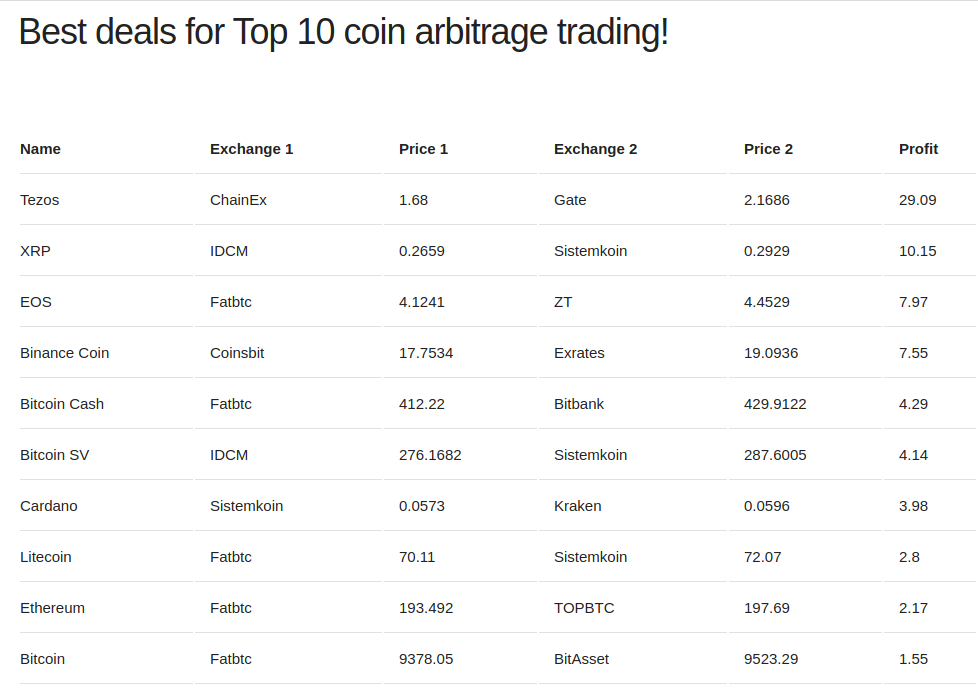

## Arbitražas

Arbitražas yra paprasta prekybos strategija, kai vienoje vietoje perkama pigiau, o kitoje - padruodama brangiau.

## Užduotis

Jums reikės, naudojant [šį](https://www.coinlore.com/cryptocurrency-data-api) API parašyti flask programėlę, kuri sugeneruotų naršyklėje lentelę, kurioje matytųsi:

* Kriptovaliutos pavadinimas
* Keityklos, kuri tą kriptovaliutą siūlo pigiausiai, pavadinimas
* Kaina USD už vnt. (pirkimo kaina)
* Keityklos, kuri tą kriptovaliutą siūlo brangiausiai, pavadinimas
* Kaina USD už vnt. (pardavimo kaina)
* Pelnas procentais.

Bonus: Leiskite vartotojui pasirinkti, iš kiek valiutų jis nori lentelės (iki 100)

Į ką atkreipti dėmesį:

* Iš valiutų TOP10 reikia išmesti USDT(Tether). Tai dolerio ekvivalentas kriptovaliutose. Mūsų nedomina USD/USDT prekyba.
* Iš keityklų išmeskite 'BCex', ji meta nesąmoningas reikšmes (x10). Jeigu dar pastebėsite panašių - meskit lauk.
* Tai tik teorinis modelis, realybėje procesas kur kas sudėtingesnis, nesugalvokite taikyti praktikoje :)

Rezultatas turi atrodyti maždaug taip:

