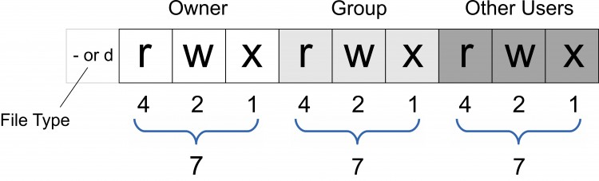
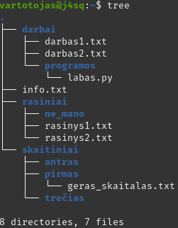
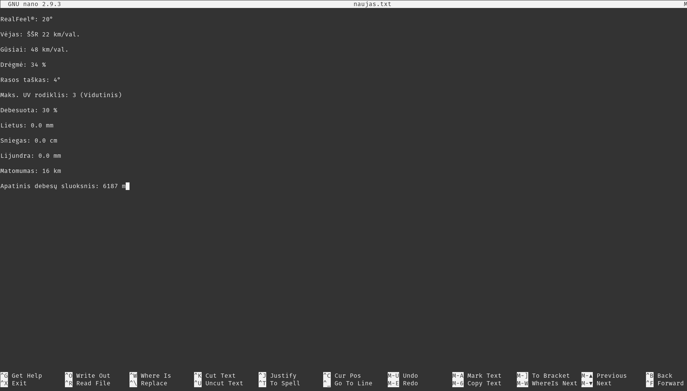
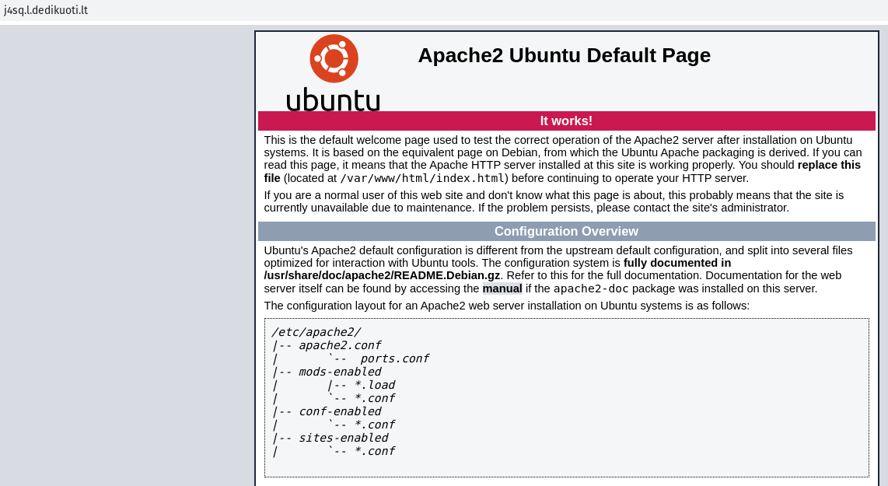
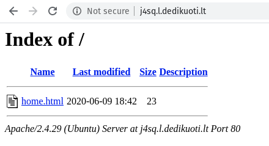

# 1-a dalis
<hr>
# Šiek tiek teorijos

Teoriją nagrinėsime tik minimaliai, tikslas yra išmokti nepasiklysti serveryje, t.y. praktinės žinios. 


Linux yra operacinė sistema, kurioje sukasi beveik visi jūsų kasdieną vartojami interneto produktai, ar tai būtų Facebook, ar Amazon, ar bet koks kitas jūsų naudojamas servisas. Netgi Microsoft savo Azure paslaugas teikia naudodami ne Windows Server, o Linux, nes reikalingas lankstumas, saugumas ir patikimumas. Jūsų telefonuose taip pat yra modifikuotas linux.

Linux turi šimtus distribucijų. [Čia](https://upload.wikimedia.org/wikipedia/commons/1/1b/Linux_Distribution_Timeline.svg) rasite gana įspūdingą iliustraciją. Distribucija paprastai žiūrint, yra aplink OS branduolį išdėliotas standartinės programinės įrangos paketas. Sakykime, vienoje distribucijoje numatyta naršyklė yra Chromium, kitoje Firefox. Vienoje jau turime sudiegtą apache serverį, o kita distribucija galbūt iš viso skirta TV priedėliui, ir nerasite ten nei ofiso nei kitų nereikalingų programų. Gali skirtis katalogų struktūra, paketų diegimo programa. 

Taip pat distribucijos gali turėti skirtingas grafines aplinkas, vienos panašesnės į MacOS, kitos į Windows, dar kitos yra unikalios, linuksinės. Mus domina darbas tarnybinėje stotyje, todėl su grafinėmis aplinkomis nesusidursime. Jos išnaudoja papildomus fizinius serverio resursus, pvz operatyviąją atmintį, procesoriaus pajėgumus, o tai verslui kainuoja papildomus pinigus. Todėl į serverius grafinės aplinkos(beveik niekada) nėra diegiamos.

Mūsų nagrinėjama distribucija bus Ubuntu Server. Be Ubuntu, serveriuose šiuo metu populiarios CentOS, Debian, OpenSUSE, Fedora. Yra ir komercinių - RHEL(Red Hat Enterprise Linux), SuSe Enterprise versija. Iš jų kūrėjų galima tikėtis palaikymo ištikus nesklandumams. 

Absoliuti dauguma mūsų nagrinėjamų komandų bus generinės - tiks bet kokiai kitai linux distribucijai. 

# Prisijungimas

Gavę serverio prisijungimo duomenis, jungsimės prie jo per [SSH](https://en.wikipedia.org/wiki/Secure_Shell) (secure shell) protokolą. Serveriuose galimybė prisijungti per SSH būna įjungta pagal nutylėjimą, todėl, jeigu kompiuteryje linux arba mac, tiesiog prisijunkime konsolėje įvedę tokią komandą:

```bash
$ ssh root@176.223.142.241
The authenticity of host '176.223.142.241 (176.223.142.241)' can't be established.
ECDSA key fingerprint is SHA256:ltze+avXA7n4N/yQOu4xyiJqVdaeSOmeg1HlMmwGt9w.
Are you sure you want to continue connecting (yes/no/[fingerprint])? yes
```
Tuomet mūsų paprašys slaptažodžio:

```bash
root@176.223.142.241's password: 
```
kurį mes suvesime, paspausime enter ir pakliūsime į savo serverio terminalą.

```bash
Welcome to Ubuntu 18.04.4 LTS (GNU/Linux 4.15.0-29-generic x86_64)

 * Documentation:  https://help.ubuntu.com
 * Management:     https://landscape.canonical.com
 * Support:        https://ubuntu.com/advantage

  System information as of Fri May 29 10:10:59 EEST 2020

  System load:  0.08              Processes:           76
  Usage of /:   7.6% of 19.56GB   Users logged in:     0
  Memory usage: 8%                IP address for ens3: 176.223.142.241
  Swap usage:   0%

 * MicroK8s passes 9 million downloads. Thank you to all our contributors!

     https://microk8s.io/

 * Canonical Livepatch is available for installation.
   - Reduce system reboots and improve kernel security. Activate at:
     https://ubuntu.com/livepatch


root@j4sq:~# 
```

serveris mus pasitinka su tokiu 'pasisveikinimu'. Apačioje matome *root@j4sq:~#* eilutę ir mirksintį kursorių. Galime rašyti komandas - pamėginkime:

```bash
root@j4sq:~# pwd
/root
```

pwd komanda mums parodo, kuriame kataloge esame, t.y. šiuo atveju esame /root kataloge. Išsamiau navigacijos komandas aptarsime visai netrukus, bet prieš tai susikurkime naują vartotoją.


# Naujo vartotojo sukūrimas

Jeigu atkreipėte dėmesį, prieš kursorių yra grotelės, jos rodo, kad esate supervartotojas, ir galite daryti absoliučiai viską, ką panorėję šioje komandinėje eilutėje. Turite leidimą viskam, galite viena trumpa komanda sunaikinti visą failų sistemą. 

Nuolat dirbti tokiame režime nėra praktiška, kadangi galite padaryti brangiai kainuosiančių klaidų. Susikurkime naują vartotoją:

```bash
root@j4sq:~# sudo useradd -m vartotojas
```
Parametras -m reiškia, kad tuo pačiu bus sukurtas vartotojo katalogas home kataloge. Priskirkime vartotojui slaptažodį:

```bash
root@j4sq:~# passwd vartotojas
Enter new UNIX password: 
Retype new UNIX password: 
passwd: password updated successfully
```

prisijunkime kaip vartotojas:

```bash
root@j4sq:~# su vartotojas
$
```

ir vietoje *root@j4sq:~#* matome dolerio ženkliuką, vadinasi vartotojas pakeistas. Pavienis dolerio ženkliukas šiek tiek neinformatyvu, surinkę komandą bash galime tai pakeisti:

```bash
$ bash
vartotojas@j4sq:/root$ 
```

norėdami sugrįžti prie superuser prisijungimo, galite surinkti:

```bash
vartotojas@j4sq:/root$ su
Password: 
root@j4sq:~# 
```

Vėliau, prireikus, dar grįšime prie vartotojų temos.

# Failų ir katalogų hierarchija, navigacija

Komanda, norint pasitikrinti, kurioje failų sistemos vietoje esame yra jau anksčiau minėta *pwd*:

```bash
root@j4sq:~# pwd
/root
```

failų ir katalogų struktūra linukse yra tokio pobūdžio:

*/katalogas/subkatalogas/failas.txt*

reikštų, kad failas *failas.txt* yra subkataloge, kuris yra kataloge. Pvz. /usr/bin/python3 yra paleidžiamasis pythono failas, esantis bin kataloge, kuris yra usr kataloge, kuris jau yra hierarchijos viršuje, ir aukščiau katalogų nėra ir negali būti, t.y. */usr/bin/python3* yra pilnas kelias (path). 
Kai kūrėme vartotoją *vartotojas*, minėjome, kad kataloge *home* jam bus sukurtas atskiras katalogas. Tad užeikime į jį ir prisijunkime kaip vartotojas:

```bash
root@j4sq:~# cd /home/vartotojas
root@j4sq:/home/vartotojas# su vartotojas
$ bash
vartotojas@j4sq:~$ 
```

su komada cd galime naviguoti per katalogus, t.y. po cd nurodome kelią iki katalogo, kuriame norime atsidurti, šiuo atveju /home/vartotojas/. 

natūralu, kad norisi pažiūrėti, kas tame kataloge yra. Šiai paskaitai buvo paruošti keletas katalogų ir failų. Katalogo turinys peržiūrimas su komanda ls:

```bash
vartotojas@j4sq:~$ ls
darbai  info.txt  rasiniai  skaitiniai
```

matome, kad turime kažkiek turinio. Norėdami išsamesnio vazdo, naudosime ls -l:

```bash
vartotojas@j4sq:~$ ls -l
total 16
drwxrwxr-x 3 vartotojas vartotojas 4096 May 29 13:51 darbai
-rw-rw-r-- 1 vartotojas vartotojas  100 May 29 13:51 info.txt
drwxrwxr-x 3 vartotojas vartotojas 4096 May 29 13:53 rasiniai
drwxrwxr-x 5 vartotojas vartotojas 4096 May 29 13:55 skaitiniai
```

dar išsamesnį rezultatą duos ls -la:

```bash
total 40
drwxr-xr-x 6 vartotojas vartotojas 4096 May 29 13:54 .
drwxr-xr-x 3 root       root       4096 May 29 10:32 ..
-rw-r--r-- 1 vartotojas vartotojas  220 Sep  1  2015 .bash_logout
-rw-r--r-- 1 vartotojas vartotojas 3771 Sep  1  2015 .bashrc
drwxrwxr-x 3 vartotojas vartotojas 4096 May 29 13:51 darbai
-rw-rw-r-- 1 vartotojas vartotojas  100 May 29 13:51 info.txt
drwxrwxr-x 3 vartotojas vartotojas 4096 May 29 13:50 .local
-rw-r--r-- 1 vartotojas vartotojas  807 Apr  4  2018 .profile
drwxrwxr-x 3 vartotojas vartotojas 4096 May 29 13:53 rasiniai
drwxrwxr-x 5 vartotojas vartotojas 4096 May 29 13:55 skaitiniai
-rw-rw-r-- 1 vartotojas vartotojas    0 May 29 13:54 .supersecret
```

* Šiek tiek panagrinėkime ką matome. Pirmame stulpelyje yra leidimų eilutės (permission strings). Jas nagrinėsime paskiausiai. 

* Pati pirma eilutė - total 40, rodo, kiek atminties blokų užima katalogas. Tai yra žemo lygmens (low-level) informacija, aktuali nebent sistemų programuotojui. 

* Toliau turime nuorodų skaičių, iš esmės tai reiškia, kad kataloge darbai rasime iš viso 3 katalogus/subkatalogus ir/ar failus, o tarkime *skaitinai* - 5.

* Sekantys 2 stulpeliai rodo katalogo savininką ir grupę, kuriai jis priklauso. Kai kūrėme vartotoją vartotojas - automatiškai sukūrėme ir grupę jam, tokiu pačiu vardu.

* Toliau turime dydį nurodytą baitais. 

* Data, kada sukurtas ar paskutinį kartą modifikuotas failas.

* Failo ar katalogo pavadinimas. Pirmi du katalogai yra loginės nuorodos. Vienas taškas - katalogo nuoroda į patį save, du taškai - į aukščiau esantį katalogą. Jeigu darytumėm *cd ..*, atsidurtumėm kataloge home. Jeigu *cd .* - atsidurtumėm ten pat, kur ir esame. T.y. neįvyktų nieko, bet tuo pačiu ir neišmestų klaidos. Tai pat yra pavadinimų prasidedančių tašku, pvz *.supersecret* - tai paslėpti failai/katalogai (hidden). Kuomet leidome komandą ls -la, raidė a parametruose reiškė, kad norime matyti ir juos (all). 

Grįžkime prie leidimų eilučių - raidės jose reiškia: 

* d - directory
* r - read
* w - write
* x - execute

Norint suprasti prasmę, eilutes reikia skaidyti į 4 dalis, kaip pavyzdį imkime drwxrwxr-x:

* d - nurodo, kad tai yra katalogas. Jeigu vietoje d būtų brūkšnelis, suprastumėm, kad turime reikalų su failu. 

* rwx - pirma porcija rodo, kokius leidimus turi savininkas, šiuo atveju *vartotojas* gali skaityti, rašyti ir vykdyti.

* rwx - antra porcija - rodo, kokius leidimus turi kiti tos pačios grupės, kuriai priklauso *vartotojas*, vartotojai.

* r-x - trečia - nurodo kokius leidimus turi visi kiti varototojai. Šiuo atveju, rašyti kiti vartotojai negali. Tik skaityti ir vykdyti.

 paveikslėlyje iliustruota, kam priklauso kokia grupė simbolių. Į skaičius kol kas nekreipkite dėmesio, juos nagrinėsime vėliau.

Komanda ls turi dar daugybę įvairiausių parametrų, kuriuos galima naudoti, norėdami sužinoti daugiau surinkite *ls --help*. Tai, beje, galioja ir kitoms komandoms. 

Norėdami vizualiau pamatyti, kokia struktūra katalogo, kuriame esate, kaip supervartotojas įdiekite programą konsolėje suvedę *apt install tree* (išsamiau apie paketų diegimą šiek tiek vėliau). Ir paleiskite konsolėje tiesiog komandą *tree*.



grįžkime prie navigacijos. Nuėjome į katalogą *vartotojas*, pažiūrėjome kas jame. Kelias gali būti nurodomas pilnas arba sąntykinis. Tarkime, pakliūti į katalogo skaitiniai trečią subkatalogą, galime dviem būdais:

```bash
vartotojas@j4sq:~$ cd skaitiniai/trečias/
vartotojas@j4sq:~/skaitiniai/trečias$
```

Tai buvo būdas, nurodant sąntykinį kelią. Būdas nurodant pilną kelią atrodytų taip:

```bash
vartotojas@j4sq:~$ cd /home/vartotojas/skaitiniai/trečias/
vartotojas@j4sq:~/skaitiniai/trečias$ 
```

Tai yra saugesnis būdas programuojant, todėl, kad kur beperkeltumėte programą, komanda suveiks. Tarp kitko, spausdinant ilgesnes komandas pravartu naudotis automatinio užbaigimo funkcija - tiesiog suvedę ilgo kelio fragmentą, spauskite TAB klavišą.

Norint papulti į aukščiau esantį (motininį) katalogą, tiesiog naudojame komandą *cd ..*. Galima peršokti nors ir per visus egzistuojančius lygius aukštyn, naudojant tokią logiką:

```bash
vartotojas@j4sq:~/skaitiniai/trečias$ cd ../..
vartotojas@j4sq:~$ pwd
/home/vartotojas
```

Šį kartą peršokome du lygius. Taip pat galėjome panaudoti tokią logiką:

```bash
vartotojas@j4sq:~/skaitiniai/trečias$ cd ../antras/
vartotojas@j4sq:~/skaitiniai/antras$ 
```

Dabar peršokome katalogu aukščiau, tada nuėjome į katalogą antras. Kur pakliūtumėm iš pagrindinio katalogo vartotojas, suvedę tokią komandą? :)

```bash
vartotojas@j4sq:~$ cd skaitiniai/antras/../trečias/../..
```

Na ir patys išsiaiškinkite, kur pakliūsite, panaudoję cd be jokių argumentų. 

Žinoma, kelio nurodymas naudojamas ne tik su cd komanda, bet ir su visom komandom, kur galima nurodyti failą ar katalogą kaip komandos objektą, pvz:

```bash
vartotojas@j4sq:~$ ls -l skaitiniai/pirmas/
total 0
-rw-rw-r-- 1 vartotojas vartotojas 0 May 29 13:55 geras_skaitalas.txt
```

# Failų skaitymas

Komanda cat leidžia perskaityti failą tiesiog konsolėje. Tai nėra redaktorius, o tiesiog skaitytuvas. Iš pažiūros, atrodytų nepilnavertis įrankis, tačiau ji labai naudinga. Sakykime norite tiesiog užmesti akį, kas parašyta faile, be jokios rizikos jį sugadinti, darbe su serveriais toks poreikis yra kasdieniškas. Naudojimas elementarus:

```bash
vartotojas@j4sq:~$ cat skaitiniai/pirmas/geras_skaitalas.txt 
Kartu su grupe kinų mokslininkų jie turėjo parengti bendrą ataskaitą apie viruso prigimtį ir apie jo plitimą 
labiausiai apgyvendintoje pasaulio šalyje. Pirmąją kelionės dieną grupės nariai-ne kinai susilinux shellninėse ir mokslinių 
tyrimų institucijose. Tai buvo vasario 16-oji, praėjus daugiau nei savaitei po to, kai Uhano gydytojas, kuris sul
aukė griežto papeikimo ir kaltinimų iš vietos pareigūnų, kai pamėgino įspėti kolegas dėl pavojingo naujojo patogeno
, pats mirė nuo viruso. Li Wenliango mirtis buvo sensacinga žinia Kinijoje, pakursčiusi audringą pasipiktinimą 
socialinėje žiniasklaidoje ir sulaukusi didelio tarptautinio atgarsio. 
```

matote visą failo geras_skaitalas.txt turinį tiesiog konsolėje. Beje, su katėmis nieko bendro komanda neturi, tai tiesiog žodžio con**cat**enate dalis :) 

Komanda tail leidžia perskaityti failo pabaigą. Tarkime, kokio nors log'o paskutines eilutes. Be argumentų komanda tail rodo paskutines 10 failo eilučių:

```bash
vartotojas@j4sq:~$ tail skaiciai.txt 
8
9
10
11
12
13
14
15
16

```

tai pat galime nurodyti, kiek eilučių norime matyti su argumentu -n :

```bash
vartotojas@j4sq:~$ tail -n 3 skaiciai.txt 
15
16

```

Komanda *head* veikia analogiškai, kaip ir tail, tik rodo ne failo pabaigą, o pradžią.

# 2-a dalis
<hr>

# Katalogų kūrimas ir trynimas

Paprastai katalogas sukuriamas naudojant **mkdir** komandą:

```bash
vartotojas@j4sq:~$ ls
darbai  info.txt  rasiniai  skaiciai.txt  skaitiniai
vartotojas@j4sq:~$ mkdir ataskaitos
vartotojas@j4sq:~$ ls
ataskaitos  darbai  info.txt  rasiniai  skaiciai.txt  skaitiniai
```

sukūrėme katalogą *ataskaitos*. Sukurkime dar keletą:

```bash
vartotojas@j4sq:~$ mkdir vienas du trys keturi penki
vartotojas@j4sq:~$ ls
ataskaitos  darbai  du  info.txt  keturi  penki  rasiniai  skaiciai.txt  skaitiniai  trys  vienas
```
Gerai įgudus, linux konsolėje daugelį procesų galima atlikti greičiau, negu grafinėje aplinkoje, tai tik vienas iš pavyzdžių. Sukurkime katalogą puslapis, katalogo darbai subkataloge programos:

```bash
vartotojas@j4sq:~$ mkdir -p darbai/programos/puslapis
vartotojas@j4sq:~$ ls darbai/programos/
labas.py  puslapis
```
Buvo panaudotas argumentas -p (parent). 
Ištrinkime neseniai sukurtus katalogus:vartotojas@j4sq:~$ find svarbu -iname 'DarbaS*.*'
svarbu/darbai/darbas1.txt
svarbu/darbai/darbas2.txt


```bash
vartotojas@j4sq:~$ rmdir  vienas du trys keturi penki
vartotojas@j4sq:~$ ls
ataskaitos  darbai  info.txt  rasiniai  skaiciai.txt  skaitiniai
```

pamėginkime ištrinti katalogą skaitiniai:

```bash
vartotojas@j4sq:~$ rmdir skaitiniai
rmdir: failed to remove 'skaitiniai': Directory not empty
```

Netuščių katalogų trynimas vyksta šiek tiek kitaip:

```bash
vartotojas@j4sq:~$ rm -rf skaitiniai/
vartotojas@j4sq:~$ ls
ataskaitos  darbai  info.txt  rasiniai  skaiciai.txt
```

# Failo sukūrimas, kopijavimas, perkėlimas, pervadinimas, trynimas

### Failo sukūrimas

Tuščias failas linux'e sukuriamas paprastai:

```bash
vartotojas@j4sq:~$ touch naujas.txt
vartotojas@j4sq:~$ ls
ataskaitos  darbai  info.txt  naujas.txt  rasiniai  skaiciai.txt
```

Galime sukurti nurodant pilną kelią arba subkataloguose, pvz:vartotojas@j4sq:~$ find svarbu -iname 'DarbaS*.*'
svarbu/darbai/darbas1.txt
svarbu/darbai/darbas2.txt


```bash
vartotojas@j4sq:~$ touch darbai/programos/helloworld.py
```

Jei norite sukurti ne tuščią failą, paprastai tai daroma prieš failo pavadinimą nurodant redagavimo programos pavadinimą ir tada kelią iki naujo failo, pvz. *nano /kažkur/tekstas.txt*. Bet apie teksto redagavimą kiek vėliau.

### kopijavimas

Paprastas failo kopijavimas vykdomas su komanda cp, nurodant kopijuojamą failą ir vietą, kur ketinate kopijuoti:

```bash
vartotojas@j4sq:~$ cp darbai/programos/helloworld.py .
vartotojas@j4sq:~$ ls
ataskaitos  darbai  helloworld.py  info.txt  naujas.txt  rasiniai  skaiciai.txt
```
šiuo atveju nukopijavome mūsų ką tik sukurtą failą helloworld.py į katalogą, kuriame esame. Tą pačią operaciją galima padaryti būnant bet kuriame failų sistemos kataloge, tarkime:

```bash
vartotojas@j4sq:/$ pwd
/
vartotojas@j4sq:/$ cp /home/vartotojas/darbai/programos/helloworld.py /home/vartotojas/
```
kaip matote, norint atlikti veiksmus su failais mums nereikia kažkur iki jų keliauti. 

Jeigu norite kopijuoti katalogą su visu turiniu, naudosime cp -r:

```bash
vartotojas@j4sq:~$ cp -r darbai ataskaitos
vartotojas@j4sq:~$ ls ataskaitos
darbai
```

Galima kopijuoti ir į neegzistuojančius katalogus, tokiu atveju sistema tokį tiesiog sukuria:

```bash
vartotojas@j4sq:~$ cp -r rasiniai svarbu
vartotojas@j4sq:~$ ls
ataskaitos  darbai  helloworld.py  info.txt  naujas.txt  rasiniai  skaiciai.txt  svarbu
```

Taip pat galima dirbti su keletu objektų, pvz *cp naujas.txt skaiciai.txt svarbu*

### perkėlimas ir pervadinimas

Perkėlimas ir pervadinimas linux'e yra vienas ir tas pats veiksmas (kopijavimas į naują vietą, senąją kopiją ištrinant), todėl ir komanda nesiskiria - mv.

Jeigu norime failą perkelti, darome taip:

```bash
vartotojas@j4sq:~$ ls
ataskaitos  darbai  helloworld.py  info.txt  naujas.txt  rasiniai  skaiciai.txt  svarbu
vartotojas@j4sq:~$ mv info.txt svarbu
vartotojas@j4sq:~$ ls
ataskaitos  darbai  helloworld.py  naujas.txt  rasiniai  skaiciai.txt  svarbu
```

Jeigu norime pervadinti failą:

```bash
vartotojas@j4sq:~$ mv helloworld.py pirmas.py
vartotojas@j4sq:~$ ls
ataskaitos  darbai  naujas.txt  pirmas.py  rasiniai  skaiciai.txt  svarbu
```

Katalogai perkeliami ir pervadinami analogiškai:

```bash
vartotojas@j4sq:~$ mv darbai svarbu
vartotojas@j4sq:~$ ls svarbu
darbai  info.txt  ne_mano  rasinys1.txt  rasinys2.txt
```
pervadinimas:
```bash
vartotojas@j4sq:~$ mv ataskaitos ataskaita
vartotojas@j4sq:~$ ls
ataskaita  naujas.txt  pirmas.py  rasiniai  skaiciai.txt  svarbu
```

### Trynimas

Failų (o praktiškai ir katalogų) trynimui naudojama komanda rm.
* *rm failo_vardas* - ištrinamas failas
* *rm -rf katalogo_pavadinimas* - ištrinamas katalogas su turiniu (jau darėme)
* *rm -f failo_pavadinimas* - trynimas per jėgą (force). Naudojamas, kai sistema nenori leisti trinti ir norint išvengti įvairių dialogų.
vartotojas@j4sq:~$ find svarbu -iname 'DarbaS*.*'
svarbu/darbai/darbas1.txt
svarbu/darbai/darbas2.txt

Išsibandykite. Trinti taip pat galima ir po kelis failus, nurodant jų pavadinimus:

```bash
vartotojas@j4sq:~$ ls
1.py  2.py  3.py  4.py  ataskaita  naujas.txt  pirmas.py  rasiniai  skaiciai.txt  svarbu
vartotojas@j4sq:~$ rm 1.py 2.py 
vartotojas@j4sq:~$ ls
3.py  4.py  ataskaita  naujas.txt  pirmas.py  rasiniai  skaiciai.txt  svarbu
```

arba naudojant filtravimus, pvz ištrinti visus .py failus galima taip:

```bash
vartotojas@j4sq:~$ rm *.py
vartotojas@j4sq:~$ ls
ataskaita  naujas.txt  rasiniai  skaiciai.txt  svarbu
```
vartotojas@j4sq:~$ find svarbu -iname 'DarbaS*.*'
svarbu/darbai/darbas1.txt
svarbu/darbai/darbas2.txt

jeigu norite vykdyti didelę operaciją ir bijote suklysti su filtrais, iš pradžių galite prafiltruoti su ls:

```bash
vartotojas@j4sq:~$ ls *.txt
naujas.txt  skaiciai.txt
```

taip pamatysite, kas bus ištrinta vietoje ls panaudojus komandą rm.

Trinkite atsargiai, linux'as neturi ctrl+z, recycle bin šiukšliadėžės ar panašių sugrįžimo atgal galimybių!

# Archyvai

Archyvai naudojami siunčiant failų grupes kaip vieną failą, ir/arba norint sutaupyti vietos diske. 
Archyvavimui naudojama tar programa. Dažniausi jos argumentai:
* c - sukurti tar archyvą
* x - išarchyvuoti
* t - atvaizduoti archyvo turinį
* z - naudoti kompresiją (siekiant sutaupyti vietos)
* f *failo_pavadinimas* - naudoti šį failą
raspberri pi

```bash
vartotojas@j4sq:~/svarbu$ ls
darbai  info.txt  ne_mano  rasinys1.txt  rasinys2.txt
vartotojas@j4sq:~/svarbu$ tar cf archyvas.tar rasinys1.txt rasinys2.txt
vartotojas@j4sq:~/svarbu$ ls
archyvas.tar  darbai  info.txt  ne_mano  rasinys1.txt  rasinys2.txt
vartotojas@j4sq:~/svarbu$ 
```
sukūrėmė archyvą archyvas.tar, į kurį įdėjome failus rasinys1.txt ir rasinys2.txt. Pažiūrėkime archyvo turinį:

```bash
vartotojas@j4sq:~/svarbu$ tar tf archyvas.tar 
rasinys1.txt
rasinys2.txt
```

išarchyvuokime failą į katalogą darbai (išarchyvuojant vietoje, katalogo nurodyti nereikia):

```bash
vartotojas@j4sq:~/svarbu$ tar xvf archyvas.tar -C darbai
rasinys1.txt
rasinys2.txt
vartotojas@j4sq:~/svarbu$ ls darbai
darbas1.txt  darbas2.txt  programos  rasinys1.txt  rasinys2.txt
```

Išarchyvavome naudodami *verbose* režimą, todėl bearchyvuodamas *tar* mums spausdino failų pavadinimus. Atskirai su -C nurodėme, kad norime išarchyvuoti į katalogą 'darbai'. Patikrinome rezultatą.

Linukse archyvai paprastai baigiasi tar arba tar.gz galūne. Jeigu norime išarchyvuoti paprastą zip'ą, galime daryti *unzip failo_pavadinimas*.


# Paieška

Paiešką galima vykdyti su *find*. Naudingi parametrai:

* *-name pattern* nurodome šabloną, pagal kurį ieškosime, pvz. **python**, arba **\*.py**
* *-iname pattern* tas pats, kaip ir name, tik nejautrus didžiosioms-mažosioms raidėms
* *-ls* kiekvieną rezultatą, jeigu tai yra katalogas, išskleidžia ir parodo jo turinį

pavyzdžiai:

```bash
vartotojas@j4sq:~$ find -name '*.txt'
./skaiciai.txt
./naujas.txt
./svarbu/rasinys1.txt
./svarbu/rasinys2.txt
./svarbu/info.txt
./svarbu/darbai/darbas1.txt
./svarbu/darbai/rasinys1.txt
./svarbu/darbai/rasinys2.txt
./svarbu/darbai/darbas2.txt
./rasiniai/rasinys1.txt
./rasiniai/rasinys2.txt
./ataskaita/darbai/darbas1.txt
./ataskaita/darbai/darbas2.txt
```

Paprasta paieška, surado visus .txt failus kataloge kur esame ir subkataloguose. Dabar nurodykime katalogą, kuriame vykdysime paiešką:

```bash
vartotojas@j4sq:~$ find svarbu -name 'darbas*.*'
svarbu/darbai/darbas1.txt
svarbu/darbai/darbas2.txt
uose kataloguose, kurie prasideda žodžiu 'darbas'. Išbandykime *-iname* parametrą:

```bash
vartotojas@j4sq:~$ find svarbu -iname 'DarbaS*.*'
svarbu/darbai/darbas1.txt
svarbu/darbai/darbas2.txt
```

matome, kad didžiąsias raides ignoruoja puikiai. Pamėginkime kataloge *svarbu* surasti ką nors iš raidės d, ir įvykdyti -ls komandą rezultatui:

```bash
vartotojas@j4sq:~$ find svarbu -name 'd*' -ls
   917784      4 drwxrwxr-x   3 vartotojas vartotojas     4096 May 31 12:53 svarbu/darbai
   917789      0 -rw-rw-r--   1 vartotojas vartotojas        0 May 29 13:51 svarbu/darbai/darbas1.txt
   917790      0 -rw-rw-r--   1 vartotojas vartotojas        0 May 29 13:51 svarbu/darbai/darbas2.txt
```

# Teksto redagavimas

Linux konsolėje yra keli populiarūs redaktoriai, tarp jų - vim ir nano. Vim yra labai galingas redaktorius, kurį galima sukonfogūruoti kaip IDE, ir programuoti bet kokiomis programavimo kalbomis, su eilučių numeravimu, klaidų paieška, keletu langų, užbaigimo sufleriu ir t.t. Privalumas - greitis, nes nenaudojama grafinė aplinka. Taip pat galime dirbti praktiškai bet kur, kur yra linux. Resursų pakaks netgi prieštvaniniame raspberry pi. Dalis žmonių pabandę vim atsisako grafinių redaktorių savo Mac'uose, ir dirba konsolėje. Tai nėra šios tema, bet žinoti verta, nes galbūt susidursite su situacija, kai reikės IDE ten, kur nėra grafinės aplinkos.

Mes aptarsime kur kas paprastesnį - nano redaktorių. 

Darbą pradedame paprastai - *nano failo-pavadinimas*. Atsidaro toks redaktorius:



Kursorius valdosi su rodyklių klavišais, pradėti dirbti užtenka šių komandų 

* Ctrl+x - išeina iš redaktoriaus, jeigu yra ką išsaugoti, paklausia ar reikia tą padaryti.
* Ctrl+o - tas pats kaip Ctrl+s grafinėse programose. Išsaugo. Kai kuriose nano versijose veikia ir Ctrl+s, kai kuriose neveikia.
* Ctrl+w - paieška. Nėra labai galinga, tačiau jei prireikia surasti kokį nors nustatymą konfigūraciniam faile, jeigu failas didelis - kartais pravartu.
* Ctrl+_ - go to line. Kai kode atsiranda klaida, ir žinome, kurioje eilutėje ji yra, gana greitai galime ją surasti.

Visas komandas matysite lango apačioje. Taip pat pravartu žinoti - Ctrl+z 'minimizuoja' programą, ir jūs pakliūnate į terminalą. Vėliau, norėdami sugrįžti, surinkite komandą *fg*.

Neverta tikėtis, kad šią programą naudosite programavimo procesui, labiau tik nedideliems pataisymams, konfigūracijos nustatymams pakeisti. Programuosite dažniau lokaliai, paskui per git perkelsite į serverį. Dar vienas variantas, pvz. VSCode turi išplėtinius, leidžiančius prisijungti per SSH prie katalogo serveryje ir programuoti tokiu būdu. Kur netinka nei vienas nei kitas, visada tiks Vim, tačiau jį užtruks laiko pramokti ir susikonfigūruoti.

# 3-ia dalis
<hr>
# Vartotojai, grupės ir leidimai

Jau esame susikūrę vartotoją, su kuriuo prisijungę galime pažaisti jam priskritoje smėliadėžėje /home/vartotojas. Bėda ta, kad vartotojas už to katalogo ribų turi labai ribotas galimybes kažką nuveikti. Taip yra todėl, kad jam nėra suteiktos supervartotojo privilegijos. Paprastai tokiu atveju naudojamas žodelis sudo prieš komandą, kurią norite vykdyti, bet neturite tam leidimo. Kai kuriose OS instaliacijose tokia galimybė yra numatyta pagal nutylėjimą, mūsų atveju (dedikuoti.lt VPS) reikės šiek tiek pakoreguoti failą, kuriame įtrauksime vartotoją į galinčių naudoti sudo komandą gretas.

Trumpa demonstracija ir kokių veiksmų reikia imtis:

```bash
vartotojas@j4sq:/root$ cat /var/log/syslog
cat: /var/log/syslog: Permission denied
vartotojas@j4sq:/root$ sudo cat /var/log/syslog
[sudo] password for vartotojas: 
vartotojas is not in the sudoers file.  This incident will be reported.
vartotojas@j4sq:/root$ su
Password: 
root@j4sq:~# nano /etc/sudoers
```

* Pabandėme perskaityti failą /var/log/syslog
* Mums nepavykom nes *Permision denied*
* Pabandėme su žodeliu *sudo* priekyje komandos
* Mums nepavykom nes nesame įtraukti į *sudoers file*
* prisijungiame kaip supervartotojas
* atidarome failą /etc/sudoers. Jame:

```
···
# User privilege specification
root    ALL=(ALL:ALL) ALL
vartotojas      ALL=(ALL:ALL) ALL
···
```

* susirandame teksto atkarpą *# User privilege specification*
* po ja jau matome, kad įtrauktas vartotojas *root*
* po juo įrašome  *vartotojas      ALL=(ALL:ALL) ALL*
* išeiname iš redaktoriaus, išsaugodami failą. Tada:

```bash
root@j4sq:~# su vartotojas
$ bash
vartotojas@j4sq:/root$ cat /var/log/syslog
cat: /var/log/syslog: Permission denied
vartotojas@j4sq:/root$ sudo cat /var/log/syslog
[sudo] password for vartotojas: 

Jun  5 07:17:01 j4sq CRON[22187]: (root) CMD (   cd / && run-parts --report /etc/cron.hourly)
Jun  5 08:17:01 j4sq CRON[22205]: (root) CMD (   cd / && run-parts --report /etc/cron.hourly)
·············
```
* prisijungiame kaip vartotojas
* pabandom perskaityti tą logą dar kartą
* neleidžia, nes *Permission denied*
* atsidarome su *sudo* ir skaitome.

Dabar, kai mūsų vartotojas jau gali veikti su supervartotojo privilegijomis, galime toliau nagrinėti vartotojų temą. Jau žinote, kaip sukurti vartotoją, pvz:

```bash
vartotojas@j4sq:/root$ sudo useradd -m antanas
vartotojas@j4sq:/root$ sudo passwd antanas
Enter new UNIX password: 
Retype new UNIX password: 
passwd: password updated successfully
```

Beje, sukūrus naują vartotoją, juo galima prisijungti prie jūsų serverio:

```bash
jt@pop-os:~$ ssh antanas@j4sq.l.dedikuoti.lt
antanas@j4sq.l.dedikuoti.lt's password: 
Welcome to Ubuntu 18.04.4 LTS (GNU/Linux 4.15.0-29-generic x86_64)
```

Todėl rekomenduotina slaptažodžius kurti kiek sudėtingesnius, paprasta rekomendacija - ne mažiau kaip 8 simbolių, įtraukiant ne tik mažąsias raides, bet ir didžiąsias, bei skaičius. Geriau perteklinis saugumas, negu ieškiniai ir kiti nemalonumai :)

Taigi, dabar pažiūrėkime, kokie yra vartotojai sistemoje. Jie yra faile /etc/passwd :

```bash
vartotojas@j4sq:/$ cat /etc/passwd
root:x:0:0:root:/root:/bin/bash
daemon:x:1:1:daemon:/usr/sbin:/usr/sbin/nologin
bin:x:2:2:bin:/bin:/usr/sbin/nologin
sys:x:3:3:sys:/dev:/usr/sbin/nologin
sync:x:4:65534:sync:/bin:/bin/sync
games:x:5:60:games:/usr/games:/usr/sbin/nologin
man:x:6:12:man:/var/cache/man:/usr/sbin/nologin
lp:x:7:7:lp:/var/spool/lpd:/usr/sbin/nologin
mail:x:8:8:mail:/var/mail:/usr/sbin/nologin
news:x:9:9:news:/var/spool/news:/usr/sbin/nologin
uucp:x:10:10:uucp:/var/spool/uucp:/usr/sbin/nologin
proxy:x:13:13:proxy:/bin:/usr/sbin/nologin
www-data:x:33:33:www-data:/var/www:/usr/sbin/nologin
backup:x:34:34:backup:/var/backups:/usr/sbin/nologin
list:x:38:38:Mailing List Manager:/var/list:/usr/sbin/nologin
irc:x:39:39:ircd:/var/run/ircd:/usr/sbin/nologin
gnats:x:41:41:Gnats Bug-Reporting System (admin):/var/lib/gnats:/usr/sbin/nologin
nobody:x:65534:65534:nobody:/nonexistent:/usr/sbin/nologin
systemd-timesync:x:100:102:systemd Time Synchronization,,,:/run/systemd:/bin/false
systemd-network:x:101:103:systemd Network Management,,,:/run/systemd/netif:/bin/false
systemd-resolve:x:102:104:systemd Resolver,,,:/run/systemd/resolve:/bin/false
syslog:x:104:108::/home/syslog:/bin/false
_apt:x:105:65534::/nonexistent:/bin/false
lxd:x:106:65534::/var/lib/lxd/:/bin/false
dnsmasq:x:107:65534:dnsmasq,,,:/var/lib/misc:/bin/false
messagebus:x:108:111::/var/run/dbus:/bin/false
sshd:x:109:65534::/var/run/sshd:/usr/sbin/nologin
landscape:x:103:105::/var/lib/landscape:/usr/sbin/nologin
pollinate:x:110:1::/var/cache/pollinate:/bin/false
naujas:x:1000:1000::/home/naujas:/bin/sh
vartotojas:x:1001:1001::/home/vartotojas:/bin/sh
antanas:x:1002:1002::/home/antanas:/bin/sh
```

Ir čia jūsų laukia netikėtumas, mes juk sukūrėme tik vieną ar du vartotojus, kodėl tiek daug eilučių? Na, operacinė sistema savo techniniams poreikiams turi susikūrusi nemažai vartotojų (sisteminės paskyros?). Tarkime vartotoją www-data savo poreikiams išnaudos web-serveriai (pvz. apache, nginx). Vartotojas sshd - atlieka įvairias operacijas reikalingas  ssh serverio veikimui ir t.t. Kaip interpretuoti šias eilutes?

```bash
vartotojas:x:1001:1001::/home/vartotojas:/bin/sh
```

* *vartotojas* - vardas.
* *x* - vietos žymeklis (placeholder) slaptažodžiui. Jie (užšifruoti) guli /etc/shadow
* 1001 - uid (user id). Sistema viduje naudoja būtent šį skaičių vartotojo identifikacijai.
* 1001 - group id.
* tuščia vieta tarp :: - ten būna įrašytas trumpas komentaras apie vartotoją, pvz *Mailing List Manager*. Mūsų atveju to komentaro nėra.
* /home/antanas - vartotojo namų katalogas
* /bin/sh - koks terminalas yra įjungiamas, vartotojui prisijungus.

failo redaguoti nerekomenduotina :)

Ištrinkime vartotoją *antanas*:

```
vartotojas@j4sq:~$ sudo userdel -r antanas
[sudo] password for vartotojas: 
userdel: antanas mail spool (/var/mail/antanas) not found
```

Ištrynėme, informaciją apie mail spool ignoruokime. -r argumentą panaudojome tam, kad ištrintumėm ir antano namų katalogą, be šio argumento jis būtų paliktas. 

### Grupės

Jeigu įvykdysite komandą *groups*, sužinosite kokioms grupėms priklauso vartotojas, kurio vardu įvykdėte komandą:

```bash
vartotojas@j4sq:/home$ groups
vartotojas
```

jeigu norite sužinoti, kokioms grupėms priklauso kitas vartotojas:

```bash
vartotojas@j4sq:/home$ groups root
root : root
```

jeigu norite pridėti vartotoją prie kurios nors grupės:

```bash
vartotojas@j4sq:/home$ sudo useradd pirmas
[sudo] password for vartotojas: 
vartotojas@j4sq:/home$ sudo gpasswd -a pirmas vartotojas
Adding user pirmas to group vartotojas
vartotojas@j4sq:/home$ groups pirmas
pirmas : pirmas vartotojas
```

* sukūrėme vartotoją *pirmas*
* sudo gpasswd -a pirmas vartotojas - nurodėme kad norime vartotoją *pirmas* priskirti grupei *vartotojas*
* patikrinome, kokioms grupėms priklauso vartotojas *pirmas*. Jis priklauso grupėms *pirmas* ir *vartotojas*. Nepamirškime, kad sukūrus vartotoją, automatiškai tuo pačiu vardu sukuriama ir grupė, dėl to šis pavyzdys gali pasirodyti kiek painokas. 

norėdami pamatyti, kokios yra grupės, skaitome failą */etc/groups*. 

```bash
vartotojas@j4sq:/home$ tail -n 5 /etc/group
landscape:x:105:
naujas:x:1000:
vartotojas:x:1001:pirmas
pirmas:x:1002:
antras:x:1003:
```

Skaitome tik failo 'uodegą' nes grupių turime dar daugiau, negu vartotojų. Matome grupės pavadinimą, GID (group id), toliau rikiuojasi grupei priklausantys vartotojai, išskyrus to paties vardo vartotoją. Pvz prie grupės *vartotojas* matome, kad jai priklauso dar ir vartotojas *pirmas*.

Sukurkime grupę:

```bash
vartotojas@j4sq:/home$ sudo groupadd cadecademy
```

priskirkime jai kokį nors vartotoją ir patikrinkime, kaip pavyko:

```bash
vartotojas@j4sq:/home$ sudo gpasswd -a antras cadecademy
vartotojas@j4sq:/home$ tail -n 5 /etc/group
naujas:x:1000:
vartotojas:x:1001:pirmas
pirmas:x:1002:
antras:x:1003:
cadecademy:x:1004:antras
```

dabar pašalinkime vartotoją *antras* iš grupės cadecademy:

```bash
vartotojas@j4sq:/home$ sudo gpasswd -d antras cadecademy
Removing user antras from group cadecademy
vartotojas@j4sq:/home$ groups antras
antras : antras
```

ištrinkime grupę cadecademy:

```bash
vartotojas@j4sq:/home$ sudo groupdel cadecademy
```

### Leidimai

Viena iš svarbesnių temų linux'e - leidimai. Dažnai susidursite su situacija, kai jums nebus leista kažko vykdyti, jūsų programai bus apribotos galimybės kažką daryti ir t.t. tik todėl, kad nesuteiktas leidimas tą daryti. Pažinties su komanda ls metu išsiaiškinome, ką reiškia eilutė, pvz. *-rwxr-x---*. Dabar atėjo metas pasiaiškinti, kaip keisti šiuos nustatymus. 


Kad nereikėtų ieškoti, dar kartą įkeliu paveikslėlį.

Paskaitai paruoštas pavyzdys:

```bash
vartotojas@j4sq:~$ ls -l
total 16
-rw-rw-r-- 1 vartotojas vartotojas    3 Jun  6 06:20 batu_dydis.txt
drwx------ 2 dede       dede       4096 Jun  6 06:21 dedes
drwxrwxr-x 2 teta       teta       4096 Jun  6 06:21 tetos
-r-------- 1 root       root         22 Jun  6 06:19 topsecret.txt
```

esame prisijungę kaip vartotojas ir galime pabandyti prisijungti prie dedes ir tetos katalogų, paskaityti failą topsecret.txt:

```bash
vartotojas@j4sq:~$ cd dedes
bash: cd: dedes: Permission denied
vartotojas@j4sq:~$ cd tetos
vartotojas@j4sq:~/tetos$ ls
antras.tetos  pirmas.tetos
vartotojas@j4sq:~/tetos$ cat ../topsecret.txt 
cat: ../topsecret.txt: Permission denied
vartotojas@j4sq:~/tetos$ sudo cat ../topsecret.txt 
nėra jokio šaukšto
```

Matome, kad apribojimai veikia, t.y. su katalogu *dedes* kažką iš viso daryti gali tik dede, su tetos katalogu situacija standartinė - galima užeiti, bet daryti pakeitimų ne, topsecret.txt prieinamas tik supervartotojui. Vartotojas *vartotojas* turi teisę naudoti komandą sudo ir tokiu būdu apeiti apribojimus. Tarkime *dede* arba *teta* sudo komandos vartoti negali:

```bash
teta@j4sq:/home/vartotojas/tetos$ cd ../dedes
bash: cd: ../dedes: Permission denied
teta@j4sq:/home/vartotojas/tetos$ sudo cd ../dedes
[sudo] password for teta: 
teta is not in the sudoers file.  This incident will be reported.
```

tetos kataloge laisvės daugiau, tačiau dėdė negali rašyti į jos failus, tik skaityti. Pabandęs išsaugoti, redaktoriuje pamtys eilutę *[ Error writing antras.tetos: Permission denied ]*. 

Yra keli būdai keisti šią situaciją. 

* Priimti dėdę į tetos grupę. 
* Pakeisti failo/katalogo savininką. 
* Pakeisti katalogo/failo grupę. 
* Modifikuoti nustatytus leidimus.

Priimti vartotojus į grupes mes jau mokame, panagrinėkime kitus punktus. Norėdami pakeisti failo/katalogo savininką naudosime komandą *chown*:

```bash
vartotojas@j4sq:~$ sudo chown -R dede tetos
[sudo] password for vartotojas: 
vartotojas@j4sq:~$ ls -l
total 16
-rw-rw-r-- 1 vartotojas vartotojas    3 Jun  6 06:20 batu_dydis.txt
drwx------ 2 dede       dede       4096 Jun  6 06:21 dedes
drwxrwxr-x 2 dede       teta       4096 Jun  6 06:21 tetos
-r-------- 1 root       root         22 Jun  6 06:19 topsecret.txt
```

-R naudojame tam, kad visi failai viduje taip pat priklausytų dėdei.

kaip pakeisti grupę? Jeigu norite keisti kartu su savininku, paprasčiausias būdas - nurodyti grupę po dvitaškio:

```
sudo chown -R dede:dede tetos
```

Norint pakeisti tik grupę, reikia naudoti chgrp:

```bash
sudo chgrp -R teta tetos
```

Dabar pasiaiškinmime, kaip keisti pačių leidimų struktūrą. Tam naudojama komanda *chmod*. Galime naudoti su argumetais *u, g ir o* (user, group, others). Pvz.:

```bash
vartotojas@j4sq:~$ sudo chmod o+r dedes
vartotojas@j4sq:~$ ls -l
total 16
-rw-rw-r-- 1 vartotojas vartotojas    3 Jun  6 06:20 batu_dydis.txt
drwx---r-- 2 dede       dede       4096 Jun  6 06:21 dedes
drwxrwxr-x 2 dede       teta       4096 Jun  6 06:21 tetos
-r-------- 1 root       root         22 Jun  6 06:19 topsecret.txt
```

Leidome visiems paskaityti, kas ten pas dėdę parašyta. Kiti *ugo* argumentų naudojimo pavyzdžiai:

* *chmod u=rx file*     -   suteikėme savininkui rx, bet ne w
* *chmod go-rwx file*    -  atėmėme iš grupės ir kitų visus leidimus
* *chmod g+w file*        - pridėjome grupei galimybę rašyti
* *chmod a+x file1 file2*  -a (all), leidome visiems vykdyti 2 failus
* *chmod g+rx,o+x file*     -galime kombinuoti per kablelį

taip pat chmod dažnai naudojama su skaitiniais argumentais, pasitelkiant tokią logiką:

* 4 - read
* 2 - write
* 1 - execute

įsivaizduokime, kad reikia leidimo savininkui daryti viską, grupei tik skaityti, o kitiems - nieko. naudosime skaičių kombinaciją 740, todėl, kad:

4 + 2 + 1 (rwx) = 7 (savininkui)
4 + 0 + 0 (r--) = 4 (grupei)
0 + 0 + 0 (---) = 0 (visiems)

pabandykime praktikoje:

```bash
vartotojas@j4sq:~$ sudo chmod 740 batu_dydis.txt 
vartotojas@j4sq:~$ ls -l
total 16
-rwxr----- 1 vartotojas vartotojas    3 Jun  6 06:20 batu_dydis.txt
drwxrwxr-- 2 dede       dede       4096 Jun  6 06:21 dedes
drwxrwxr-x 2 dede       teta       4096 Jun  6 11:03 tetos
-r-------- 1 root       root         22 Jun  6 06:19 topsecret.txt
```

Matome, kad leidimai failui batu_dydis.txt pasikeitė, kaip ir planuota.


logika nėra labai sudėtinga - lentelėje matome jog remiamasi aštuntaine skaičiavimo sistema - tarkime 7 aštuntainėje = 111 - t.y. įjungia visus tris leidimus, rwx. Ši lentelė tik iliustracija, kuo remiasi ši leidimų nustatymo sistema, jeigu dėl jos darosi dar painiau, tiesiog sumuokite 4, 2, 1, 0 skaičius, atsimindami, kad read yra 4, write yra 2, o execute 1. 

# IV Dalis

## grep

<hr>

Dažnai mums ieškant kokios nors informacijos paieškoje, nuskaitant visą failą ar katalogą, gauname informacijos perteklių, kuriame sunku atsirinkti, ko reikia. Tokiu atveju labai naudinga naudotis komanda *grep*. 

Tarkime, kad didžiuliame .py faile reikia susirasti, kaip jame skaičiuojamas koks nors, tarkime integralas.

```bash
vartotojas@j4sq:~$ grep integral pid.py 
        :param Ki: The value for the integral gain Ki
            in that direction. Setting output limits also avoids integral windup, since the
            integral term will never be allowed to grow outside of the limits.
        # compute integral and derivative terms
        self._integral += self.Ki * error * dt
        self._integral = _clamp(self._integral, self.output_limits)  # avoid integral windup
        output = self._proportional + self._integral + self._derivative
        return self._proportional, self._integral, self._derivative
            self._integral = last_output if last_output is not None else 0
            self._integral = _clamp(self._integral, self.output_limits)
        self._integral = _clamp(self._integral, self.output_limits)
        This sets each term to 0 as well as clearing the integral, the last output and the last
        self._integral = 0
```

gauname krūvą eilučių, iš kurių žymiai paprasčiau atsirinkti. Jeigu ieškome žodžių kombinacijos, žodžius reikia sudėti į kabutes. O panaudojus argumentą -w *grep* ieškotų tik tos frazės pilno atitikimo, pvz atkarpos *self._integral* jau neberodytų.

```bash
vartotojas@j4sq:~$ grep -w "integral windup" pid.py 
            in that direction. Setting output limits also avoids integral windup, since the
        self._integral = _clamp(self._integral, self.output_limits)  # avoid integral windup
```

naudingi argumentai :

* -i - ignoruoja didžiąsias/mažąsias raides
* -n - nurodo eilučių numerius
* -C *eilučių sk.* - kontekstas, nurodo kiek eilučių prieš ir po reikia parodyti rezultatuose. (-B - before, -A after, šios atitinkamai rodo eilutes prieš ir po atskirai.)

pvz.:

```bash
vartotojas@j4sq:~$ grep -win -C 2 "integral windup" pid.py 
52-            elements, for example: (lower, upper). The output will never go below the lower limit
53-            or above the upper limit. Either of the limits can also be set to None to have no limit
54:            in that direction. Setting output limits also avoids integral windup, since the
55-            integral term will never be allowed to grow outside of the limits.
56-        :param auto_mode: Whether the controller should be enabled (auto mode) or not (manual mode)
--
108-        # compute integral and derivative terms
109-        self._integral += self.Ki * error * dt
110:        self._integral = _clamp(self._integral, self.output_limits)  # avoid integral windup
111-
112-        self._derivative = -self.Kd * d_input / dt
```

Uždavėme komandą surasti tikslią frazę "integral windup", nepaisant didžiųjų/mažųjų raidžių, parodyti eilučių numerius, ir apsupti kontekstu, po 2 eilutes iš viršaus ir apačios.

Grep taip pat pravartus kombinacijoje su kitomis komandomis:

```bash
vartotojas@j4sq:/usr/bin$ ls
'['                                   newgrp
 aa-enabled                           newuidmap
 aa-exec                              NF
 add-apt-repository                   ngettext
 addpart                              nice
 addr2line                            nl
 apt                                  nm
············· ir dar daug daug eilučių.
```

sakykime, kad mus domina tik tie katalogai, kurie turi žodį 'python'

```bash
vartotojas@j4sq:/usr/bin$ ls | grep python
dh_python3
python3
python3.6
python3.6m
python3m
```

T.y. su grep mes apdorojame komandos ls išvestį. Tai tik įžanga į grep, tačiau kasdieniam vartojimui tiek turėtų pakakti. Tačiau tai yra labai galingas įrankis, turintis plačias filtravimo galimybes, palaikantis *search patterns* ir *regex*, iškilus poreikiui turėkite omenyje :)

## history

Tai paprastas, bet labai naudingas įrankis. Tiesiog suvedę history terminale, matysite savo suvestų komandų istoriją. Pvz.:

```bash
vartotojas@j4sq:~$ history
    1  pwd
    2  mkdir rasiniai
    3  mkdir skaitiniai
    4  mkdir darbai
    5  ls
    6  touch info.txt
    7  nano info.txt 
    8  ls
    9  cd darbai
   10  touch darbas1.txt
   11  darbas2.txt
   12  touch darbas2.txt
   13  mkdir programos
   14  ls
   ················ ir dar daug.
```

norėdami įvykdyti pasirinktą komandą iš naujo, neskubėkite copy/paste'inti, galime tiesiog terminale nurodyti šauktuką ir komandos numerį:

```bash
vartotojas@j4sq:~$ !14
ls
batu_dydis.txt  dedes  pid.py  tetos  topsecret.txt
```

History galime naudoti kombinacijoje su tuo pačiu grep, pvz:

```bash
vartotojas@j4sq:~$ history | grep python
   17  python3 labas.py 
  429  ls -l | grep python
  430  ls | grep python
  444  history | grep python
```

Taip nesunkiai rasite primirštas komandas, ssh prisijungimus, kelią iki giliai paslėpto failo ir t.t.

# Paketų diegimas

Debian šeimos linukso distribucijose (viena iš jų yra Ubuntu), naudojamas paketų 'diegėjas' apt - (Advanced Package Tool). Veikimo principas panašus į mobiliųjų platformų 'app-store' ir panašių - distribucijos turi savo programinės įrangos ir OS atnaujinimo repozitorijas, į kurias kreipiasi apt ir saugiai diegia programinę įrangą. OS šią informaciją indeksuoja savo viduje, todėl pirmas dalykas, prieš norint kažką įsidiegti yra tos indeksacijos atnaujinimas, kad Ubuntu žinotų, kokios naujausios programinės įrangos versijos yra prieinamos. Tai daroma konsolėje suvedus *sudo apt update*:

```bash
vartotojas@j4sq:~$ sudo apt update
[sudo] password for vartotojas: 
Hit:1 http://ubuntu-archive.mirror.serveriai.lt bionic InRelease
Hit:2 http://ubuntu-archive.mirror.serveriai.lt bionic-updates InRelease
Hit:3 http://ubuntu-archive.mirror.serveriai.lt bionic-security InRelease
Hit:4 http://archive.canonical.com/ubuntu bionic InRelease                             
Reading package lists... Done                      
Building dependency tree       
Reading state information... Done
1 package can be upgraded. Run 'apt list --upgradable' to see it.
```

šiuo metu įdiegtus paketus atnaujinti galime taip:

```bash
vartotojas@j4sq:~$ sudo apt upgrade
Reading package lists... Done
Building dependency tree       
Reading state information... Done
Calculating upgrade... Done
The following NEW packages will be installed:
  libnetplan0
The following packages ········· etc.
```

Atnaujinti paketus verta todėl, kad juose užlopomos saugumo spragos, galbūt atsiranda kažkokios naujos funkcijos ar geresnis palaikymas.

Toliau seka paketo diegimas, pvz:

```bash
vartotojas@j4sq:~$ sudo apt install htop
Reading package lists... Done
Building dependency tree       
Reading state information... Done
···············
Setting up htop (2.1.0-3) ...
Processing triggers for mime-support (3.60ubuntu1) ...
```

Įdiegėme htop. Htop yra šiek tiek įmantresnis komandos top variantas, išbandykite. Norint išdiegti darome taip:

```bash
vartotojas@j4sq:~$ sudo apt remove htop
··············
Removing htop (2.1.0-3) ...
Processing triggers for mime-support (3.60ubuntu1) ...
vartotojas@j4sq:~$ 
```

Turėkite omenyje, kad jeigu diegiate didelę programą, pvz PostrgeSQL ar Apache serverį, greičiausiai taip paprastai neišdiegsite, todėl, kad diegiasi visas paketas programų, pvz klientas, serveris, dar kažkas. Tokiu atveju tektų pasiieškoti kaip konkrečiai išdiegiamas tas paketas. 

# Systemd

systemd yra Linux sistemos ir servisų valdymo įrankis. Naudojamas norint sustabdyti, perkrauti, automatizuoti įvairius procesus, tarkime duomenų bazę ar web-serverį. Išbandykime systemd veikimą. Pradžiai instaliuokime Apache serverį:

```bash
vartotojas@j4sq:~$ sudo apt install apache2
············
Created symlink /etc/systemd/system/multi-user.target.wants/apache2.service → /lib/systemd/system/apache2.s
ervice.
Created symlink /etc/systemd/system/multi-user.target.wants/apache-htcacheclean.service → /lib/systemd/syst
em/apache-htcacheclean.service.
Processing triggers for libc-bin (2.27-3ubuntu1) ...
Processing triggers for systemd (237-3ubuntu10.41) ...
Processing triggers for ureadahead (0.100.0-21) ...
```
diegimo pabaigoje pamatysite, kad sukuriamas systemd servisas. Patikrinkime apache serverio statusą:

```bash
vartotojas@j4sq:~$ systemctl status apache2
● apache2.service - The Apache HTTP Server
   Loaded: loaded (/lib/systemd/system/apache2.service; enabled; vendor preset: enabled)
  Drop-In: /lib/systemd/system/apache2.service.d
           └─apache2-systemd.conf
   Active: active (running) since Tue 2020-06-09 18:31:19 EEST; 2min 23s ago
 Main PID: 30177 (apache2)
    Tasks: 55 (limit: 2360)
   CGroup: /system.slice/apache2.service
           ├─30177 /usr/sbin/apache2 -k start
           ├─30179 /usr/sbin/apache2 -k start
           └─30180 /usr/sbin/apache2 -k start
```

matome, kad serveris veikia. Vadinasi, turi kažką rodyti:



Tai yra standartinis apache serverio 'It works!' puslapis. 

Sustabdykime serverį:

```bash
vartotojas@j4sq:~$ sudo systemctl stop apache2
```

apsilankę puslapyje pamatysite klaidą. Paleiskime serverį vėl:

```bash
vartotojas@j4sq:~$ sudo systemctl start apache2
```

Jums šios procedūros taps aktualios, kai keisite serverio konfigūrciją, tam kad serveris pasigautų naujus nustatymus reikės jį perkrauti. Dabar galime tik susimuliuoti kažką nelabai tikroviško. Apache 'transliuoja' savo demo puslapį iš /var/www/html/index.html failo. Ištrinkime, sukurkime naują:

```bash
vartotojas@j4sq:~$ sudo rm /var/www/html/index.html 
vartotojas@j4sq:~$ sudo nano /var/www/html/home.html
```
ir jame įrašykime bet kokį paprastą html fragmentą. Perkraukime svetainę:



Jo serveris neperskaito, nes numatytuoju būdu yra sukonfigūruotas skaityti index.html. Tam teks pakeisti konfigūraciją. Visos konfigūracijos (ne tik Apache) guli /etc kataloge. 

```bash
vartotojas@j4sq:/etc/apache2$ sudo nano apache2.conf 
```

ir pačioje failo pabaigoje prirašome eilutę *DirectoryIndex home.html*. Išsaugome.

pabandę perkrauti puslapį, jokių pokyčių nepamatysime, nes serveris iš inercijos naudoja į atmintį nuskaitytus konfigūracijos failus. Ir tik perkrovę serverį:

```bash
vartotojas@j4sq:/etc/apache2$ sudo systemctl restart apache2
```

Ir po to perkrovę puslapį, pamatysime pokyčius:


kitos systemctl naudojimo galimybės:

* enable - nustato, kad komanda startuos įrenginiui užsikrovus
* disable - atvirkštinis nustatymas - nestartuos.
* list-units - galima paskaityti, kokie servisai šiuo metu dirba.


*TODO: > operator, cat multiple files into one, cat as file writer, echo, less reader, running in background, pipelines, ufw*
